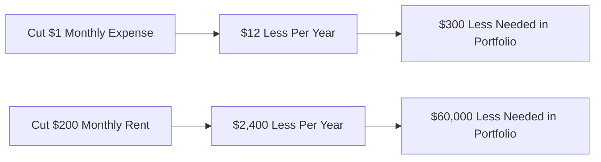
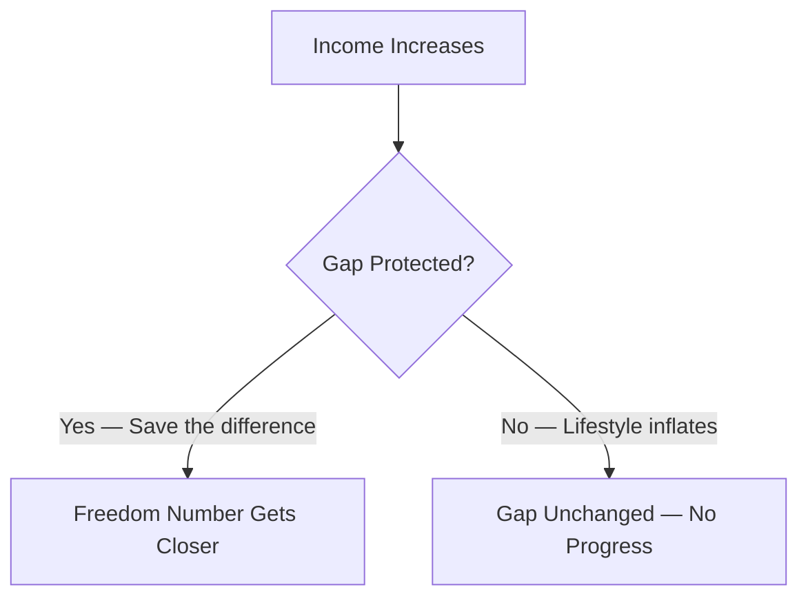
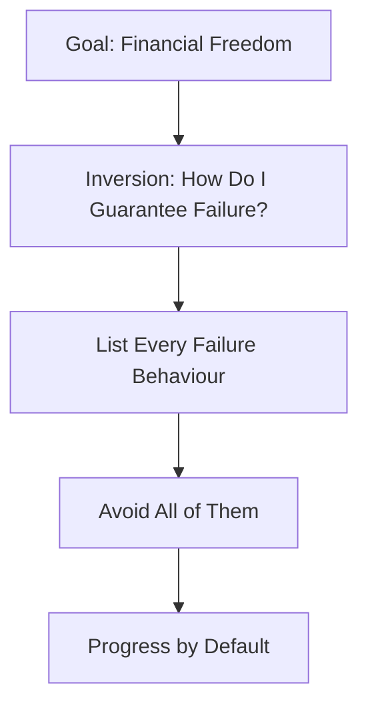

tags: [financial-freedom, personal-finance, wealth-building, investing, money-mindset] 
created: 2026-06-09 
source: https://www.youtube.com/watch?v=Pd3HYjpmks4

# Nine Rules to Financial Freedom

> [!summary] Financial freedom is not about a vague desire for "enough money." It is a specific, calculable target — and nine rules determine how fast you reach it. Most people take decades because they break every one of them without knowing it.

---

## Rule 1 — Find Your Financial Freedom Number

Most people say they want financial freedom but cannot define what that actually means. A wish without a number is not a goal. The Trinity Study (1990s, Trinity University) analyzed 70 years of market data including every crash and recession and found that 25 times your annual expenses is the point where your investment grows faster than you spend. Your portfolio never shrinks; it sustains forever.

- Take your yearly expenses and multiply by 25
- Spending $40,000/year = need $1,000,000 invested
- Spending $30,000/year = need $750,000 invested
- This is your concrete, trackable target — not a vague wish
- Monthly tracking tells you whether you moved forward or backward

> [!definition] **The 4% Rule (Trinity Study)**: You can safely withdraw 4% of your portfolio per year indefinitely. Multiplying annual expenses by 25 is the inverse of 4%, giving you your required portfolio size.

|Annual Spend|Freedom Number (×25)|
|---|---|
|$20,000|$500,000|
|$30,000|$750,000|
|$40,000|$1,000,000|
|$60,000|$1,500,000|
|$80,000|$2,000,000|

---

## Rule 2 — Cut $1 to Save $25

Because your freedom number is 25x your annual expenses, every dollar you remove from your spending shrinks your target by $25. This makes cutting expenses far more powerful than most people realize. The mistake is obsessing over small purchases (coffee, Netflix) instead of the three categories that actually drive spending.

- Housing, transportation, and food account for ~70% of most people's spending
- Cutting $200/month rent = $2,400/year saved = $60,000 less needed to invest
- One big cut beats a hundred tiny ones
- Stop optimizing small purchases; attack the big three categories first
- The question is not "can I afford this?" but "what does this cost me in freedom target?"

> [!tip] Frame every recurring expense as a freedom target impact: monthly cost × 12 × 25 = how much extra you need invested to support it. A $500/month car payment requires $150,000 in invested assets just to justify it.

---

## Rule 3 — Protect the Gap

Income does not build wealth. The gap between income and spending does. A person earning $3,000/month and saving $1,000 is closer to freedom than someone earning $10,000 and spending all of it. The single most dangerous trap is [[lifestyle inflation]]: spending rises in proportion to income, the gap stays the same, and the finish line never gets closer.

- The gap (income minus expenses) is the only number that moves you toward freedom
- A raise that triggers a matching lifestyle upgrade produces zero progress
- Lifestyle inflation is the most common reason high earners stay broke
- Protect the gap deliberately — assign every raise to savings before adjusting lifestyle
- Wealth is the gap, compounded over time

> [!warning] Getting a $500/month raise and immediately moving to a $500/month more expensive apartment is giving your landlord a raise, not yourself. The gap did not change. You ran faster on the same treadmill.

---

## Rule 4 — Build Your Foundation First

Jumping straight from cutting expenses to investing is a mistake. Without a foundation, one unexpected expense destroys all progress and sends you back to zero. The foundation has three sequential steps and must be completed before a single dollar goes into the market.

- **Step 1 — $1,000 emergency buffer**: turns small crises into inconveniences, not debt
- **Step 2 — Kill high-interest debt**: paying off a 15% loan is a guaranteed 15% return; no stock can match that
- **Step 3 — Opportunity fund (3-6 months expenses)**: lets you say yes to business opportunities, career moves, and high-value courses

> [!note] The opportunity fund is not just protection — it is optionality. Without it, you have to say no to every good opportunity because you have no room to breathe. With it, you can take calculated risks that accelerate your timeline.

|Foundation Step|Purpose|Priority|
|---|---|---|
|$1,000 buffer|Stop emergencies becoming debt|First|
|Kill high-interest debt|Guaranteed return > market return|Second|
|3-6 months expenses|Create optionality and breathing room|Third|
|Start investing|Grow toward freedom number|Only after the above|

---

## Rule 5 — Drop the Dead Weight (Sunk Cost Fallacy)

Old decisions made before you understood financial freedom become anchors. An expensive car with three years of payments, a house eating half your income, a lifestyle built on assumptions that no longer serve you — these slow everything down. The psychological trap keeping people stuck is the [[sunk cost fallacy]]: continuing a bad decision because you already invested time, money, or energy in it.

- The past has zero relevance to what you should do next
- Ask: "If I were starting fresh today, would I make this same decision?"
- If no, it is worth seriously considering the exit, even if it feels like a step backward
- Selling, downsizing, or walking away from sunk costs is often the unlock, not a retreat
- Past investments of time or money do not justify future losses

> [!definition] **Sunk Cost Fallacy**: The tendency to continue a course of action because of resources already invested, even when continuing is worse than stopping. The money or time already spent is gone regardless of what you do next — it should never drive the decision.

---

## Rule 6 — Invert Always Invert

[[Charlie Munger]]'s core mental model: instead of asking how to succeed, ask how to guarantee failure — then avoid those things. Applied to financial freedom, the question becomes "what would guarantee I never reach financial freedom?" The answers are obvious. Not doing those things is more valuable than finding the perfect strategy.

- Upgrading lifestyle the moment income increases
- Telling yourself you will start saving "next month" for years
- Spending to impress people who do not matter
- Chasing complex strategies instead of eliminating basic mistakes
- Avoiding stupidity consistently beats trying to be brilliant occasionally

> [!tip] Write a "failure list" for your finances: 5 things that would guarantee you never reach your freedom number. Then treat that list as your first rulebook. Removing stupidity is faster than adding brilliance.

---

## Rule 7 — Focus Before You Diversify

Diversification protects existing wealth. It does not create it. Trying to run multiple income streams simultaneously when you have not mastered any of them produces mediocre results across the board. Every person who built real wealth got there through deep focus on one thing first, then diversified to protect what they had.

- Pick one income-generating skill or path and get exceptional at it
- $200 from three side hustles after six months is not progress
- You get rich by focusing; you stay rich by diversifying
- Diversification is a wealth-preservation tool, not a wealth-creation tool
- Once one stream generates real income, then build the second

|Stage|Strategy|Reason|
|---|---|---|
|$0 to first real income|Deep focus on one skill/path|Mastery produces results; splitting attention produces average|
|Early wealth building|Reinvest all gains into the same path|Compounding requires concentration|
|Established income|Begin selective diversification|Protect what you have built|
|Wealth preservation|Full diversification|Reduce risk, not create returns|

---

## Rule 8 — At Zero, You Are the Investment

When starting with little capital, time spent researching stock allocation or asset strategies is almost entirely wasted. A 20% return on $1,000 is $200 per year — about 40 cents per hour for the research time invested. The highest-return investment available to someone with no wealth is themselves: skills, certifications, and knowledge that increase earning capacity.

- A $1,000 course that raises monthly income by $1,000 is a 1,200% annual return
- No index fund, stock, or asset class can match the ROI of early skill investment
- Time is the only real asset available when capital is near zero
- Spending hours on portfolio theory while earning $30,000/year is misallocated effort
- Build income first; invest capital later when the capital is large enough to matter

> [!example] $1,000 in an index fund at 10% annual return = $100 after one year. $1,000 in a skill certification that increases monthly income by $500 = $6,000 additional income in year one. The stock market can wait. The skill cannot.

---

## Rule 9 — Create Imbalance

Work-life balance is a comfortable story that extends the timeline. Every significant outcome — passing a hard exam, getting in great physical shape, building a business — was created through deliberate imbalance. Periods of concentrated, disproportionate effort compress timelines that would otherwise stretch into decades.

- Balance is the default for people who want to stay comfortable
- Temporary imbalance (2-4 years of focused effort) beats permanent imbalance (40 years of financial stress)
- Saying no to social obligations, hobbies, and comfort in the short term creates lasting freedom
- The goal is not permanent imbalance — it is a defined period of sacrifice with a clear end condition
- Freedom is the reward for enduring the discomfort that others avoid

> [!warning] Work-life balance is not wrong forever — it is wrong now, if now is the period when the foundation is being built. Once financial freedom is reached, balance becomes available as a choice. Before it, balance is a tax on your future.

---

## Key Takeaways

- Financial freedom has a number: annual expenses × 25. Track it monthly
- Every $1 cut from expenses removes $25 from the freedom target
- The gap between income and expenses is the engine of wealth — protect it from lifestyle inflation
- Build the three-step foundation before investing a single dollar
- Sunk costs are irrelevant to future decisions — ask "would I do this today?" not "did I already commit?"
- Invert: identify what guarantees failure, then avoid those things
- Focus produces wealth; diversification protects it — do not confuse the two
- When capital is near zero, you are the highest-return investment available
- Temporary, deliberate imbalance compresses decades of timeline into years

---

## Related Notes

- [[The Trinity Study and the 4% Rule]]
- [[Lifestyle Inflation and the Hedonic Treadmill]]
- [[Sunk Cost Fallacy]]
- [[Charlie Munger — Mental Models and Inversion]]
- [[Skill Investment vs Capital Investment]]

---

## References

- YouTube transcript (creator unnamed, claims 9-year path to financial freedom)
- Trinity Study (1994, Trinity University) — safe withdrawal rate research
- Charlie Munger — inversion mental model