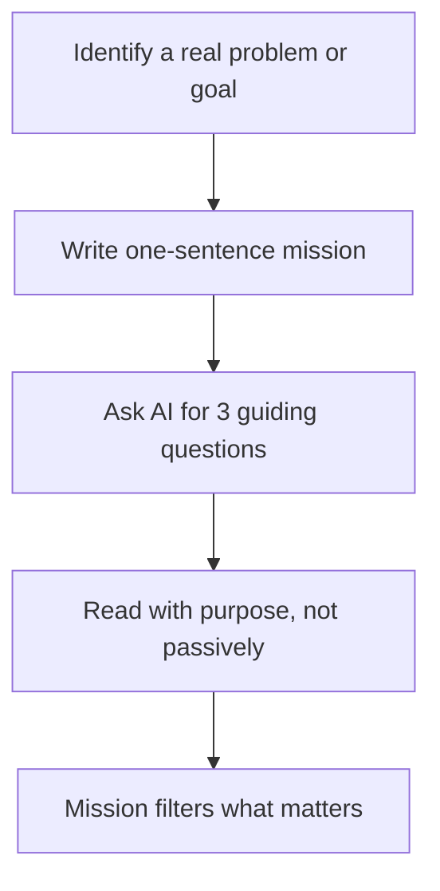
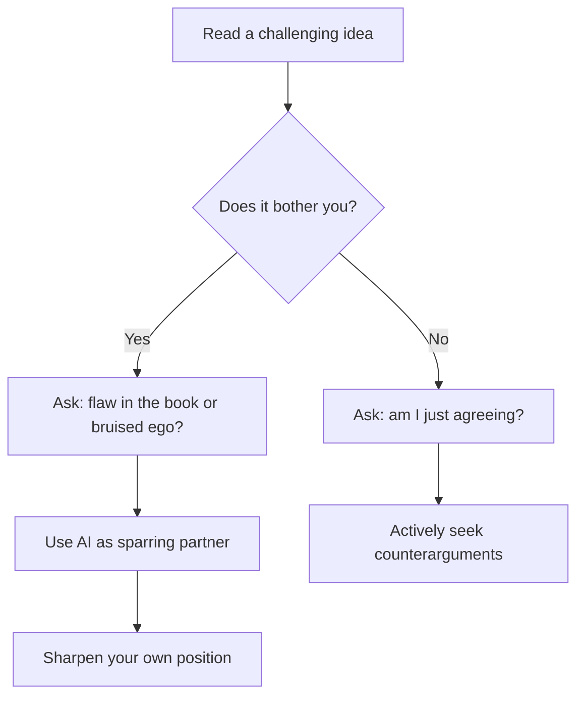

---
tags:
  - reading
  - learning
  - mental-models
  - productivity
created: 2026-06-10
Source:
---

 source: Video transcript — CEO/investor on reading systems and the top 1%

# The ACTOR Reading Framework

> [!summary] Most people read passively and forget almost everything. The ACTOR framework is a five-step system for reading with purpose, compressing ideas into memory, testing them critically, owning them through recall, and running them into real action — with AI as a sidekick, never a shortcut.

---

## Why Most Reading Fails

Reading without a system produces three predictable traps that feel productive but lead nowhere. The highlighter trap mistakes marking a sentence for remembering it. The summary trap produces perfect notes nobody ever reads again. The completion trap finishes a book while forming nothing inside the reader. These traps are reinforced by three myths: that learning styles are fixed, that fluency signals understanding, and that AI summaries can replace the cognitive work of wrestling with ideas.

- Highlighting a sentence is not the same as owning the idea
- The "illusion of fluency" (Yale research) makes unfamiliar things feel understood
- Reading styles as fixed identity ("I'm a visual learner") create self-imposed ceilings
- AI summaries give the feeling of reading without the struggle that produces growth
- Passive reading treats books as content to consume, not tools to train thinking
- The completion trap: finishing a book is not the same as being changed by it

> [!warning] If AI can summarize any book instantly, the edge is no longer access to information. It's what you bring to it: judgment, taste, and a point of view that is yours alone.

---

## The Three Reading Myths

Before building better habits, it helps to dismantle the beliefs that undermine them. Research across four major universities found little evidence that matching content to a preferred learning style improves retention. The Yale "illusion of explanatory depth" study showed that people feel confident about understanding things they cannot actually explain. And the AI myth — that a summary replaces reading — ignores the cognitive wrestling that makes ideas stick.

|Myth|What It Feels Like|What Research Shows|
|---|---|---|
|Learning styles are real|"I need to see it to learn it"|No consistent evidence they improve retention|
|Fluency = understanding|"I get what the book is saying"|Confidence collapses when asked to explain step-by-step|
|AI summaries replace reading|"I know the book now"|You haven't wrestled with the ideas or made them yours|

> [!note] The label creates the ceiling. Calling yourself a "visual learner" or "bad reader" becomes an identity that limits what you attempt.

---

## A — Aim: Read Like a Spy

Most people read as tourists. The best readers read with a mission. Lin-Manuel Miranda picked up an 800-page Hamilton biography on vacation, but his lifelong obsessions with hip-hop, immigration, and words as a tool for the powerless were already active. When his mission connected with the material, it ignited the most successful Broadway musical in history. The mission changes the material. Without a purpose sentence before you read, the book decides what matters. With one, you decide what to hunt for.

- Write one sentence before reading: "I am reading this because I need to ___"
- Different books serve different missions: leadership, money, relationships, craft
- If the mission is unclear, ask AI: "Give me three questions to carry into this book"
- Or reverse it: "I'm dealing with X — which book serves that, and what should I look for?"
- A great book is a doorway to the next great book
- [ ] Write your mission statement before starting your next book

---

## C — Compress: Find the Trunk, Not the Leaves

Elon Musk described knowledge as a tree: before collecting leaves, you need to see the trunk and branches, or the leaves have nothing to hold onto. The trunk is the book's single load-bearing idea. Branches are the major chapters and arguments. Leaves are examples, quotes, and details. Most readers collect only leaves and wonder why nothing stays. Compression is not dumbing an idea down — it's finding the structure that makes all the details meaningful.

- Trunk = the core idea that holds everything else together
- Branches = major chapters, arguments, frameworks
- Leaves = examples, quotes, anecdotes, data points
- Some books have clear trunks (Atomic Habits, Grit, Start With Why)
- Others are harder (Zen and the Art of Motorcycle Maintenance, The Innovator's Dilemma)
- For hard books, use AI as an interpreter: "I think the load-bearing idea is X — what did I miss?"
- [ ] After each book, write the core idea in one to two sentences before checking AI

> [!tip] Use AI to challenge your compression, not do it for you. Write your interpretation first, then ask: "What did I overstate? What did I miss?"

---

## T — Test: Read to Find What to Reject

The best readers don't read to agree. They read to find what they want to push back on. A Stanford study on the death penalty showed that mixed evidence made people more entrenched, not more balanced — they attacked data they disliked and praised data they already agreed with. Bill Gates reportedly writes more feverishly in the margins when he disagrees with a book. Testing an idea against your own beliefs is where reading becomes self-discovery.

- Most readers highlight only what flatters their existing point of view
- Disagreement is not a reason to quit — it's a signal to think harder
- Ask: did I find a flaw in the book, or did it bruise my ego?
- Ask: where is the author right? Where are they wrong?
- Ask: what would I have to believe to argue the opposite?
- Use AI as a sparring partner: "Find my hidden assumptions. Give me your best counterargument. When would this advice fail?"

> [!example] When a paragraph bothers you, stop and ask: "What belief am I protecting?" That discomfort is often where the most useful learning lives.

---

## O — Own: Recall, Connect, Teach

Washington University research showed that students who looked away and tried to recall a passage outperformed those who reread it, even though the re-readers felt more confident. Familiarity is not ownership. Owning an idea requires three moves: recalling it in your own words without looking, connecting it to a real situation in your life, and teaching it to someone else (or to a wall). If you cannot teach it, you do not yet own it.

|Method|How to Do It|Why It Works|
|---|---|---|
|Recall without looking|Close the book and write a summary from memory|Forces retrieval, not recognition|
|Connect to real life|Link the idea to a meeting, mistake, person, or decision|Meaning gives memory a place to live|
|Teach it|Explain it to someone or to AI, then ask for gaps|Teaching moves the idea from page to mind|

- [ ] After finishing a chapter or book, write a 1-2 paragraph summary without looking
- [ ] Identify one personal or professional experience the idea connects to
- [ ] Teach the idea to AI and ask: "Am I hitting all the right notes?"
- Use AI as a coach: "Help me explain this in plain English with one business example"
- Buying a book gives you the object. Owning what's inside it is the harder work

---

## R — Run: Turn Words Into Action

Books have always been civilization's software updates. Newton's Principia rewired minds toward science. A communication book should change a conversation. A money book should change a decision. A leadership book should change how you run your team. MIT's motto is "mind and hand" — thinking is not finished until it helps build something real. The true power of a book is that it interrupts the way you used to run your life and gives you new awareness. That's where change happens.

- A book that only makes you comfortable is not going to change you
- Reading Crucial Conversations, for example, should change what you notice in real conversations — not just what you know
- Action does not require perfection; it requires awareness and one changed behavior
- Ask AI: "Turn this idea into one decision, one rule, one checklist, or one experiment"
- [ ] Identify one concrete change this book should produce in your behavior
- [ ] Write the action down and set a trigger: "The next time X happens, I will Y"

> [!tip] In the age of AI, everyone has access to the same summaries and takeaways. The edge is your judgment, your taste, and the actions you actually take.

---

## Key Takeaways

- The three reading traps (highlighter, summary, completion) feel productive but produce nothing lasting
- Reading myths — fixed learning styles, fluency as understanding, AI as replacement — silently limit growth
- **A (Aim):** Write a one-sentence mission before every serious read
- **C (Compress):** Find the trunk (load-bearing idea), not just the leaves (quotes and examples)
- **T (Test):** Read to find what to reject; use AI as a sparring partner, not an affirmer
- **O (Own):** Recall without looking, connect to real life, teach it out loud
- **R (Run):** One book, one changed behavior; reading is not finished until something in the real world shifts
- AI belongs inside each step of ACTOR as a sidekick, never as a shortcut — you are always the actor

---

## Related Notes

- [[How to Build a Second Brain]]
- [[Atomic Habits — Summary and Application]]
- [[The Feynman Technique for Deep Learning]]
- [[Active Recall and Spaced Repetition]]
- [[Using AI as a Thinking Partner]]

---

## References

- Video transcript: CEO/investor reading framework (ACTOR system)
- Stanford study on confirmation bias and mixed evidence
- Washington University retrieval practice study
- Yale "illusion of explanatory depth" research
- Bill Gates reading habits (margin notes on disagreement)
- Lin-Manuel Miranda / Hamilton origin story