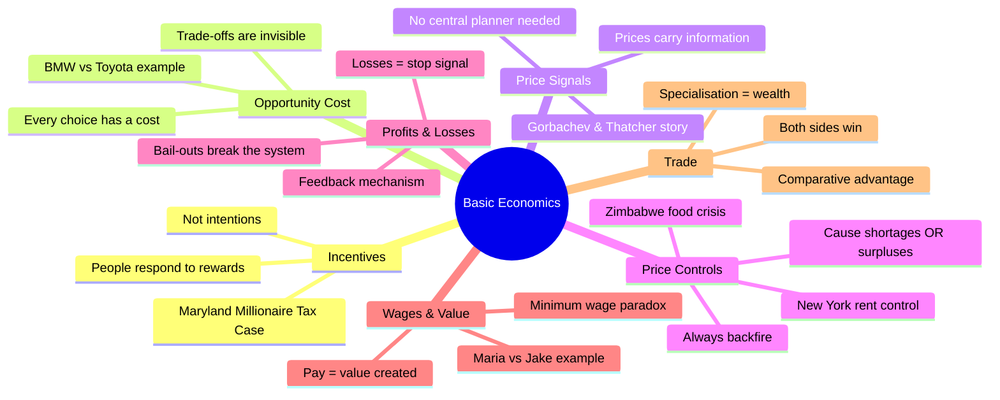
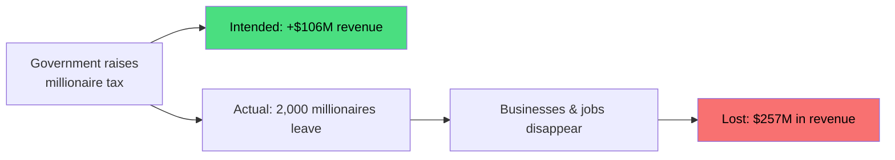
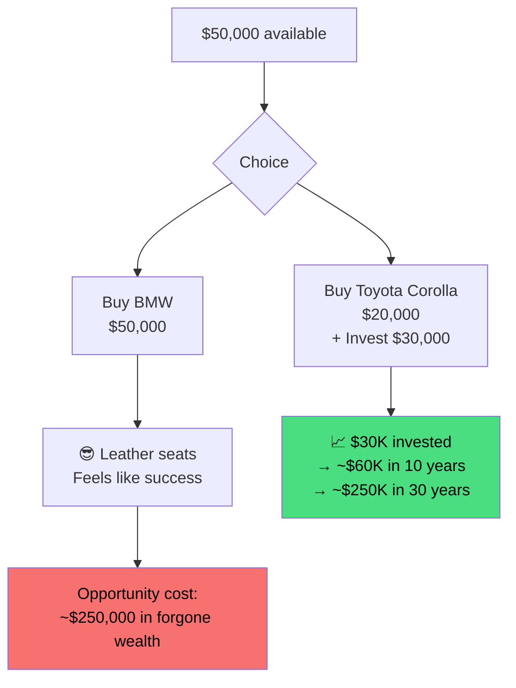
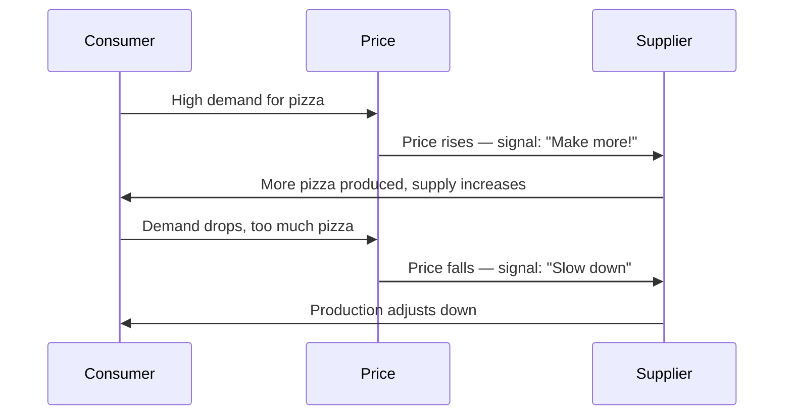
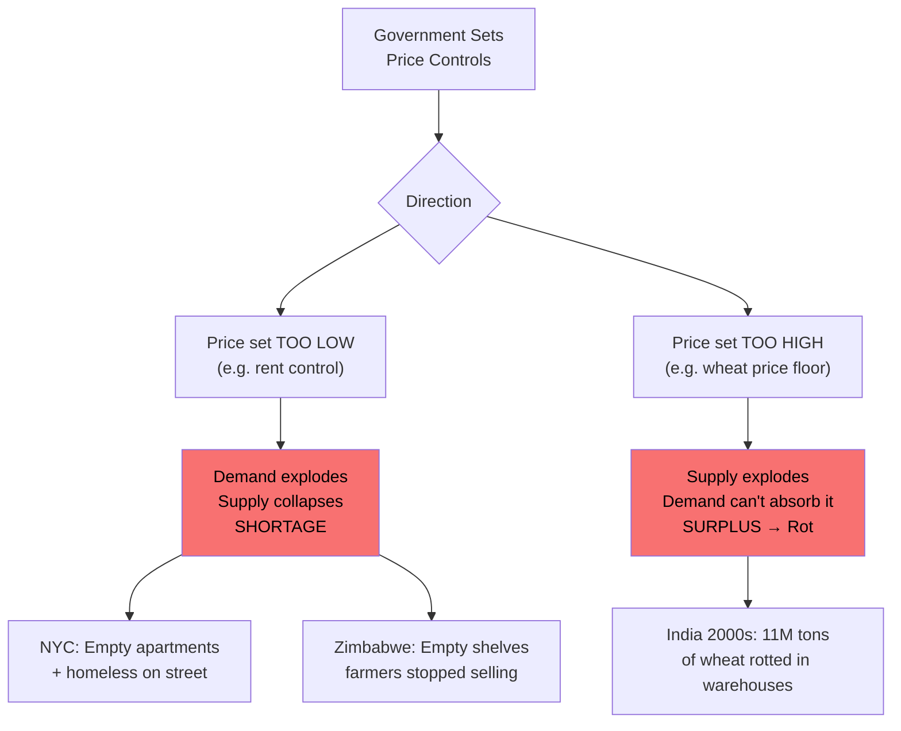
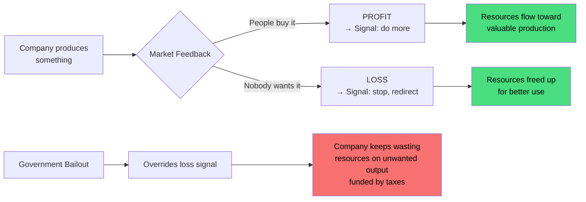
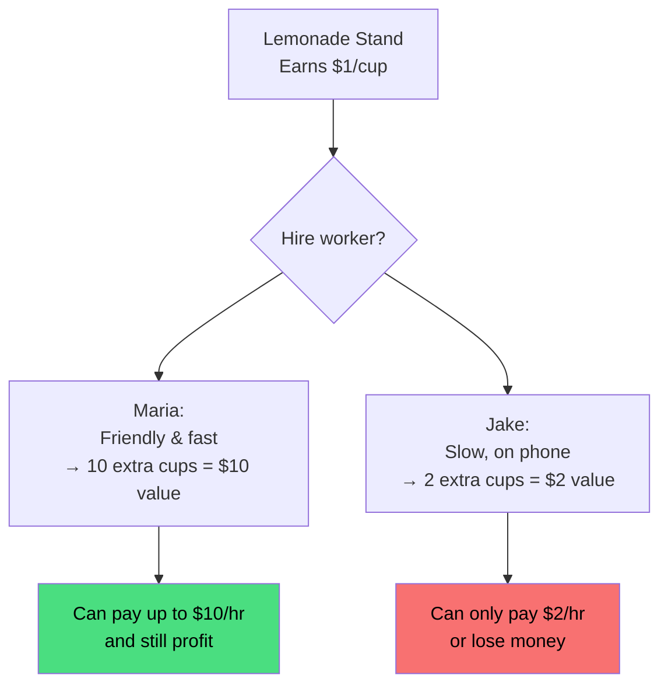
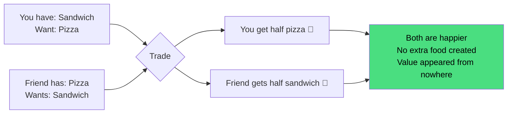
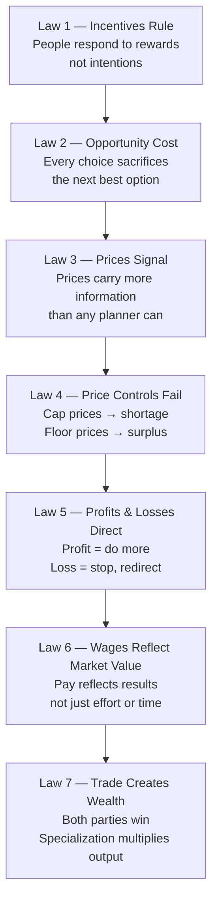

# 📚 # 📚 Basic Economics — Thomas Sowell

**Source:** _Basic Economics_ by Thomas Sowell (700 pages) | Stanford Economist **Video:** Once You Learn Economics, You Can't Be MANIPULATED Anymore 

**Tags:** #economics #mindset #money #systems-thinking #book-summary **Status:** #evergreen 

**Links:** [[MOC-Finance]] | [[MOC-Books]]

---

> [!quote] Core Thesis _"The economy seems confusing and complicated, but it's not. Most people never learn how it actually works, so they keep getting fooled."_ — Thomas Sowell

---

## 🗺️ Map of Concepts

---

## 1. 🎯 People Respond to Rewards — Not Intentions

> [!example] Case Study: Maryland Millionaire Tax (2008)
> 
> - Maryland had **~8,000 millionaires**
> - Government raised taxes to collect **$106M more**
> - Result: **2,000 millionaires left the state**
> - Actual outcome: **Lost $257M** in total tax revenue
> - Oregon did the same → lost **billions** over time

> [!warning] The Core Trap Intentions ≠ Outcomes. What matters is **what you're rewarding**, not what you _want_ to happen.

> [!tip] 💡 Apply to Your Life
> 
> - In your business: don't ask what you _want_ people to do — ask what you're **rewarding** them to do
> - In relationships: the same principle holds
> - In your career: systems reward specific behaviours — find out which ones

---

## 2. ⚖️ Every Choice Has a Cost (Opportunity Cost)

> [!info] Definition **Opportunity Cost** = the value of the _next best alternative_ you gave up when making a choice

> [!example] Venezuela vs Switzerland
> 
> |Country|Natural Resources|Wealth|
> |---|---|---|
> |Venezuela|Massive oil reserves|Broke|
> |Switzerland|Almost none|One of richest|
> 
> **Lesson:** Wealth is not about _what you have_ — it's about _what you do with what you have_

> [!tip] 💡 Apply to Your Life Every dollar, hour, and unit of energy can only be spent **once**.
> 
> - Real question isn't: _"Can I afford this?"_
> - Real question is: _"What am I giving up to get this?"_

---

## 3. 📡 Prices Are Messages (The Price Signal System)

> [!quote] Margaret Thatcher to Gorbachev _"How do you make sure people get food?"_ _"I don't — prices do."_

> [!important] Why No Human (or Computer) Can Replace Prices To centrally plan pizza supply for one country, you'd need to know:
> 
> - How many people want pizza **today vs tomorrow**
> - Which cities need more, which toppings, how much cheese
> - How much milk goes to cheese vs ice cream
> - How many tomatoes to grow, how many ovens to build
> - **All of this changes every single day**
> 
> Prices solve this problem **automatically**, in real time, without anyone being in charge.

> [!tip] 💡 Mental Shift When a price makes you angry — pause. Ask: _"What is this price trying to tell me?"_ Is something scarce? Are too many people chasing too little supply? **The price isn't the problem. It's the only honest signal you've got.**

---

## 4. 🚫 Price Controls Always Backfire

> [!danger] The Free Pizza Problem A school offers free pizza → everyone rushes in → hoarders grab extra → latecomers get nothing. This is **exactly** what happens with price controls.

> [!example] Real World Cases
> 
> |Case|Control Type|Result|
> |---|---|---|
> |New York City|Rent control (price floor too low)|4x more empty apartments than homeless people|
> |Zimbabwe inflation crisis|Food price cap|Stores emptied in hours, crops rotted on farms|
> |India 2000s|Wheat price guarantee (too high)|11M tons rotted in warehouses|

> [!warning] The Cruelest Irony Price controls are designed to help the poor. But when the product disappears — rich people find workarounds (bribes, connections). **The poor suffer most from the very policy meant to help them.**

> [!tip] 💡 The One Question to Ask When a politician promises to make something affordable by controlling the price: **→ "What happens to the supply?"**

---

## 5. 📊 Profits & Losses Are Directions

> [!info] The Feedback Loop
> 
> - **Profit** = "Yes, keep going. People want this."
> - **Loss** = "Stop. Try something else."

> [!example] The Raisin Kid Analogy You sell raisins at lunch. Nobody buys them. You lose money. That loss tells you: **stop bringing raisins**. If someone pays you to keep bringing raisins anyway — the signal is broken. That's what government bailouts do to companies.

> [!tip] 💡 Apply to Your Life Look at your projects, habits, income streams right now:
> 
> - What's producing results? → **Do more of that**
> - What's been bleeding cash or energy for 3+ years? → **Kill it**
> 
> Killing a failing project isn't failure. It's the market telling you the truth. The moment you kill it, you free up time and energy for something that actually works.

---

## 6. 💰 Your Wage Is a Price Too

> [!info] The Real Formula **Your pay = the value you create for others** That's it. Not your effort. Not your time. Your _results_.

> [!warning] The Minimum Wage Paradox
> 
> - Worker creates $10/hr of value
> - Minimum wage set at $15/hr
> - Business **loses $5 every hour** that worker is employed
> - Business response: don't hire → buy self-checkout → cut hours → close shop
> 
> The worker meant to be helped is now **unemployed**.

> [!tip] 💡 Apply to Your Career Your boss isn't paying for your **time** — they're paying for your **results**.
> 
> - Want to earn more? Create more value.
> - Learn the skill nobody else wants to learn.
> - Be Maria, not Jake.

---

## 7. 🌐 Trade Makes Everyone Richer

> [!info] The Core Insight Trade doesn't just redistribute wealth — it **creates** value without creating more stuff. Both parties end up better off. That's why both keep doing it.

> [!example] Comparative Advantage — The Lawyer Analogy
> 
> - You're a lawyer charging $300/hr
> - You're also decent at cleaning
> - Should you clean your own office?
> 
> |Option|Time Spent|Income|
> |---|---|---|
> |Clean yourself|1 hr cleaning|$0 earned|
> |Hire cleaner ($20/hr) + do legal work|1 hr legal|$300 earned − $20 = **$280 net**|
> 
> **Countries work the same way.** Even if Country A is better at _everything_, they should still specialise in what they do _relatively_ best and trade for the rest.

> [!important] Why Economists Agree on Free Trade Economists across every political view have supported free trade for **200+ years**. Trade is not war. It's cooperation. Both sides win — always.

> [!tip] 💡 Apply to Your Week How many hours last week did you spend on things you're bad at and hate?
> 
> - Emails, admin, spreadsheets, errands
> - What if you paid someone $50 to handle those?
> - And spent those hours on your unique skill?
> 
> **That's the trade. Every hour on your weakness is an hour stolen from your strength.**

---

## 🔁 Master Summary — The 7 Laws

---

## 🧠 Evergreen Principles

> [!abstract] The Invisible Pattern Every single lesson in this book comes down to **one thing**: **Trade-offs.** Resources — money, time, energy, attention — can only be used **once**. The question is never _"can I do this?"_ It's always _"what am I giving up to do this?"_

|Principle|Common Misconception|Economic Reality|
|---|---|---|
|Tax the rich|More revenue|Rich leave, revenue drops|
|Rent control|Cheaper housing|Housing shortage, buildings rot|
|Food price caps|Affordable food|Empty shelves, crops rot|
|Minimum wage hike|Workers earn more|Some workers lose jobs entirely|
|Bailout failing firms|Saves jobs|Wastes resources on unwanted output|
|Trade deficits|"We're losing"|Both countries gain from specialisation|

---

## 🔗 Linked Notes

- [[Opportunity Cost — Mental Model]]
- [[Price Signals and Hayek's Knowledge Problem]]
- [[Comparative Advantage — Ricardo]]
- [[Incentive Design in Business]]
- [[Why Socialism Fails — Sowell]]
- [[Personal Finance Trade-offs]]

---

## 📖 Further Reading

- [ ] _Basic Economics_ — Thomas Sowell (primary source)
- [ ] _The Road to Serfdom_ — F.A. Hayek (price signals & central planning)
- [ ] _Freakonomics_ — Levitt & Dubner (incentives in unexpected places)
- [ ] _The Wealth of Nations_ — Adam Smith (trade & specialization, foundational)
- [ ] _Economics in One Lesson_ — Henry Hazlitt (shorter, same principles)

---

