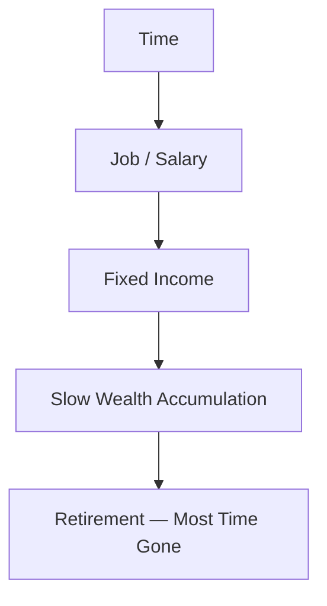
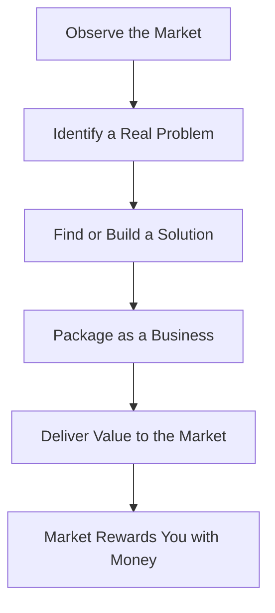
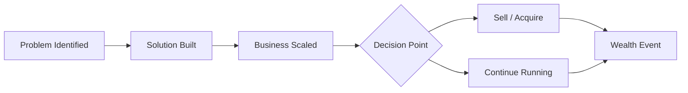

---
tags:
  - entrepreneurship
  - money
  - business
  - financial-freedom
created: 2026-06-09
Source: " https://www.youtube.com/watch?v=6mRbDEtDoyA"
---

# The Equation to Wealth

> [!summary] Most people chase money through jobs and salaries, but that equation is broken. The real path to wealth is solving problems at scale — and trading time for freedom, not just income.

---

## The Broken Equation Most People Follow

Society programs people from childhood to believe that education leads to a job, and a job leads to financial security. This "[[The Map of Money]] Money = salary from a job" equation feels logical, but it has a hard ceiling. At $20/hour working 40 hours a week, it takes nearly 24 years to accumulate $1 million — before taxes, expenses, and inflation eat into it.

- Trading time for money limits your ceiling to the hours in a day
- Inflation reduces the real value of savings over decades
- A salary is entirely dependent on someone else's valuation of your time
- Most of your most productive years get consumed before wealth is reached
- The job model makes you replaceable — the market pays for perceived value, not effort

|Path|Income Type|Scalable?|Time-Bound?|Wealth Potential|
|---|---|---|---|---|
|Job / Salary|Active|No|Yes|Low–Medium|
|Freelance / Consulting|Active|Partially|Yes|Medium|
|Business (local)|Mixed|Limited|Partially|Medium|
|Scalable Business / Software|Passive|Yes|No|High|
|Acquisition / Exit|One-time|N/A|No|Very High|

---

## Why Perceived Value Drives Pay, Not Effort

The market does not reward hard work — it rewards perceived value. A cleaner works physically harder than an accountant, yet earns far less because the market sees the cleaner's skill as easily replaceable. This is not a moral judgment; it is how capitalist economies distribute compensation.

- Perceived value is set by the market, not by the worker
- Replaceable skills attract low pay regardless of effort
- Rare, specialized, or high-leverage skills attract higher compensation
- Football players earn millions because millions of people assign value to football
- Increasing value means either becoming harder to replace or solving bigger problems

> [!definition] **Perceived Value**: The worth the market assigns to a skill, product, or service — determined by demand, scarcity, and the scale of the problem it solves.

---

## The Real Equation: Solve Problems

Every dollar in a capitalist economy traces back to a problem being solved. Amazon solved the friction of retail shopping. PayPal solved the friction of online payments. The size of the problem determines the scale of the reward. If you stop chasing money and start identifying problems, you find the actual source of wealth.

- Listen for pain points — what do people complain about, wish existed, or find frustrating?
- Validate the problem before building a solution
- A solved problem with no market demand generates no money
- The solution does not have to be technical — franchises, services, and content all qualify
- Start with a problem the market has, not a passion you have

> [!tip] Ask yourself: "What problem am I solving?" at every stage of a business, career, or creative project. If you cannot answer clearly, reconsider the direction.

---

## Scale: The Multiplier That Changes Everything

Solving a problem is not enough on its own. The solution must reach many people without requiring your time every single time. This is the concept of scale. A yoga teacher charging $100/hour has made themselves a job, not a business. An online yoga course sold to thousands is a scalable business.

- Scalability means income is not directly tied to your hours
- Software, digital products, and franchises scale well
- Local services, solo consulting, and time-traded work do not scale
- Automation and systems allow the business to run without constant input
- Outsourcing or hiring removes you as the bottleneck

|Business Type|Scales?|Time-Bound Income?|Example|
|---|---|---|---|
|Yoga teacher (hourly)|No|Yes|$100/hr, 8 lessons/day max|
|Online yoga course|Yes|No|Recorded once, sold infinitely|
|Local restaurant|Limited|Partially|Constrained by location|
|Franchise chain|Yes|No|McDonald's model|
|SaaS software|Yes|No|Build once, subscribe forever|

> [!warning] If removing yourself from the business for one month would cause it to collapse, you have a job with extra steps — not a business.

---

## The Exit: Where the Wealth Crystallises

At a certain point, a well-built business can be sold. This acquisition event is where years of problem-solving and value creation convert into a single, large payoff. Instagram sold to Facebook for $1 billion. PayPal sold to eBay for $1.5 billion, giving Elon Musk $165 million. These are not lucky events — they are the endpoint of a deliberate process.

- Building for acquisition means making the business valuable without you
- Passive, recurring revenue increases a company's sale price
- Alternatively, continuing to run the business can compound wealth over time
- Not every business needs to exit — some generate wealth passively for decades
- The exit is optional, but knowing it is possible changes how you build

---

## The Mindset Shift Required

The biggest obstacle is not capital, connections, or coding ability. It is the belief system around money inherited from upbringing, school, and culture. Hollywood portrays the wealthy as corrupt; schools teach salary-seeking; families replicate their own financial patterns. A Wealth-X report found that 68% of the world's ultra-wealthy (net worth $30M+) were self-made. The data contradicts the narrative.

- Beliefs formed in childhood shape financial behaviour as an adult
- Schooling largely ignores entrepreneurship, investing, and business creation
- Failure is not the opposite of success — it is part of the process
- Most people will not follow through, and that is an honest reality to accept
- The goal was never money itself — it was freedom, time, and choice

> [!note] MJ DeMarco's books (notably _The Millionaire Fastlane_) form the intellectual foundation behind much of this framework and are worth reading as a starting point.

---

## Key Takeaways

- The salary model cannot generate significant wealth in a reasonable timeframe
- The market pays for perceived value, not effort or hours worked
- Wealth comes from solving problems at scale, not from chasing money directly
- A scalable solution removes the direct link between your time and your income
- Automation, systems, and hiring extend the business beyond your personal capacity
- Acquisition events convert years of value creation into a concentrated payoff
- The real goal is freedom from financial anxiety — money is just the mechanism
- Failing fast and iterating is the actual path, not a linear road to success

---

## Related Notes

- [[The Millionaire Fastlane — MJ DeMarco]]
- [[Value Creation and Market Perception]]
- [[Scalable Business Models]]
- [[Time as a Non-Renewable Resource]]
- [[Passive Income Systems]]

---

## References

- Video transcript (YouTube, channel unknown) — inspired by MJ DeMarco
- Wealth-X Report: Ultra High Net Worth individuals, self-made wealth statistics