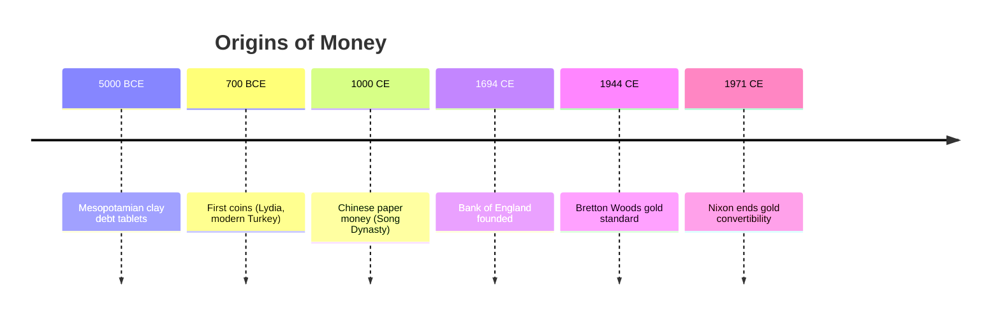
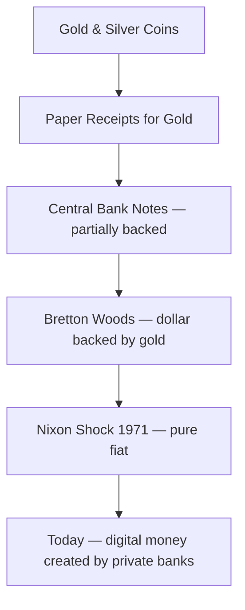

tags: [money, economics, finance, monetary-history, debt] 
created: 2026-06-08 
source: "YouTube – Merlin AI, 'Entire Map of Money in 21 Min.' (https://www.youtube.com/watch?v=mnuOZcmoGD8)"

# The Map of Money

> [!summary] Money was never about the object — it was always about the agreement. This note traces the full arc of money from oral debt records in ancient Mesopotamia to modern fractional banking, showing how the system was designed to benefit borrowers and punish savers.

---

## What Money Actually Is

Most people think money is a thing. A coin, a note, a number on a screen. But the story of Yap Island flips that assumption entirely. The people of Yap used massive limestone discs as currency, some weighing four tones. They never moved. Ownership transferred through collective agreement alone. One disc sank to the bottom of the ocean during a storm and kept circulating as money because everyone agreed it still existed and belonged to that family.

- Money is a shared agreement, not a physical object
- Value lives in collective belief, not in the material itself
- Even [[John Maynard Keynes]] and [[Milton Friedman]], who disagreed on almost everything, both concluded the Yap islanders understood money better than modern economists
- The "measuring tool" analogy holds — a ruler works only because everyone agrees on the unit
- The key vulnerability: unlike a minute (fixed by nature), money is a human agreement that can be changed silently

> [!definition] **Money**: A collectively agreed-upon measure of value. Its power comes entirely from shared trust, not from any intrinsic property of the medium used.

---

## The Barter Myth

The standard story — that humans bartered first, then invented money — was written by [[Adam Smith]] in 1776 as a logical argument, not historical evidence. For 250 years, economists treated it as fact. When anthropologists actually looked for barter economies, they found none.

- [[Caroline Humphrey]], Cambridge anthropologist, spent her career searching for evidence of a barter economy and found none
- Barter appeared _after_ money systems collapsed, not before (Russia 1990s, Argentina 2002)
- What actually came first was informal mutual credit — helping a neighbor with the roof, who later helped with the harvest
- The oldest writing ever found (5,000+ years old, Mesopotamia) records debt, not barter
- Coins appeared 2,700 years _after_ those debt records — the promise came first

|Assumed Order|Actual Order|
|---|---|
|Barter → Money → Credit|Mutual Credit → Recorded Debt → Coins|
|Primitive swap economies|Cooperative social memory|
|Adam Smith (1776)|Anthropological field research|

---

## Paper Money and the Gradual Betrayal

Paper money was not invented by governments. It was invented by ordinary merchants in Song Dynasty China trying to solve a practical problem — iron coins were too heavy to carry across the empire. They left iron with trusted shops and traded the receipts instead. It worked. Then the government adopted it. Then wars got expensive. Then the printing started.

- China invented paper money and was also the first civilization destroyed by [[hyperinflation]] from it
- The London goldsmith pattern repeated the same cycle: store gold, issue receipts, lend receipts that had no gold behind them
- King William III institutionalised the fraud in 1694 by founding the [[Bank of England]] — the crown gave merchants a license to issue paper backed by a promise, not by gold
- The Bank of England became the template for every central bank that followed

> [!warning] The fraud was not shut down when exposed. It was made official and given a crown. Every bank operating today runs on the same system the goldsmith invented while lying awake at night.

|Era|Location|Innovation|Failure Mode|
|---|---|---|---|
|~1000 CE|Song Dynasty China|Iron deposit receipts|War spending, mass printing, collapse|
|17th C|London|Goldsmith paper receipts|Lending unbacked receipts, fractional fraud|
|1694|England|Bank of England notes|Backed by royal promise, not gold|
|1944|Bretton Woods|Dollar pegged to gold at $35/oz|US overspent, gold ran out|
|1971|USA|Nixon shock|Dollar fully unpegged, pure fiat|

---

## The End of the Gold Standard

After World War II, the Western world agreed on one rule through the [[Bretton Woods Agreement]]: all currencies tied to the dollar, the dollar tied to gold at $35 per ounce. It worked for a generation. Europe rebuilt. Living standards rose. But underneath, the US was printing dollars to fund wars and domestic spending without matching gold reserves.

- France was the first country to demand physical gold for its dollars
- [[Richard Nixon]] ended gold convertibility on a Sunday evening in August 1971 with a television broadcast
- Overnight, every currency on earth became pure fiat — backed by nothing but trust
- $100 in 1971 buys roughly $8 worth of goods today — 92% of purchasing power gone while the number on the note stayed the same

> [!note] The number on the note never changed. The purchasing power did. That gap is the silent tax.

---

## How Banks Create Money Today

Most people believe banks lend out deposits. They take your money in, keep a reserve, and lend the rest. This is what economics textbooks still teach. It is not what happens.

When you sign a loan agreement for $10,000, the bank records your promise as an asset and types $10,000 into your account. That money did not exist before. Your signature created it. The bank collects real interest on money it created from nothing.

- 97% of all money in circulation today is created by private banks, not central banks or governments
- [[Fractional reserve banking]] is the system; banks create money through lending, not through relending deposits
- The interest problem: you borrow $10,000 but owe $11,000 back — that extra $1,000 was never created and can only exist if someone else borrows first
- This makes perpetual debt expansion a structural requirement, not a side effect
- More money chasing roughly the same goods means each unit buys less over time

|Myth|Reality|
|---|---|
|Banks lend out deposits|Banks create new money when they issue loans|
|Central banks control the money supply|97% of money is created by commercial banks|
|Interest is paid from existing money|The interest money was never created — requires new debt|
|Inflation is accidental|Central banks target 2% inflation deliberately|

---

## Inflation as Policy, Not Accident

Every major central bank in the world targets 2% inflation per year and calls it "price stability." At 2%, compound inflation halves the value of savings roughly every 35 years. This is not a bug. It is a deliberate design choice that benefits one group at the expense of another.

- Inflation benefits borrowers: you borrow with strong currency, repay with weaker currency
- The world's largest borrower is every government on earth — debt that could never be repaid outright gets inflated away quietly over decades
- Savers — people who hold cash or low-yield accounts — bear the full cost
- The 2% target was chosen to make the erosion slow enough to go unnoticed
- The ruler is being shortened on purpose, every single year

> [!tip] Understanding this is the first step toward protecting savings. Assets that hold value against inflation (real estate, equities, commodities, hard assets) behave differently from cash savings because they track the shortening ruler rather than being measured by it.

|Winner|Loser|
|---|---|
|Governments (biggest debtors)|Savers holding cash|
|Asset owners|Workers with fixed wages|
|Borrowers with fixed-rate loans|Pensioners on fixed income|
|Banks collecting interest on created money|People without investable assets|

---

## Key Takeaways

- Money is a collective agreement, not a thing — its value comes entirely from shared trust
- The barter-first narrative is a myth; recorded debt predates coins by over 2,000 years
- Paper money started as a practical solution by ordinary people; governments weaponised it
- Every central bank in the world is modelled on a fraud the goldsmith invented and the Bank of England made official
- Private banks create 97% of the money supply through lending, not governments
- Inflation is structural and deliberate — it transfers wealth from savers to borrowers, and the biggest borrower is always the state
- The system does not have a flaw. The system _is_ the flaw, designed to work exactly this way

---

## Related Notes

- [[Fractional Reserve Banking]]
- [[Bretton Woods Agreement]]
- [[History of Central Banks]]
- [[Inflation and Purchasing Power]]
- [[Debt-Based Money System]]
- [[Store of Value Assets]]

---

## References

- YouTube: Merlin AI, "Entire Map of Money in 21 Min." — https://www.youtube.com/watch?v=mnuOZcmoGD8
- Adam Smith, _The Wealth of Nations_ (1776)
- Caroline Humphrey, anthropological research on barter economies
- David Graeber, _Debt: The First 5,000 Years_
- Bank of England founding charter, 1694
- Nixon's televised address, August 15, 1971
- [[Basic Economics]]