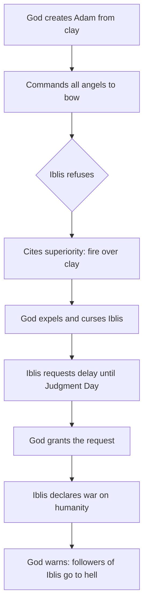
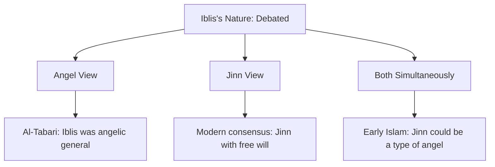
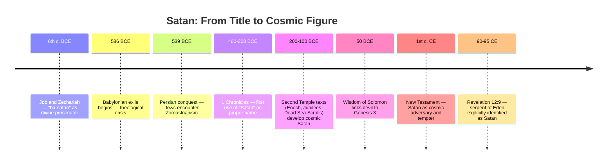

---
tags:
  - islamic-theology
  - biblical-studies
  - comparative-religion
  - demonology
  - second-temple-judaism
created: 2026-06-14
Source: https://www.youtube.com/watch?v=6y8mFSQO6cI
---

# Iblis and Satan Across Traditions

> [!summary] Iblis (Islam) and Satan (Christianity/Judaism) share a deeply intertwined history rooted in Near Eastern tradition, yet each tradition developed the figure differently. This note traces their origins, psychology, cross-cultural evolution, and theological roles across Islamic and biblical scholarship.

---

## Who Is Iblis? The Islamic Figure

In Islamic tradition, Iblis is neither a fallen angel waging war on heaven nor an equal adversary to God. He is a corrupting force who tempts, deceives, and challenges humanity with God's explicit permission. The Quran gives him the specific name Iblis, while he is also called Ash-Shaitan (the devil) and Al-Aduw (the adversary). His power is real but bounded: he cannot force humans into sin, only whisper.

- **Waswasa**: the Arabic word for Iblis's signature whispers, which even sounds like a whisper
- Commands lesser devils called **Shayatin**, which can be human or jinn, not separate supernatural entities
- Can be invisible, take any human form except the Prophet Muhammad, appear in dreams, or enter bodies
- Distracts people during prayer (a hadith describes Satan "urinating in the ears" of someone who oversleeps Fajr, understood metaphorically)
- The **Tawwudh** prayer ("I seek refuge in God from the devil") is recited before Quran recitation and important tasks
- Stoning of the Devil during Hajj commemorates Prophet Ibrahim throwing stones at Iblis who tried to dissuade the sacrifice of Ishmael
- Not the ultimate source of evil: "Evil exists not because God can't stop it, but because He explicitly allows it" (Surah 6:112)

> [!definition] **Waswasa**: The Arabic word for satanic whispers. Used both as a theological concept and as an onomatopoeic term that mimics the hissing sound of a whisper.

---

## The Fall of Iblis: The Quranic Story

When God created Adam from clay and breathed life into him, He commanded the angels to bow. Iblis refused. His stated reason: he was created from fire, Adam from clay — therefore he was superior. God expelled him and placed a curse on him. But before Iblis departed, he asked for a delay in punishment until the Day of Resurrection. God agreed, and Iblis declared his intention to deceive and corrupt mortals, except God's chosen servants. God permitted the plan and warned that those who follow Iblis will share his fate in hell.

|Element|Detail|
|---|---|
|Iblis's reason for refusal|Made from fire; Adam from clay|
|Type of disobedience|Not armed rebellion, but a refusal rooted in pride|
|Punishment|Expelled and cursed|
|Concession granted|Allowed to roam earth until Day of Resurrection|
|Iblis's declared mission|To deceive all of humanity except God's sincere servants|

> [!note] The Quranic fall story closely parallels the Syriac Christian _Book of the Cave of Treasures_ and a 4th-century Coptic text by Archbishop Timothy of Alexandria, both featuring Satan's refusal to bow to Adam. These texts predate the Quran and circulated widely across the Near East.

---

## The Psychology of Iblis: Nouman Ali Khan's Analysis

Nouman Ali Khan offers one of the most psychologically rich readings of Iblis's fall. God's question "What stopped you?" (not "Why did you disobey?") signals that something internal blocked Iblis, not mere ignorance. Iblis had intelligence, free will, moral responsibility, and direct knowledge of God. He was hearing God's command firsthand, not through a messenger thousands of years removed.

- Iblis had a **self-image** built on being the only jinn among the angels, a VIP with exclusive status
- When God honored Adam, Iblis felt his self-image was shattered: "Either you're number one or you're zero"
- He chose to protect his pride over obeying God's direct command
- He then **blamed two parties**: Adam (whose existence ruined his status) and God (who created the situation)
- His revenge against the children of Adam is endless because it cannot fix the real wound: his broken self-image
- He promotes a value system where **rank matters more than character**: CEO vs. taxi driver logic, followers vs. contribution
- His core export to humanity: "Your value comes from how people see you, not from what you do"
- He creates a personal narrative ("my truth") that no evidence can penetrate, because admitting error would mean admitting his story is wrong

> [!warning] Iblis's mindset mirrors behaviors that can take root in humans: inability to forgive, obsession with social status, the need to remain relevant through chaos when one cannot be relevant through virtue.

|Iblis's Internal Logic|Human Parallel|
|---|---|
|Value = rank, not character|Social media clout culture|
|Blame others for personal loss|Victim mentality / scapegoating|
|"My truth" over objective truth|Confirmation bias, echo chambers|
|Revenge as purpose|Destructive grudge-holding|
|Relevance through pain|Attention-seeking through conflict|

---

## Is Iblis an Angel or a Jinn? The Scholarly Debate

The Quran's verses on Iblis's origin appear to contradict each other, fueling centuries of scholarly debate. Most modern Muslims accept that Iblis was a jinn, not an angel. But early Islamic thought was not uniform on this.

- **Surah 15:31** groups Iblis with the angels: "So the angels prostrated, all of them entirely, except Iblis"
- **Surah 7:12** has Iblis say "You created me from fire" and **Surah 15:27** links fire-creation to jinn
- **Surah 18:50** provides both: "We said to the angels: prostrate to Adam... except Iblis. He was of the jinn"
- Al-Tabari (10th century) cited traditions that Iblis was once an angelic general who fought corrupted jinn before growing proud
- That pre-fall name, **Azazil**, echoes _Azazel_ from the Book of Enoch, suggesting cross-pollination with Jewish tradition
- Al-Ash'ari argued Iblis was "of jannah" (heavenly origin), not of the jinn category at all
- Al-Jahiz (9th c.) classified jinn into three types: evil jinn (Shayatin), powerful jinn (Ifrits), and purely good jinn (angels)

---

## Sufi and Mystical Reinterpretations of Iblis

While mainstream Islam condemned Iblis as the enemy, Sufi mystics saw more complexity in his story. The early Sufi Mansur Al-Hallaj reframed Iblis not as a being of arrogance but of radical, absolute devotion to God. If God alone is worthy of worship, and bowing to Adam implies worshipping something other than God, then Iblis's refusal could be read as the ultimate act of monotheism. Al-Hallaj did not deny that Iblis deserved punishment, only that the punishment was the price of his devotion.

- **Mansur Al-Hallaj**: Iblis refused to bow out of love for God, not pride. His fall was tragic, not villainous
- **Ain Al-Qudat Al-Hamdani**: Iblis and his devils serve God by delineating the faithful from the sinful
- Both scholars were executed for heterodoxy
- The figure of Iblis also inspired poetry: Abu Nuwas, a celebrated early Islamic poet, invoked Iblis as his muse in verses celebrating wine, revelry, and forbidden love
- **Iblis as musician**: In _One Thousand and One Nights_, Ibrahim Al-Mawsili is said to have studied music under Iblis himself
- Pre-Islamic Arab tradition linked jinn and Shayatin to poetic inspiration, a connection the Quran pushes back on (Surah 36:69)

> [!note] The Jabrites, an early Islamic sect, asked: if God is the source of all actions and nothing happens without His permission, did God compel Iblis to disobey? Islamic orthodoxy rejected this framing, affirming that Iblis had sufficient free will to be justly punished.

---

## Satan in the Hebrew Bible: From Title to Name

The Hebrew word _satan_ originally meant "adversary" or "one who opposes" and was not a proper name. It appears as a title with the definite article (_ha-satan_) in the book of Job, where the figure is a member of the divine council whose job is to observe and report on humans. He is not a fallen angel, not a prince of demons, and not God's archnemesis. He is closer to a celestial prosecutor or internal affairs officer.

- In **1 Samuel**, the Philistines call David a potential _satan_ (human adversary)
- In **Numbers 22:22**, an angel of God acts as a _satan_ to Balaam
- In **Job 1**, the _ha-satan_ challenges God's assessment of Job's faithfulness
- In **Zechariah**, the _satan_ appears as a divine prosecutor accusing the high priest Joshua
- The first appearance of _Satan_ as a proper name (no definite article) is **1 Chronicles 21:1**, written after the Babylonian exile

|Text|Period|Role of Satan|
|---|---|---|
|1 Samuel|Pre-exile|Human adversary (common noun)|
|Numbers 22|Pre-exile|Angel acting as obstacle|
|Job 1-2|Exilic/post-exilic|Divine prosecutor with definite article|
|1 Chronicles 21|Post-exile|First proper name use (no article)|
|Dead Sea Scrolls|200-100 BCE|Belial: cosmic evil leader of sons of darkness|
|Book of Jubilees|~150 BCE|Mastema: chief of demons, challenger of God|
|Revelation 12:9|~90 CE|"Ancient serpent" = devil = Satan|

---

## The Serpent, the Nahash, and Genesis 3

The serpent in Genesis 3 is never called Satan anywhere in the Hebrew Bible. The identification only becomes explicit in Revelation 12:9, written roughly 1,400 years after Genesis. However, the Hebrew word for serpent, _nahash_, is a triple entendre that carries layers the original audience would have recognized:

- **Serpent**: the creature in the garden
- **Shining one**: _nahash_ derives from a root meaning "to shine or gleam" (related to bronze/copper), identifying the creature as a radiant divine being
- **Enchanter/diviner**: the verb form of _nahash_ means to practice divination or seek omens

This explains how the serpent could speak, reason theologically, and know God's commands. It was not merely an animal. Second Temple Jews began retroactively reading Satan back into Genesis 3, connecting the dots between the rebel in Eden and the cosmic adversary they were developing theology around. The Wisdom of Solomon (~50 BCE) made the first explicit connection: "through the devil's envy, death entered the world."

> [!definition] **Progressive Revelation**: The biblical principle that God does not reveal all truth at once but gradually over time. The serpent didn't need to be named Satan in Genesis 3 because the full picture wasn't yet available to readers. Revelation 12:9 closes the loop.

---

## Why the Eden Rebel Became the Archvillain

Multiple rebellions appear in the Bible: Eden (Genesis 3), the Watchers (Genesis 6), the Tower of Babel (Genesis 11). But the Eden rebel became the supreme cosmic antagonist. The reason is not just that he was first, but that his rebellion introduced **death** into creation.

- Before the Fall, humans were created to live forever with God. Death was not part of the equation
- The serpent's rebellion made death universal, and every human eventually goes to Sheol (the realm of the dead)
- Genesis 3:14's curse on the serpent uses _erets_ (earth), which also refers to the underworld in ancient Near Eastern usage
- "Eating dust all the days of his life" is an ancient image of being given over to the dead
- The Eden rebel became the de facto **king of Sheol**, and all other rebellious powers operate under a world defined by his victory
- This is why Paul calls him "the god of this world" (2 Cor. 4:4) and why Hebrews 2:14 says Jesus came to destroy "the one who has the power of death, that is, the devil"
- Genesis 3:15 contains the first prophecy of his defeat: "He will crush your head, you will strike his heel"

---

## Cross-Traditional Comparison: Iblis vs. Satan

|Feature|Iblis (Islam)|Satan (Christianity/Judaism)|
|---|---|---|
|Origin|Jinn (modern consensus)|Fallen angel (Christian mainstream)|
|Nature of fall|Pride, refusal to bow to Adam|Similar refusal in some pre-Islamic texts; broader rebellion in Christian tradition|
|Relationship to God|Servant under God's sovereignty, given permission to tempt|Created being under God; permitted to test (Job); eventually defeated|
|Role|Whisperer, tempter, deceiver|Accuser, tempter, ruler of demons, prince of the air|
|Army|Shayatin (human and jinn)|Fallen angels / demons|
|End fate|Sent to hell on Judgment Day|Cast into lake of fire (Revelation)|
|Name meaning|Possibly from Greek _diabolos_; or Arabic roots for despair/confusion|Hebrew: adversary/opponent|
|As metaphor|Rejected by orthodoxy; real entity|Debated; ~40% of US Christians see him as symbolic|

---

## Key Takeaways

- Iblis and Satan share a common conceptual lineage rooted in pre-Islamic Near Eastern traditions, including Syriac and Coptic Christian texts
- In Islam, Iblis is not God's enemy but a permitted agent of testing, reflecting a theology that locates the permission for evil inside divine sovereignty
- The psychology of Iblis (as analyzed by Nouman Ali Khan) reads like a clinical case study in pride, scapegoating, and externalized blame
- The Hebrew _satan_ evolved from a common noun meaning "adversary" into a proper name and cosmic figure largely through the pressure of the Babylonian exile and Second Temple theological development
- Zoroastrianism may have influenced Second Temple Jewish theology, but the core concept of a rebellious spiritual adversary was already present in the Hebrew Bible
- The serpent of Genesis 3 is never called Satan until Revelation 12:9, over 1,400 years later, reflecting progressive revelation
- The popular red-horned devil image has no biblical basis and comes from Greek/Roman mythological figures (Pan, Satyrs, Hades) absorbed into medieval Christian art

---

## Related Notes

- [[Jinn in Islamic Theology]]
- [[Second Temple Judaism and Apocalyptic Literature]]
- [[The Problem of Evil and Theodicy in Monotheism]]
- [[Progressive Revelation in Biblical Theology]]
- [[Sufi Mysticism and Heterodox Islam]]

---

## References

- Religion for Breakfast — ["Iblis: The Islamic Devil"](https://www.youtube.com/watch?v=6y8mFSQO6cI)
- Religion for Breakfast — ["How Satan Evolved in the Bible"](https://www.youtube.com/watch?v=5sYhbtk8jJc&t=47s)
- Nouman Ali Khan —[ Lecture on the psychology of Iblis](https://www.youtube.com/watch?v=qD2yWyQ-F7c&t=23s) 
- [Islamic lecture on Iblis and the creation of Adam](https://www.youtube.com/watch?v=iwF0WbvY7yA&t=14s) 
- Al-Tabari — _Tafsir al-Tabari_ 
- Book of the Cave of Treasures (Syriac Christian, pre-Islamic)
- The Book of Jubilees (~150 BCE)
- 1 Enoch / Book of the Watchers
- Dead Sea Scrolls — Community Rule, War Scroll
- Wisdom of Solomon (~50 BCE)