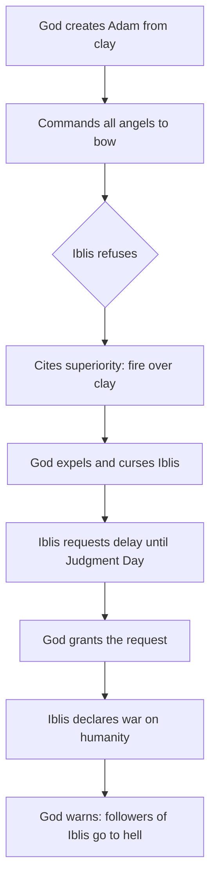
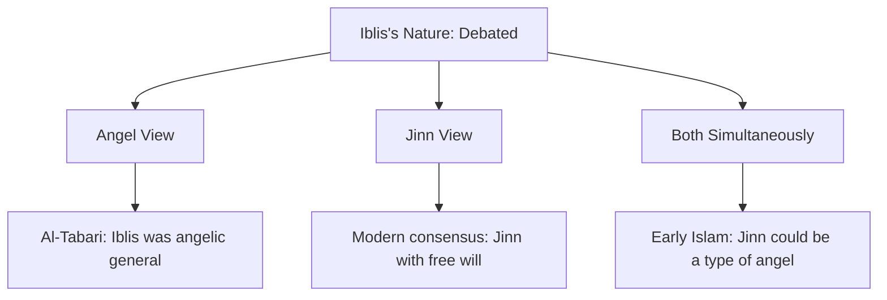
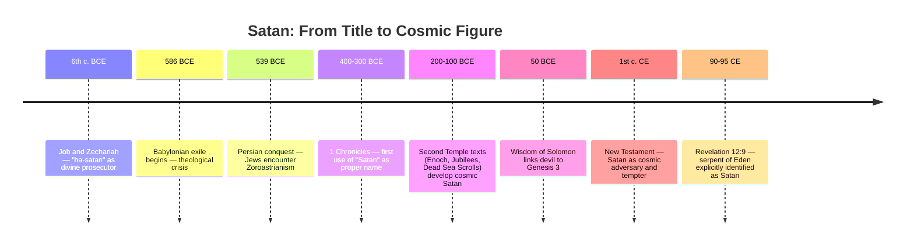
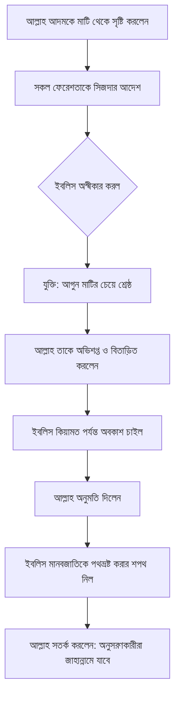
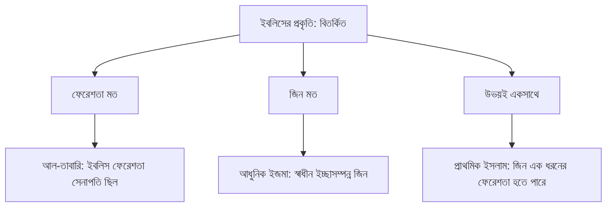
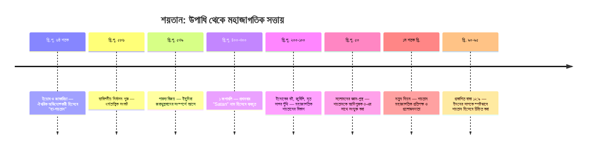

---
tags:
  - islamic-theology
  - biblical-studies
  - comparative-religion
  - demonology
  - second-temple-judaism
created: 2026-06-14
Source: https://www.youtube.com/watch?v=6y8mFSQO6cI
---

# Iblis and Satan Across Traditions

> [!summary] Iblis (Islam) and Satan (Christianity/Judaism) share a deeply intertwined history rooted in Near Eastern tradition, yet each tradition developed the figure differently. This note traces their origins, psychology, cross-cultural evolution, and theological roles across Islamic and biblical scholarship.

---

## Who Is Iblis? The Islamic Figure

In Islamic tradition, Iblis is neither a fallen angel waging war on heaven nor an equal adversary to God. He is a corrupting force who tempts, deceives, and challenges humanity with God's explicit permission. The Quran gives him the specific name Iblis, while he is also called Ash-Shaitan (the devil) and Al-Aduw (the adversary). His power is real but bounded: he cannot force humans into sin, only whisper.

- **Waswasa**: the Arabic word for Iblis's signature whispers, which even sounds like a whisper
- Commands lesser devils called **Shayatin**, which can be human or jinn, not separate supernatural entities
- Can be invisible, take any human form except the Prophet Muhammad, appear in dreams, or enter bodies
- Distracts people during prayer (a hadith describes Satan "urinating in the ears" of someone who oversleeps Fajr, understood metaphorically)
- The **Tawwudh** prayer ("I seek refuge in God from the devil") is recited before Quran recitation and important tasks
- Stoning of the Devil during Hajj commemorates Prophet Ibrahim throwing stones at Iblis who tried to dissuade the sacrifice of Ishmael
- Not the ultimate source of evil: "Evil exists not because God can't stop it, but because He explicitly allows it" (Surah 6:112)

> [!definition] **Waswasa**: The Arabic word for satanic whispers. Used both as a theological concept and as an onomatopoeic term that mimics the hissing sound of a whisper.

---

## The Fall of Iblis: The Quranic Story

When God created Adam from clay and breathed life into him, He commanded the angels to bow. Iblis refused. His stated reason: he was created from fire, Adam from clay — therefore he was superior. God expelled him and placed a curse on him. But before Iblis departed, he asked for a delay in punishment until the Day of Resurrection. God agreed, and Iblis declared his intention to deceive and corrupt mortals, except God's chosen servants. God permitted the plan and warned that those who follow Iblis will share his fate in hell.

|Element|Detail|
|---|---|
|Iblis's reason for refusal|Made from fire; Adam from clay|
|Type of disobedience|Not armed rebellion, but a refusal rooted in pride|
|Punishment|Expelled and cursed|
|Concession granted|Allowed to roam earth until Day of Resurrection|
|Iblis's declared mission|To deceive all of humanity except God's sincere servants|

> [!note] The Quranic fall story closely parallels the Syriac Christian _Book of the Cave of Treasures_ and a 4th-century Coptic text by Archbishop Timothy of Alexandria, both featuring Satan's refusal to bow to Adam. These texts predate the Quran and circulated widely across the Near East.

---

## The Psychology of Iblis: Nouman Ali Khan's Analysis

Nouman Ali Khan offers one of the most psychologically rich readings of Iblis's fall. God's question "What stopped you?" (not "Why did you disobey?") signals that something internal blocked Iblis, not mere ignorance. Iblis had intelligence, free will, moral responsibility, and direct knowledge of God. He was hearing God's command firsthand, not through a messenger thousands of years removed.

- Iblis had a **self-image** built on being the only jinn among the angels, a VIP with exclusive status
- When God honored Adam, Iblis felt his self-image was shattered: "Either you're number one or you're zero"
- He chose to protect his pride over obeying God's direct command
- He then **blamed two parties**: Adam (whose existence ruined his status) and God (who created the situation)
- His revenge against the children of Adam is endless because it cannot fix the real wound: his broken self-image
- He promotes a value system where **rank matters more than character**: CEO vs. taxi driver logic, followers vs. contribution
- His core export to humanity: "Your value comes from how people see you, not from what you do"
- He creates a personal narrative ("my truth") that no evidence can penetrate, because admitting error would mean admitting his story is wrong

> [!warning] Iblis's mindset mirrors behaviors that can take root in humans: inability to forgive, obsession with social status, the need to remain relevant through chaos when one cannot be relevant through virtue.

|Iblis's Internal Logic|Human Parallel|
|---|---|
|Value = rank, not character|Social media clout culture|
|Blame others for personal loss|Victim mentality / scapegoating|
|"My truth" over objective truth|Confirmation bias, echo chambers|
|Revenge as purpose|Destructive grudge-holding|
|Relevance through pain|Attention-seeking through conflict|

---

## Is Iblis an Angel or a Jinn? The Scholarly Debate

The Quran's verses on Iblis's origin appear to contradict each other, fueling centuries of scholarly debate. Most modern Muslims accept that Iblis was a jinn, not an angel. But early Islamic thought was not uniform on this.

- **Surah 15:31** groups Iblis with the angels: "So the angels prostrated, all of them entirely, except Iblis"
- **Surah 7:12** has Iblis say "You created me from fire" and **Surah 15:27** links fire-creation to jinn
- **Surah 18:50** provides both: "We said to the angels: prostrate to Adam... except Iblis. He was of the jinn"
- Al-Tabari (10th century) cited traditions that Iblis was once an angelic general who fought corrupted jinn before growing proud
- That pre-fall name, **Azazil**, echoes _Azazel_ from the Book of Enoch, suggesting cross-pollination with Jewish tradition
- Al-Ash'ari argued Iblis was "of jannah" (heavenly origin), not of the jinn category at all
- Al-Jahiz (9th c.) classified jinn into three types: evil jinn (Shayatin), powerful jinn (Ifrits), and purely good jinn (angels)

---

## Sufi and Mystical Reinterpretations of Iblis

While mainstream Islam condemned Iblis as the enemy, Sufi mystics saw more complexity in his story. The early Sufi Mansur Al-Hallaj reframed Iblis not as a being of arrogance but of radical, absolute devotion to God. If God alone is worthy of worship, and bowing to Adam implies worshipping something other than God, then Iblis's refusal could be read as the ultimate act of monotheism. Al-Hallaj did not deny that Iblis deserved punishment, only that the punishment was the price of his devotion.

- **Mansur Al-Hallaj**: Iblis refused to bow out of love for God, not pride. His fall was tragic, not villainous
- **Ain Al-Qudat Al-Hamdani**: Iblis and his devils serve God by delineating the faithful from the sinful
- Both scholars were executed for heterodoxy
- The figure of Iblis also inspired poetry: Abu Nuwas, a celebrated early Islamic poet, invoked Iblis as his muse in verses celebrating wine, revelry, and forbidden love
- **Iblis as musician**: In _One Thousand and One Nights_, Ibrahim Al-Mawsili is said to have studied music under Iblis himself
- Pre-Islamic Arab tradition linked jinn and Shayatin to poetic inspiration, a connection the Quran pushes back on (Surah 36:69)

> [!note] The Jabrites, an early Islamic sect, asked: if God is the source of all actions and nothing happens without His permission, did God compel Iblis to disobey? Islamic orthodoxy rejected this framing, affirming that Iblis had sufficient free will to be justly punished.

---

## Satan in the Hebrew Bible: From Title to Name

The Hebrew word _satan_ originally meant "adversary" or "one who opposes" and was not a proper name. It appears as a title with the definite article (_ha-satan_) in the book of Job, where the figure is a member of the divine council whose job is to observe and report on humans. He is not a fallen angel, not a prince of demons, and not God's archnemesis. He is closer to a celestial prosecutor or internal affairs officer.

- In **1 Samuel**, the Philistines call David a potential _satan_ (human adversary)
- In **Numbers 22:22**, an angel of God acts as a _satan_ to Balaam
- In **Job 1**, the _ha-satan_ challenges God's assessment of Job's faithfulness
- In **Zechariah**, the _satan_ appears as a divine prosecutor accusing the high priest Joshua
- The first appearance of _Satan_ as a proper name (no definite article) is **1 Chronicles 21:1**, written after the Babylonian exile

|Text|Period|Role of Satan|
|---|---|---|
|1 Samuel|Pre-exile|Human adversary (common noun)|
|Numbers 22|Pre-exile|Angel acting as obstacle|
|Job 1-2|Exilic/post-exilic|Divine prosecutor with definite article|
|1 Chronicles 21|Post-exile|First proper name use (no article)|
|Dead Sea Scrolls|200-100 BCE|Belial: cosmic evil leader of sons of darkness|
|Book of Jubilees|~150 BCE|Mastema: chief of demons, challenger of God|
|Revelation 12:9|~90 CE|"Ancient serpent" = devil = Satan|

---

## The Serpent, the Nahash, and Genesis 3

The serpent in Genesis 3 is never called Satan anywhere in the Hebrew Bible. The identification only becomes explicit in Revelation 12:9, written roughly 1,400 years after Genesis. However, the Hebrew word for serpent, _nahash_, is a triple entendre that carries layers the original audience would have recognized:

- **Serpent**: the creature in the garden
- **Shining one**: _nahash_ derives from a root meaning "to shine or gleam" (related to bronze/copper), identifying the creature as a radiant divine being
- **Enchanter/diviner**: the verb form of _nahash_ means to practice divination or seek omens

This explains how the serpent could speak, reason theologically, and know God's commands. It was not merely an animal. Second Temple Jews began retroactively reading Satan back into Genesis 3, connecting the dots between the rebel in Eden and the cosmic adversary they were developing theology around. The Wisdom of Solomon (~50 BCE) made the first explicit connection: "through the devil's envy, death entered the world."

> [!definition] **Progressive Revelation**: The biblical principle that God does not reveal all truth at once but gradually over time. The serpent didn't need to be named Satan in Genesis 3 because the full picture wasn't yet available to readers. Revelation 12:9 closes the loop.

---

## Why the Eden Rebel Became the Archvillain

Multiple rebellions appear in the Bible: Eden (Genesis 3), the Watchers (Genesis 6), the Tower of Babel (Genesis 11). But the Eden rebel became the supreme cosmic antagonist. The reason is not just that he was first, but that his rebellion introduced **death** into creation.

- Before the Fall, humans were created to live forever with God. Death was not part of the equation
- The serpent's rebellion made death universal, and every human eventually goes to Sheol (the realm of the dead)
- Genesis 3:14's curse on the serpent uses _erets_ (earth), which also refers to the underworld in ancient Near Eastern usage
- "Eating dust all the days of his life" is an ancient image of being given over to the dead
- The Eden rebel became the de facto **king of Sheol**, and all other rebellious powers operate under a world defined by his victory
- This is why Paul calls him "the god of this world" (2 Cor. 4:4) and why Hebrews 2:14 says Jesus came to destroy "the one who has the power of death, that is, the devil"
- Genesis 3:15 contains the first prophecy of his defeat: "He will crush your head, you will strike his heel"

---

## Cross-Traditional Comparison: Iblis vs. Satan

|Feature|Iblis (Islam)|Satan (Christianity/Judaism)|
|---|---|---|
|Origin|Jinn (modern consensus)|Fallen angel (Christian mainstream)|
|Nature of fall|Pride, refusal to bow to Adam|Similar refusal in some pre-Islamic texts; broader rebellion in Christian tradition|
|Relationship to God|Servant under God's sovereignty, given permission to tempt|Created being under God; permitted to test (Job); eventually defeated|
|Role|Whisperer, tempter, deceiver|Accuser, tempter, ruler of demons, prince of the air|
|Army|Shayatin (human and jinn)|Fallen angels / demons|
|End fate|Sent to hell on Judgment Day|Cast into lake of fire (Revelation)|
|Name meaning|Possibly from Greek _diabolos_; or Arabic roots for despair/confusion|Hebrew: adversary/opponent|
|As metaphor|Rejected by orthodoxy; real entity|Debated; ~40% of US Christians see him as symbolic|

---

## Key Takeaways

- Iblis and Satan share a common conceptual lineage rooted in pre-Islamic Near Eastern traditions, including Syriac and Coptic Christian texts
- In Islam, Iblis is not God's enemy but a permitted agent of testing, reflecting a theology that locates the permission for evil inside divine sovereignty
- The psychology of Iblis (as analyzed by Nouman Ali Khan) reads like a clinical case study in pride, scapegoating, and externalized blame
- The Hebrew _satan_ evolved from a common noun meaning "adversary" into a proper name and cosmic figure largely through the pressure of the Babylonian exile and Second Temple theological development
- Zoroastrianism may have influenced Second Temple Jewish theology, but the core concept of a rebellious spiritual adversary was already present in the Hebrew Bible
- The serpent of Genesis 3 is never called Satan until Revelation 12:9, over 1,400 years later, reflecting progressive revelation
- The popular red-horned devil image has no biblical basis and comes from Greek/Roman mythological figures (Pan, Satyrs, Hades) absorbed into medieval Christian art

---

## Related Notes

- [[Jinn in Islamic Theology]]
- [[Second Temple Judaism and Apocalyptic Literature]]
- [[The Problem of Evil and Theodicy in Monotheism]]
- [[Progressive Revelation in Biblical Theology]]
- [[Sufi Mysticism and Heterodox Islam]]

---

## References

- Religion for Breakfast — ["Iblis: The Islamic Devil"](https://www.youtube.com/watch?v=6y8mFSQO6cI)
- Religion for Breakfast — ["How Satan Evolved in the Bible"](https://www.youtube.com/watch?v=5sYhbtk8jJc&t=47s)
- Nouman Ali Khan —[ Lecture on the psychology of Iblis](https://www.youtube.com/watch?v=qD2yWyQ-F7c&t=23s) 
- [Islamic lecture on Iblis and the creation of Adam](https://www.youtube.com/watch?v=iwF0WbvY7yA&t=14s) 
- Al-Tabari — _Tafsir al-Tabari_ 
- Book of the Cave of Treasures (Syriac Christian, pre-Islamic)
- The Book of Jubilees (~150 BCE)
- 1 Enoch / Book of the Watchers
- Dead Sea Scrolls — Community Rule, War Scroll
- Wisdom of Solomon (~50 BCE)

---

# ইবলিস ও শয়তান — বিভিন্ন ধর্মীয় ঐতিহ্যে

> [!summary] ইবলিস আর শয়তান নামটা আলাদা হলেও এদের শিকড় একই জায়গায়, নিকট প্রাচ্যের প্রাচীন ঐতিহ্যে। তবু ইসলাম আর খ্রিস্টধর্ম এই সত্তাকে খুব আলাদাভাবে বুঝেছে। 

---

## ইবলিস কে? ইসলামি দৃষ্টিভঙ্গি

ইসলামি বোঝাপড়ায় ইবলিস স্বর্গের বিরুদ্ধে সশস্ত্র বিদ্রোহকারী কোনো পতিত ফেরেশতা না, আল্লাহর প্রতিপক্ষও না। সে মানুষকে ফাঁদে ফেলে, ফিসফিস করে, আর এই পুরো কাজটা সে করে আল্লাহরই অনুমতি নিয়ে। কুরআনে তার নাম ইবলিস। পাশাপাশি আশ-শয়তান আর আল-আদুউ (শত্রু) নামেও পরিচিত।

- **ওয়াসওয়াসা**: কানে কানে ফিসফিস করার জন্য আরবি শব্দ। মজার বিষয় হলো শব্দটা উচ্চারণ করলেও ফিসফিসের মতো শোনায়
- সে ছোট শয়তানদের পরিচালনা করে, এদের বলে **শয়াতিন**। এরা মানুষও হতে পারে, জিনও হতে পারে
- সে অদৃশ্য থাকতে পারে, নবী মুহাম্মদ (সা.) ছাড়া যেকোনো মানুষের রূপ ধারণ করতে পারে
- নামাজে মনোযোগ ভাঙানো তার একটা বড় কাজ। একটা হাদিসে আছে যে ফজরের নামাজ ঘুমিয়ে পার করার ঘটনাকে নবী (সা.) রূপকভাবে বলেছেন শয়তান তার কানে পেশাব করেছে
- **তাআউউজ** পড়া হয় কুরআন শুরুর আগে এবং যেকোনো গুরুত্বপূর্ণ কাজের শুরুতে: "আউজু বিল্লাহি মিনাশ শয়তানির রজিম"
- হজে **শয়তানকে পাথর মারা** ইবরাহিম (আ.)-এর স্মৃতিকে জীবিত রাখে। ইবলিস তাঁকে কোরবানি থেকে বিরত রাখতে চেষ্টা করেছিল, তিনি পাথর ছুড়ে তাড়িয়ে দিয়েছিলেন
- সে মানুষের পাপের মূল কারণ না। সূরা আন'আম ৬:১১২ স্পষ্ট বলে যে এই ফিতনা আল্লাহর ইচ্ছাতেই চলছে

> [!definition] **ওয়াসওয়াসা**: শয়তানের ফিসফিসানির আরবি শব্দ। এটা একটা ধর্মতাত্ত্বিক পরিভাষাই শুধু না, অনুকারশব্দও বটে। উচ্চারণেই টের পাওয়া যায় অর্থটা।

---

## ইবলিসের পতন: কুরআনের বর্ণনা

আল্লাহ আদমকে মাটি থেকে বানিয়ে রুহ ফুঁকে দিলেন, তারপর সবাইকে সিজদা করতে বললেন। ইবলিস রাজি হলো না। তার যুক্তিটা সরল: সে আগুনের তৈরি, আদম মাটির। তাই সে শ্রেষ্ঠ, তাই সে বাঁকবে না। আল্লাহ তাকে অভিশাপ দিয়ে বিতাড়িত করলেন। কিন্তু যাওয়ার আগে ইবলিস একটা সুযোগ চাইল, কিয়ামত পর্যন্ত সময়। আল্লাহ দিলেন। আর সেই মুহূর্তেই ইবলিস ঘোষণা করল যে সে আদমের সন্তানদের পথ থেকে সরিয়ে ছাড়বে। আল্লাহ জানিয়ে দিলেন: যে তাকে অনুসরণ করবে, সে তার সাথে জাহান্নামে যাবে।

|বিষয়|বিবরণ|
|---|---|
|ইবলিসের অস্বীকারের কারণ|আগুনের তৈরি হওয়ার কারণে নিজেকে শ্রেষ্ঠ মনে করা|
|অবাধ্যতার ধরন|সশস্ত্র বিদ্রোহ নয়, অহংকারজনিত প্রত্যাখ্যান|
|শাস্তি|অভিশাপ ও স্বর্গ থেকে বিতাড়ন|
|দেওয়া সুযোগ|কিয়ামত পর্যন্ত পৃথিবীতে বিচরণের অনুমতি|
|ইবলিসের লক্ষ্য|আল্লাহর খাঁটি বান্দাদের ব্যতীত সবাইকে পথভ্রষ্ট করা|

> [!note] কুরআনের এই ঘটনা সিরীয় খ্রিস্টান গ্রন্থ _কেইভ অব ট্রেজারস_ এবং চতুর্থ শতাব্দীর একটি কপটিক পাণ্ডুলিপির সাথে অদ্ভুতভাবে মিলে যায়। দুটোতেই শয়তান আদমকে সিজদা করতে অস্বীকার করে। আর এই গ্রন্থগুলো কুরআনেরও আগের।

---

## ইবলিসের মনোবিজ্ঞান: নোমান আলী খানের বিশ্লেষণ

নোমান আলী খান একটা প্রশ্ন দিয়ে শুরু করেন: আল্লাহ ইবলিসকে "কেন অবাধ্য হলে?" বলেননি, বলেছেন "কীসে তোমাকে বাধা দিল?" এই পার্থক্যটা গুরুত্বপূর্ণ। মানে হলো ইবলিস সিজদা করতে চেয়েছিল, কিন্তু ভেতর থেকে কিছু একটা তাকে থামিয়ে দিয়েছে। আর সেই বাধাটা অজ্ঞতা না, বেপরোয়া বিদ্রোহও না। ইবলিস বুদ্ধিমান ছিল। আল্লাহকে চিনত। স্বাধীন ইচ্ছা ছিল। সরাসরি আল্লাহর কণ্ঠ শুনে সিজদা করতে না পারাটা মানে একটাই, ভেতরে এমন কিছু ছিল যা আল্লাহর ভয়ের চেয়েও বড় হয়ে গিয়েছিল।

- ইবলিসের **আত্মপরিচয়** দাঁড়িয়ে ছিল একটাই ভিতের উপর: ফেরেশতাদের মধ্যে সে একমাত্র জিন, তাই সে বিশেষ
- আদমকে সম্মান দেওয়া মাত্র সেই ভিত কেঁপে উঠল। তার মাথায় একটাই ক্যালকুলেশন: এক নম্বর না হলে শূন্য
- আল্লাহর সরাসরি আদেশের চেয়ে নিজের অহংকার তার কাছে বড় হয়ে গেল
- সে দুজনকে দোষ দিল। আদমকে, কারণ তার অস্তিত্বই সমস্যার কারণ। আর আল্লাহকে, কারণ এই পরিস্থিতি তিনিই তৈরি করেছেন
- আদমের বংশের বিরুদ্ধে প্রতিশোধ নেওয়া শেষ হয় না, কারণ সেই প্রতিশোধ মূল ক্ষতটা সারাতে পারে না। ভেতরের ভাঙা আত্মপরিচয় ঠিক হওয়ার না
- সে মানুষকে একটাই শিক্ষা দিতে চায়: **তোমার মূল্য তুমি কী করো তাতে না, মানুষ তোমাকে কীভাবে দেখে তাতে**
- সে নিজের জন্য একটা "নিজস্ব সত্য" বানিয়ে নিয়েছে। যত প্রমাণই আসুক, সেটা ভাঙবে না

> [!warning] ইবলিসের এই মানসিকতা শুধু তার একার না। ক্ষমা করতে না পারা, সামাজিক মর্যাদায় আটকে থাকা, নিজের গল্পটা টিকিয়ে রাখতে সব কিছু ভেঙে দেওয়ার প্রবণতা, এগুলো আমাদের মধ্যেও থাকে।

|ইবলিসের মানসিকতা|মানবীয় সমান্তরাল|
|---|---|
|মূল্য = পদমর্যাদা, চরিত্র নয়|সোশ্যাল মিডিয়ার ফলোয়ার সংস্কৃতি|
|ব্যক্তিগত ক্ষতির জন্য অন্যকে দোষ দেওয়া|ভিকটিম মানসিকতা / স্কেপগোটিং|
|"আমার সত্য" বনাম বস্তুনিষ্ঠ সত্য|কনফার্মেশন বায়াস, ইকো চেম্বার|
|প্রতিশোধকে উদ্দেশ্য বানানো|বিধ্বংসী ক্রোধ ধরে রাখা|
|কষ্ট দেওয়ার মাধ্যমে প্রাসঙ্গিক থাকা|দ্বন্দ্বের মাধ্যমে মনোযোগ চাওয়া|

---

## ইবলিস কি ফেরেশতা নাকি জিন? পণ্ডিতদের বিতর্ক

কুরআনের বিভিন্ন আয়াত ইবলিসের পরিচয় নিয়ে একটু ভিন্ন ভিন্ন কথা বলে, এবং এ নিয়ে পণ্ডিতদের বিতর্ক শতাব্দীর পুরনো। আধুনিক মুসলমানদের সংখ্যাগরিষ্ঠ অবস্থান হলো ইবলিস একজন জিন, ফেরেশতা না। কিন্তু প্রথম কয়েক শতাব্দীতে ব্যাপারটা এত সরল ছিল না।

- **সূরা হিজর (১৫:৩১)**: "সকল ফেরেশতাই সিজদা করল, ইবলিস ব্যতীত" — এখানে ইবলিসকে ফেরেশতার সাথেই রাখা হচ্ছে বলে মনে হয়
- **সূরা আ'রাফ (৭:১২)**: ইবলিস বলে "তুমি আমাকে আগুন থেকে তৈরি করেছ"। **সূরা হিজর (১৫:২৭)** জানায় জিনরাও আগুন থেকে তৈরি
- **সূরা কাহফ (১৮:৫০)**: "ফেরেশতাদের বললাম সিজদা করতে, সবাই করল, ইবলিস ছাড়া। সে ছিল জিনদের অন্তর্ভুক্ত"
- **আল-তাবারি** (১০ম শতক) এমন বর্ণনা উল্লেখ করেন যেখানে ইবলিস একসময় দুর্নীতিগ্রস্ত জিনদের বিরুদ্ধে লড়াই করা একজন ফেরেশতা সেনাপতি ছিল
- তার পূর্বের নাম ছিল **আজাজিল**। এই নামটা ইনোকের বইয়ের _আজাজেল_-এর সাথে মিলে যায়, ইহুদি ও ইসলামি ঐতিহ্যের মধ্যে গভীর সংযোগের ইঙ্গিত
- **আল-আশ'আরি** বললেন ইবলিস "জান্নাত থেকে আসা", জিন জাতির না

---

## সুফি ও রহস্যবাদী পুনর্ব্যাখ্যা

মূলধারার ইসলাম ইবলিসকে শত্রু হিসেবেই দেখে। কিন্তু সুফি রহস্যবাদীরা তার গল্পে অন্য কিছু খুঁজে পেয়েছেন। প্রাথমিক সুফি মনসুর আল-হাল্লাজের কাছে ইবলিস অহংকারী না, বরং আল্লাহর প্রতি এতটাই একনিষ্ঠ যে অন্য কাউকে সিজদা করাটা তার পক্ষে সম্ভব হয়নি। শাস্তি পাওয়াটাকে তিনি অস্বীকার করেননি, শুধু বলেছেন এটাই ভালোবাসার মূল্য।

- **মনসুর আল-হাল্লাজ**: ইবলিস ভালোবাসা থেকে সিজদা করেনি, অহংকার থেকে না। তার পতন ছিল বিয়োগান্তিক, খলনায়কসুলভ না
- **আইন আল-কুদাত আল-হামাদানি**: ইবলিস আর তার শয়তানরা ঈমানদার ও পাপীকে আলাদা করে দিয়ে আসলে আল্লাহরই একটা কাজ করছে
- দুজনকেই শেষপর্যন্ত ধর্মদ্রোহিতার অভিযোগে মৃত্যুদণ্ড দেওয়া হয়েছিল
- কবি **আবু নুওয়াস** মদ আর নিষিদ্ধ প্রেমের কবিতায় ইবলিসকে তার অনুপ্রেরণা বলে ডেকেছেন
- _আলফ লায়লা ওয়া লায়লা_-তে বলা হয়েছে বিখ্যাত সংগীতশিল্পী ইবরাহিম আল-মাওসিলি সংগীত শিখেছিলেন ইবলিসের কাছ থেকে

> [!note] জাবরিয়া সম্প্রদায় একটা সত্যিকারের কঠিন প্রশ্ন তুলেছিল: আল্লাহ যদি সব কিছুর উৎস হন, তাহলে ইবলিসের অবাধ্যতাও কি আল্লাহরই ইচ্ছায়? ইসলামি মূলধারা এই প্রশ্ন নাকচ করেছে। ইবলিসের স্বাধীন ইচ্ছা ছিল, তাই তার শাস্তি ন্যায্য।

---

## হিব্রু বাইবেলে শয়তান: উপাধি থেকে নামে

হিব্রু শব্দ _satan_ কোনো নাম না, মানে "প্রতিপক্ষ" বা "বিরোধী"। ইয়োবের বইয়ে সে আসে _হা-শয়তান_ রূপে, নির্দিষ্ট বিশেষ্যসহ। সে ঐশ্বরিক পরিষদের সদস্য, মানুষের কার্যক্রম পর্যবেক্ষণ করে রিপোর্ট দেয়। পতিত ফেরেশতা না, দানবদের রাজা না। অনেকটা সরকারি দফতরের পরিদর্শকের মতো।

- **১ শমুয়েল**-এ পলেষ্টীয়রা দাউদকে সম্ভাব্য _satan_ বলে, সেখানে তিনি একজন মানব প্রতিপক্ষ
- **গণনাপুস্তক ২২:২২**-এ ঈশ্বরের দূত নিজেই বিলিয়মের জন্য _satan_ হিসেবে দাঁড়িয়ে যান
- **ইয়োব ১**-এ _হা-শয়তান_ ইয়োবের বিশ্বস্ততা নিয়ে ঈশ্বরের মূল্যায়নকে সরাসরি প্রশ্ন করে
- **১ বংশাবলি ২১:১**-এ প্রথমবারের মতো _Satan_ নির্দিষ্ট বিশেষ্য ছাড়া নাম হিসেবে লেখা হয়। এটি ব্যাবিলনীয় নির্বাসনের পরের লেখা

|গ্রন্থ|যুগ|শয়তানের ভূমিকা|
|---|---|---|
|১ শমুয়েল|নির্বাসনপূর্ব|মানব প্রতিপক্ষ (সাধারণ বিশেষ্য)|
|গণনাপুস্তক ২২|নির্বাসনপূর্ব|বাধাদানকারী হিসেবে ফেরেশতা|
|ইয়োব ১-২|নির্বাসনকালীন/পরবর্তী|নির্দিষ্ট বিশেষ্যযুক্ত ঐশ্বরিক অভিযোগকারী|
|১ বংশাবলি ২১|নির্বাসনোত্তর|প্রথম নাম হিসেবে ব্যবহার (বিশেষ্য ছাড়া)|
|মৃত সাগর পুঁথি|খ্রি.পূ. ২০০-১০০|বেলিয়াল: অন্ধকারের পুত্রদের নেতা|
|প্রকাশিত বাক্য ১২:৯|খ্রি. ৯০|"সেই পুরনো সাপ" = শয়তান|

---

## সাপ, নাহাশ এবং আদিপুস্তক ৩

আদিপুস্তক ৩-এর সাপকে হিব্রু বাইবেলের কোথাও শয়তান বলা হয়নি। এই সংযোগটা প্রথম আসে প্রকাশিত বাক্য ১২:৯-এ, আদিপুস্তকের প্রায় ১,৪০০ বছর পরে। তবু হিব্রু শব্দ _নাহাশ_ একসাথে তিনটা অর্থ বহন করে, আর মূল পাঠকরা সেটা বুঝতেন।

- **সাপ**: উদ্যানের প্রাণী, এটাই সাধারণ অনুবাদ
- **দীপ্তিমান সত্তা**: _নাহাশ_ "উজ্জ্বল বা চকচক করা" ধাতু থেকে এসেছে, স্বর্গীয় সত্তার ইঙ্গিত দেয়
- **জাদুকর/গণক**: ক্রিয়ারূপে _নাহাশ_ মানে গণনা করা বা মন্ত্র অনুশীলন করা

এই কারণেই সাপটা কথা বলতে পারল, যুক্তি দিতে পারল, ঈশ্বরের আদেশ জানত। সে শুধু একটা প্রাণী ছিল না। সলোমনের জ্ঞান-গ্রন্থ (~খ্রি.পূ. ৫০) প্রথম স্পষ্টভাবে বলে: "শয়তানের হিংসার মাধ্যমে মৃত্যু জগতে প্রবেশ করেছে।"

> [!definition] **ক্রমান্বয়ে প্রকাশ (Progressive Revelation)**: ঈশ্বর সব সত্য একসাথে দেননি, দিয়েছেন ধীরে ধীরে। আদিপুস্তকে সাপকে শয়তান বলা হয়নি কারণ তখনো পূর্ণ চিত্র তৈরি হয়নি। প্রকাশিত বাক্য ১২:৯ এসে সেই ফাঁকটা ভরাট করে দেয়।

---

## তুলনামূলক দৃষ্টিভঙ্গি: ইবলিস বনাম শয়তান

|বৈশিষ্ট্য|ইবলিস (ইসলাম)|শয়তান (খ্রিস্টধর্ম/ইহুদিধর্ম)|
|---|---|---|
|উৎপত্তি|জিন (আধুনিক ইজমা)|পতিত ফেরেশতা (খ্রিস্টান মূলধারা)|
|পতনের প্রকৃতি|অহংকার, আদমকে সিজদা করতে অস্বীকার|একই অস্বীকার কিছু প্রাক-ইসলামি গ্রন্থে; খ্রিস্টধর্মে ব্যাপকতর বিদ্রোহ|
|আল্লাহ/ঈশ্বরের সাথে সম্পর্ক|ঈশ্বরের সার্বভৌমত্বের অধীন, অনুমতিপ্রাপ্ত প্রলোভনদাতা|সৃষ্ট সত্তা; ঈশ্বর অনুমতি দেন (ইয়োব); শেষ পর্যন্ত পরাজিত|
|ভূমিকা|ফিসফিসকারী, প্রলোভনদাতা, প্রতারক|অভিযোগকারী, প্রলোভনদাতা, দানবদের শাসক|
|বাহিনী|শয়াতিন (মানুষ ও জিন)|পতিত ফেরেশতা / দানব|
|পরিণতি|কিয়ামতে জাহান্নামে নিক্ষেপ|আগুনের হ্রদে নিক্ষেপ (প্রকাশিত বাক্য)|
|নামের অর্থ|সম্ভবত গ্রিক _diabolos_ থেকে; বা আরবি: হতাশা/বিভ্রান্তি|হিব্রু: প্রতিপক্ষ/বিরোধী|
|রূপক কিনা|গোঁড়াপন্থায় প্রকৃত সত্তা|বিতর্কিত; যুক্তরাষ্ট্রের ~৪০% খ্রিস্টান প্রতীকী মনে করেন|

---

## মূল শিক্ষণীয় বিষয়

- ইবলিস আর শয়তানের শিকড় একই জায়গায়, প্রাক-ইসলামি নিকট প্রাচ্যের ঐতিহ্যে। সিরিয়াক ও কপটিক খ্রিস্টান গ্রন্থে একই গল্প ছিল
- ইসলামে ইবলিস আল্লাহর শত্রু না। সে অনুমোদিত পরীক্ষক, মন্দের অনুমতিও আল্লাহর সার্বভৌমত্বের মধ্যেই আছে
- নোমান আলী খানের বিশ্লেষণে ইবলিসের গল্পটা অহংকার, দোষারোপ আর ভাঙা আত্মপরিচয়ের একটা স্বচ্ছ ছবি। পড়তে পড়তে নিজের চেহারা দেখা যায়
- হিব্রু _satan_ একটা সাধারণ বিশেষ্য থেকে মহাজাগতিক সত্তায় পরিণত হয়েছে মূলত ব্যাবিলনীয় নির্বাসনের ধাক্কায়
- জরাথুস্ত্রবাদ প্রভাব রেখে থাকতে পারে। কিন্তু বিদ্রোহী আধ্যাত্মিক প্রতিপক্ষের ধারণা ইহুদি ধর্মগ্রন্থে আগে থেকেই ছিল
- আদিপুস্তক ৩-এর সাপ প্রকাশিত বাক্য ১২:৯ পর্যন্ত শয়তান নামে পরিচিত হয়নি। এটাই ক্রমান্বয়ে প্রকাশের নীতি
- লাল শিংওয়ালা শয়তানের ছবির কোনো বাইবেলীয় ভিত্তি নেই। এটা গ্রিক-রোমান পৌরাণিক চরিত্র আর মধ্যযুগীয় শিল্পকলার ফসল

---

## সম্পর্কিত নোট

- [[ইসলামি ধর্মতত্ত্বে জিন]]
- [[দ্বিতীয় মন্দির যুগ ও অ্যাপোক্যালিপটিক সাহিত্য]]
- [[একেশ্বরবাদে মন্দের সমস্যা ও থিওডিসি]]
- [[বাইবেলীয় ধর্মতত্ত্বে ক্রমান্বয়ে প্রকাশ]]
- [[সুফি রহস্যবাদ ও বিষমধর্মী ইসলাম]]

---

## তথ্যসূত্র

- Religion for Breakfast — "Iblis: The Islamic Devil" (ভিডিও ট্রান্সক্রিপ্ট)
- Religion for Breakfast — "How Satan Evolved in the Bible" (ভিডিও ট্রান্সক্রিপ্ট)
- নোমান আলী খান — ইবলিসের মনোবিজ্ঞান বিষয়ক বক্তৃতা (ট্রান্সক্রিপ্ট)
- ইবলিস ও আদমের সৃষ্টি বিষয়ক ইসলামি বক্তৃতা (ট্রান্সক্রিপ্ট)
- আল-তাবারি — তাফসির আল-তাবারি (১০ম শতাব্দী)
- সিরিয়াক খ্রিস্টান গ্রন্থ: কেইভ অব ট্রেজারস (প্রাক-ইসলামি)
- জুবিলির বই (~খ্রি.পূ. ১৫০)
- ১ ইনোক / ওয়াচার্সের বই
- মৃত সাগর পুঁথি — কমিউনিটি রুল, ওয়ার স্ক্রোল
- সলোমনের জ্ঞান-গ্রন্থ (~খ্রি.পূ. ৫০)