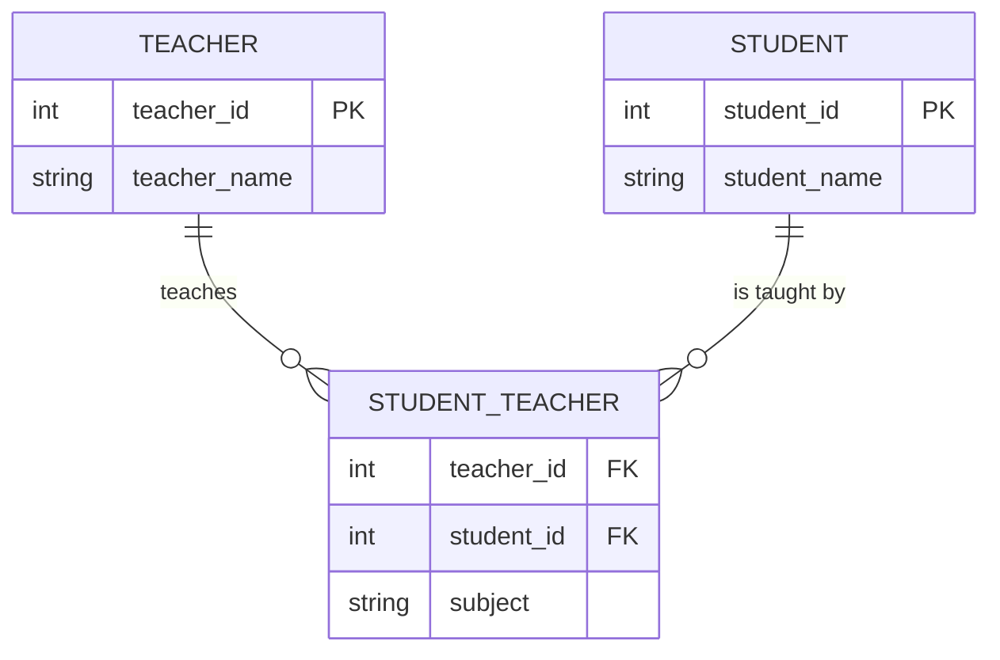

# 🗄️ Database & DBMS — Complete Notes

> [!tip] How to Use This Note Read from top to bottom for the first time. Each section builds on the last. Use the headings to jump around later when you need to revise a topic. Every concept has a real-life example so you never feel lost.

---

1. [[#🔷 What is Data|🔷 What is Data]]
2. [[#🔷 What is a Database|🔷 What is a Database]]
3. [[#🔷 What is a DBMS|🔷 What is a DBMS]]
4. [[#🔷 Components of a DBMS|🔷 Components of a DBMS]]
5. [[#🔷 DBMS Architecture|🔷 DBMS Architecture]]
6. [[#🔷 Types of Database Models|🔷 Types of Database Models]]
7. [[#🔷 ER Model — Designing a Database|🔷 ER Model — Designing a Database]]
8. [[#🔷 Enhanced ER Model|🔷 Enhanced ER Model]]
9. [[#🔷 Codd's 12 Rules|🔷 Codd's 12 Rules]]
10. [[#🔷 Basic Relational DBMS Concepts|🔷 Basic Relational DBMS Concepts]]
11. [[#🔷 Database Keys (Deep Dive)|🔷 Database Keys (Deep Dive)]]
12. [[#🔷 Normalization — Cleaning Up Data|🔷 Normalization — Cleaning Up Data]]
13. [[#🔷 Normal Forms — Step by Step|🔷 Normal Forms — Step by Step]]
14. [[#🔷 Relational Algebra|🔷 Relational Algebra]]
15. [[#🔷 Relational Calculus|🔷 Relational Calculus]]
16. [[#🔷 ER Model → Relational Model (Converting Design to Tables)|🔷 ER Model → Relational Model (Converting Design to Tables)]]
17. [[#🗂️ Quick Reference Cheat Sheet|🗂️ Quick Reference Cheat Sheet]]
18. [[#🏷️ Tags|🏷️ Tags]]


---

## 🔷 What is Data

> [!quote] Simple Definition **Data** = Raw, unprocessed facts.

Think of it like this:

| Raw Data (Meaningless alone) | Processed Information (Meaningful) |
| ---------------------------- | ---------------------------------- |
| `01720123456`                | Nurul's phone number               |
| `12-05-2002`                 | Karim's date of birth              |
| `5000`                       | Monthly salary in BDT              |

**Real-life analogy:** Imagine a grocery receipt full of numbers. Those numbers alone are "data." When you understand that `120 TK = Rice, 1kg`, it becomes **information**.

Data becomes **information** only when it is organized and given context.

---

## 🔷 What is a Database

> [!quote] Simple Definition A **Database** is an organized collection of related data stored electronically so it can be easily accessed, managed, and updated.

**Real-life analogy:** Think of a database like a **school register**.

- It has student names, roll numbers, grades, attendance — all in one place.
- It is organized so you can find any student quickly.
- It is electronic, so searching takes seconds instead of minutes.

Without a database, data would be scattered across papers, Excel sheets, and notebooks — messy and hard to find.

---

## 🔷 What is a DBMS

> [!quote] Simple Definition A **DBMS (Database Management System)** is **software** that creates, manages, and controls a database.

**Real-life analogy:** If a database is a library full of books, the DBMS is the **librarian** who:

- Organizes the books
- Helps you find what you need
- Makes sure nobody misplaces or damages books
- Controls who can borrow what

### Popular DBMS Software

|DBMS|Common Use|
|---|---|
|MySQL|Websites, apps (free)|
|PostgreSQL|Advanced projects (free)|
|Oracle|Large companies|
|SQL Server|Microsoft products|
|MongoDB|Flexible/big data|

### ✅ Why DBMS is Better Than Storing Data in Files

```
❌ Without DBMS:               ✅ With DBMS:
- Many Excel files             - One central database
- Duplicate data everywhere    - No duplicate data
- Hard to search               - Fast search with SQL
- No security                  - Password & permission control
- One user at a time           - Many users at once
```

### Pros and Cons

|✅ Advantages|❌ Disadvantages|
|---|---|
|Less duplicate data|Complex to set up initially|
|Fast data retrieval|Expensive licensed versions (use free ones like MySQL)|
|Supports many users at once|Requires good storage|
|Strong security|Needs trained staff to manage|
|Easy to maintain||

---

## 🔷 Components of a DBMS

A DBMS has **5 main components**. Think of it like running a restaurant:

```
🖥️ Hardware     = The kitchen equipment (physical machines)
💾 Software     = The restaurant management app (programs)
📦 Data         = The food ingredients (what you store)
📋 Procedures   = The recipes and rules (how to operate)
🗣️ Language     = The order tickets (how you communicate with the DB)
```

### Breaking It Down

|Component|Real-Life Example|What It Does|
|---|---|---|
|**Hardware**|Computer, hard drive, server|Physically stores the data|
|**Software**|MySQL, Oracle app|The program that runs everything|
|**Data**|Student records, product info|The actual information stored|
|**Procedures**|Backup rules, user manual|Instructions for using the system|
|**Database Language**|SQL (Structured Query Language)|How you talk to the database|

### 👥 User Roles in a DBMS

|Role|What They Do|Real-Life Example|
|---|---|---|
|**DBA** (Database Administrator)|Manages the whole system, security, access|IT Admin in a company|
|**Application Developer**|Builds apps that connect to the database|App developer|
|**End User**|Uses the system through apps|A bank customer checking their balance|

---

## 🔷 DBMS Architecture

Architecture means **how the system is structured** — who talks to who.

### 1-Tier Architecture (Direct Access)

```
[Developer] ──── directly talks to ──── [Database]
```

Used only in **development** (programmer testing things on their own computer). No security layer. Simple but not safe for real users.

---

### 2-Tier Architecture (Client-Server)

```
[User] ──── [Application Layer] ──── [Database]
```

The app sits between the user and the database.

- User never directly touches the database
- App checks if user is allowed
- More secure

**Example:** A desktop banking app where you log in and check your balance.

---

### 3-Tier Architecture (Most Common on the Web)

```
[User] ──── [GUI / Website] ──── [App Logic] ──── [Database]
```

Three clear layers:

1. **GUI Layer** — What you see (the website or app screen)
2. **App Layer** — The business rules and logic
3. **Database Layer** — Where data is actually stored

**Example:** When you use Pathao or Shohoz:

- You see a website/app (GUI)
- App checks if your booking is valid (Logic)
- Database stores your booking (Data)

> [!info] Most modern websites and apps use 3-Tier Architecture.

---

## 🔷 Types of Database Models

A **database model** is the blueprint — how data is stored and connected.

Think of it like deciding **how to arrange furniture** in a room before actually placing it.

### Quick Comparison Table

|Model|Structure|Best For|Example Tool|
|---|---|---|---|
|**Hierarchical**|Tree (parent → child)|Simple one-to-many data|Old banking systems|
|**Network**|Web (many connected)|Complex many-to-many|Old telecom systems|
|**ER Model**|Diagram for planning|Designing databases|Planning phase only|
|**Relational**|Tables (rows & columns)|Business data|MySQL, PostgreSQL|
|**Object-Oriented**|Objects with properties|Complex software|Used in programming|
|**NoSQL**|Flexible documents/JSON|Big data, real-time|MongoDB, Redis|
|**Graph**|Nodes & connections|Social networks|Neo4j|

---

### 1. Hierarchical Model 🌳

Like a **family tree**. One parent, many children. A child can only have one parent.

```
University
   └── Department
         ├── Course
         ├── Teacher
         └── Student
```

- **Good for:** Simple one-to-many relationships
- **Bad for:** When one item belongs to multiple parents

---

### 2. Network Model 🕸️

Like a **spider web**. A child can have more than one parent.

```
Student ──── Course 1
   │               │
   └──── Course 2 ──── Teacher
```

- **Good for:** Complex many-to-many relationships
- **Bad for:** Hard to design and maintain

---

### 3. Relational Model 📊 _(Most Popular)_

Data stored in **tables** — like Excel sheets. Tables are connected using keys.

```
Student Table:
| ID | Name  | Dept |
|----|-------|------|
|  1 | Rahim | CSE  |
|  2 | Karim | BBA  |
```

- **Good for:** Business data, structured information
- **Used in:** MySQL, PostgreSQL, Oracle, SQL Server

---

### 4. NoSQL Model 📄

Data stored as flexible **JSON documents** (like a filled-in form).

```json
{
  "name": "Rahim",
  "age": 20,
  "courses": ["CSE", "Math", "English"]
}
```

- **Good for:** Big data, apps that need speed and flexibility
- **Used in:** MongoDB, Redis, Cassandra

---

### 5. Graph Model 🔗

Data stored as **dots (nodes)** connected by **lines (edges)**.

```
[Rahim] ──Friend──► [Karim]
  │                    │
  └──Likes──► [Movie] ◄┘
```

- **Good for:** Social networks, recommendation systems, fraud detection
- **Used in:** Neo4j

---

## 🔷 ER Model — Designing a Database

> [!quote] Simple Definition The **ER Model (Entity-Relationship Model)** is a **planning tool** — like drawing a map of your database before building it.

You use it to answer:

- What things do I need to store data about? (**Entities**)
- What details do I need for each thing? (**Attributes**)
- How are these things connected? (**Relationships**)

---

### Core Concepts

#### 🟦 Entity

A **real-world object** you want to store data about.

|Entity|Example|
|---|---|
|Student|Rahim, Karim, Ayesha|
|Teacher|Mr. Ahmed, Ms. Sultana|
|Product|Phone, Laptop|
|Course|DBMS, Java, PHP|

**Entity Set** = A group of similar entities (all students together = Student Entity Set)

---

#### 🟡 Attributes

The **details/properties** of an entity.

```
Student
  ├── Roll Number
  ├── Name
  ├── Age
  ├── Gender
  └── Address
```

#### Types of Attributes

|Type|Meaning|Example|
|---|---|---|
|**Simple**|Cannot be divided further|Age, Gender|
|**Composite**|Can be divided into smaller parts|Address → House No, Street, City|
|**Derived**|Calculated from another attribute|Age (from Date of Birth)|
|**Single-valued**|Only one value per entity|Roll Number|
|**Multi-valued**|Can have many values|Phone Numbers (can have 2-3)|

---

#### 🔑 Keys — The ID Card of Each Row

|Key Type|Simple Meaning|
|---|---|
|**Super Key**|Any column(s) that can uniquely identify a row|
|**Candidate Key**|The best, minimal choices for primary key|
|**Primary Key**|The one key chosen as the main identifier|
|**Composite Key**|Two or more columns combined as a key|
|**Alternative Key**|Candidate key NOT chosen as primary key|
|**Foreign Key**|A key in one table pointing to another table|

**Real-life analogy:**

- Your **NID number** is a primary key — unique to only you
- Your **phone number** is an alternative key — also unique but not the main ID

---

#### 🔗 Relationships

How entities are **connected** to each other.

|Type|Meaning|Real-Life Example|
|---|---|---|
|**One-to-One**|One connects to exactly one|Person → Passport|
|**One-to-Many**|One connects to many|Teacher → Students|
|**Many-to-One**|Many connect to one|Students → Class|
|**Many-to-Many**|Many connect to many|Students ↔ Courses|
|**Recursive**|Entity connected to itself|Employee manages Employee|

---

### ER Diagram Symbols

|Symbol|Shape|Represents|
|---|---|---|
|Rectangle|`[Student]`|Entity|
|Double Rectangle|`[[Dependent]]`|Weak Entity|
|Ellipse|`((Name))`|Attribute|
|Underlined in ellipse|`((Roll No))`|Key Attribute|
|Dotted ellipse|`...Age...`|Derived Attribute|
|Double ellipse|`((Phone))`|Multi-valued Attribute|
|Diamond|`<Studies In>`|Relationship|

---

### 🏫 School ER Diagram (Full Example)

```mermaid
erDiagram
    STUDENT {
        int roll_no PK
        string name
        int age
        string gender
    }
    CLASS {
        int class_id PK
        string class_name
    }
    TEACHER {
        int teacher_id PK
        string name
    }
    SUBJECT {
        int subject_id PK
        string subject_name
    }

    STUDENT }o--|| CLASS : "studies in"
    TEACHER ||--o{ SUBJECT : "teaches"
    CLASS ||--o{ SUBJECT : "has"
```

---

## 🔷 Enhanced ER Model

When databases get more complex, the basic ER Model is not enough. The **Enhanced ER Model** adds 3 powerful ideas:

---

### 1. Generalization (Bottom-Up) ⬆️

**Combine** similar entities into one general entity.

```
Savings Account ──┐
                  ├──► Account (General)
Current Account ──┘
```

> Think of it like: Mango and Banana are both → Fruit

**Direction:** Specific → General

---

### 2. Specialization (Top-Down) ⬇️

**Divide** one general entity into specific entities.

```
Account (General)
    ├── Savings Account
    ├── Current Account
    └── Fixed Deposit Account
```

> Think of it like: Vehicle → Car, Bike, Truck

**Direction:** General → Specific

---

### 3. Aggregation 🔄

**Treat a relationship as an entity** when a relationship itself needs to be connected to something else.

```
Center ──Offers──► Course
                      │
                      ▼
                   Visitor asks about [Center + Course] together
```

> Think of it like: "Hotel booking" is not just a hotel OR a room — it's the combination of both that a customer reserves.

---

### Comparison Table

|Concept|Direction|Simple Meaning|
|---|---|---|
|Generalization|Bottom-up (specific → general)|Combine similar things|
|Specialization|Top-down (general → specific)|Divide into types|
|Aggregation|Relationship → Entity|Treat a connection as a thing|

---

## 🔷 Codd's 12 Rules

**E.F. Codd** invented the Relational Database concept. He defined **13 rules** (numbered 0–12) to decide if a system truly qualifies as an RDBMS.

> [!note] Think of these as the "quality checklist" for a proper database system.

|Rule|Name|Simple Meaning|
|---|---|---|
|**Rule 0**|Foundation Rule|Must fully work as a relational system|
|**Rule 1**|Information Rule|All data must be in tables|
|**Rule 2**|Guaranteed Access|Every value reachable via Table + Key + Column|
|**Rule 3**|NULL Handling|NULL must be handled properly (missing/unknown)|
|**Rule 4**|Active Catalog|DB must store its own structure info|
|**Rule 5**|Query Language|Must support SQL or similar language|
|**Rule 6**|View Updating|Updatable views should allow updates|
|**Rule 7**|High-Level Operations|Insert/Update/Delete on sets of data|
|**Rule 8**|Physical Independence|Storage changes shouldn't affect users|
|**Rule 9**|Logical Independence|Table structure changes shouldn't affect users|
|**Rule 10**|Integrity Independence|Rules enforced by DB itself, not outside apps|
|**Rule 11**|Distribution Independence|Data location (city/server) shouldn't matter to users|
|**Rule 12**|Non-Subversion|No backdoor should bypass DB rules|

---

## 🔷 Basic Relational DBMS Concepts

### Key Terms Explained Simply

|Term|Simple Meaning|Real-Life Example|
|---|---|---|
|**Table (Relation)**|Grid of rows and columns|An Excel sheet|
|**Row (Tuple/Record)**|One complete entry|One employee's full details|
|**Column (Attribute)**|One type of detail|The "Name" column|
|**Attribute Domain**|Allowed values for a column|Age column → only numbers|
|**Relation Schema**|The structure/design of a table|`Employee(ID, Name, Age, Salary)`|
|**Primary Key**|The unique ID of each row|Employee ID|

---

### Employee Table Example

```
Employee Table:
| ID | Name   | Age | Salary |
|----|--------|-----|--------|
|  1 | Adam   |  34 | 13000  |
|  2 | Alex   |  28 | 15000  |
|  3 | Stuart |  20 | 18000  |

- Each ROW = one employee record (tuple)
- Each COLUMN = one attribute (ID, Name, Age, Salary)
- ID = Primary Key (unique for each employee)
```

---

### 🛡️ Integrity Constraints (Rules That Keep Data Correct)

#### 1. Key Constraint

- Every row must have a unique key
- The key cannot be NULL (empty)

```
❌ Wrong:
| ID | Name |
|  1 | Adam |
|  1 | Alex |   ← Duplicate ID! Not allowed

✅ Correct:
|  1 | Adam |
|  2 | Alex |   ← Each ID is unique
```

#### 2. Domain Constraint

- A column can only store its allowed type of data

```
❌ Wrong:
| Age |
| Twenty |   ← Text in a number column!

✅ Correct:
| Age |
|  20 |
```

#### 3. Referential Integrity Constraint

- If one table points to another, the referenced data must actually exist

```
Student Table:
| Student ID | Course ID |
|     1      |   C101    |  ← C101 must exist in Course Table!

Course Table:
| Course ID | Course Name |
|   C101    |    DBMS     |  ✅ It exists, so it's fine.

If Course ID = C999 but C999 doesn't exist → ❌ VIOLATION
```

---

## 🔷 Database Keys (Deep Dive)

Why do we need keys? Because two people can have the same name:

```
| student_id | name | phone       | age |
|     1      | Akon | 9876723452  |  17 |
|     2      | Akon | 9991165674  |  19 |
```

Both named **Akon** — we can't tell them apart by name. We need a unique ID → **student_id**

---

### Key Types Explained

#### 🔵 Super Key

Any column (or group of columns) that can **uniquely identify** a row — even if it has extra unnecessary columns.

```
Super Keys for Student table:
✅ student_id
✅ phone
✅ student_id + name   (extra, but still unique because student_id is unique)
✅ student_id + age    (extra too)
```

---

#### 🟢 Candidate Key

The **minimum** super key — no extra columns, just the essentials.

```
Candidate Keys:
✅ student_id   (alone, uniquely identifies)
✅ phone        (alone, uniquely identifies)

❌ student_id + name  (NOT candidate key — student_id alone is enough)
```

---

#### 🔴 Primary Key

The **one candidate key chosen** as the main identifier.

- Must be unique
- Cannot be NULL
- Only one per table

```
Primary Key chosen: student_id ✅
```

---

#### 🟡 Composite Key

A key made from **2 or more columns** where no single column alone is unique.

```
Score Table:
| student_id | course_id | marks |
|     1      |   C101    |  85   |
|     1      |   C102    |  90   |
|     2      |   C101    |  78   |

student_id alone → not unique (student 1 appears twice)
course_id alone  → not unique (C101 appears twice)
student_id + course_id → UNIQUE ✅ = Composite Key
```

---

#### 🟠 Alternative Key

A candidate key that was **not selected** as the primary key.

```
Candidate Keys: student_id, phone
Primary Key chosen: student_id
Alternative Key: phone (still unique, just not the main one)
```

---

#### 🔗 Foreign Key

A column in one table that **points to the primary key** of another table. This is how tables are connected.

```
Student Table:              Course Table:
| student_id | course_id |  | course_id | course_name |
|     1      |   C101    |→ |   C101    |    DBMS     |

course_id in Student Table is a FOREIGN KEY pointing to Course Table
```

---

### Key Hierarchy (How They Relate)

```
Super Keys  (biggest group — all unique identifiers)
    │
    ▼
Candidate Keys  (minimal super keys — no extras)
    │
    ├──► Primary Key    (the one chosen)
    └──► Alternative Key (the ones not chosen)
```

---

## 🔷 Normalization — Cleaning Up Data

> [!quote] Simple Definition **Normalization** = Organizing database tables to reduce repetition and prevent errors.

**Real-life analogy:** Imagine a messy room where the same book is in 5 different places. Normalization is like **tidying up** — one place for each thing, no duplicates.

---

### ❌ Problems WITHOUT Normalization

#### Unnormalized Table (Bad Design)

```
| rollno | name | branch | hod   | office_tel |
|   401  | Akon |  CSE   | Mr. X |   53337    |
|   402  | Bkon |  CSE   | Mr. X |   53337    |
|   403  | Ckon |  CSE   | Mr. X |   53337    |
|   404  | Dkon |  CSE   | Mr. X |   53337    |
```

Notice `branch`, `hod`, and `office_tel` are repeated 4 times!

---

#### Problem 1: Insertion Anomaly

**You can't add data properly because something else is missing.**

Example: A new branch "EEE" has no students yet. You can't add branch details because there's no student row to attach it to.

---

#### Problem 2: Update Anomaly

**Changing one piece of info requires updating many rows.**

Example: Mr. X is replaced as HOD. You must update 400 rows. Miss one row → data becomes wrong.

---

#### Problem 3: Deletion Anomaly

**Deleting one record accidentally removes other important info.**

Example: Only one student is in the "EEE" branch. Delete that student → the EEE branch information disappears too!

---

### ✅ Solution: Separate Tables

```
Student Table:            Branch Table:
| rollno | name | branch |  | branch | hod   | tel   |
|  401   | Akon |  CSE   |  |  CSE   | Mr. X | 53337 |
|  402   | Bkon |  CSE   |  |  EEE   | Ms. Y | 67890 |
```

Now branch info is stored once. No repetition. No anomalies.

---

## 🔷 Normal Forms — Step by Step

Normalization happens in stages called **Normal Forms**.

```
Raw/Messy Table
      │
      ▼
    1NF  →  Remove multiple values from one cell
      │
      ▼
    2NF  →  Remove partial dependency
      │
      ▼
    3NF  →  Remove transitive dependency
      │
      ▼
   BCNF  →  Stronger version of 3NF
      │
      ▼
    4NF  →  Remove multi-valued dependency
      │
      ▼
    5NF  →  Remove join dependency (advanced)
```

---

### 🔹 1NF — First Normal Form

**Rule: One cell = One value**

```
❌ BAD (Not in 1NF):
| roll_no | name | subject   |
|   101   | Akon | OS, CN    |  ← Two subjects in one cell!
|   102   | Bkon | C, C++    |  ← Two subjects in one cell!

✅ GOOD (In 1NF):
| roll_no | name | subject |
|   101   | Akon |   OS    |
|   101   | Akon |   CN    |  ← Separate rows, one value each
|   102   | Bkon |    C    |
|   102   | Bkon |   C++   |
```

**4 Rules of 1NF:**

1. One value per cell
2. Same data type in each column
3. Each column has a unique name
4. Order of rows doesn't matter

---

### 🔹 2NF — Second Normal Form

**Rule: No partial dependency** (Every non-key column must depend on the FULL primary key, not just part of it)

This only matters when the primary key is a **composite key** (2+ columns).

```
Score Table (Composite Key = student_id + subject_id):

| student_id | subject_id | marks | teacher      |
|     1      |     1      |  70   | Java Teacher |
|     1      |     2      |  75   | C++ Teacher  |
|     2      |     1      |  80   | Java Teacher |

Problem: "teacher" depends only on "subject_id", not on student_id.
         This is PARTIAL DEPENDENCY ❌

❌ subject_id → teacher   (only part of the key decides teacher)
✅ student_id + subject_id → marks  (full key decides marks)
```

**Fix:** Move `teacher` to the Subject table.

```
Subject Table:               Score Table (Fixed):
| subject_id | teacher     |  | student_id | subject_id | marks |
|     1      | Java Teacher|  |     1      |     1      |  70   |
|     2      | C++ Teacher |  |     1      |     2      |  75   |
```

---

### 🔹 3NF — Third Normal Form

**Rule: No transitive dependency** (A non-key column should NOT depend on another non-key column)

```
Score Table:
| student_id | subject_id | marks | exam_name  | total_marks |
|     1      |     1      |  70   |   Mains    |     70      |
|     2      |     1      |  42   | Practicals |     30      |

Problem: 
  student_id + subject_id → exam_name ✅
  exam_name → total_marks ❌ (non-key deciding another non-key!)

This is TRANSITIVE DEPENDENCY
```

**Fix:** Create a separate Exam table.

```
Exam Table:                    Score Table (Fixed):
| exam_id | exam_name  | total |  | student_id | subject_id | marks | exam_id |
|    1    |   Mains    |  70   |  |     1      |     1      |  70   |    1    |
|    2    | Practicals |  30   |  |     2      |     1      |  42   |    2    |
```

---

### 🔹 BCNF — Boyce-Codd Normal Form (3.5NF)

**Rule: In every dependency A → B, A must be a Super Key**

BCNF is stricter than 3NF. It catches hidden problems 3NF misses.

```
Enrollment Table:
| student_id | subject   | professor |
|    101     |   Java    |  P.Java   |
|    101     |   C++     |  P.Cpp    |
|    102     |   Java    | P.Java2   |

Rules: professor → subject  (one professor teaches only one subject)
       student_id + subject → professor

Problem: "professor → subject" exists, but "professor" is NOT a super key!
         Many students can have the same professor. ❌
```

**Fix:** Split into two tables.

```
Professor Table:               Student Enrollment Table:
| p_id | professor | subject |  | student_id | p_id |
|   1  |  P.Java   |  Java   |  |    101     |   1  |
|   2  |  P.Cpp    |  C++    |  |    101     |   2  |
|   3  | P.Java2   |  Java   |  |    102     |   3  |
```

Now `p_id → professor, subject` and p_id IS a super key. ✅

---

### 🔹 4NF — Fourth Normal Form

**Rule: No multi-valued dependency** (A table should not store two independent multi-valued facts together)

```
❌ BAD:
| student | course  | hobby    |
|  Rahim  |  DBMS   | Cricket  |
|  Rahim  |  Java   | Football |

Problem: Course and Hobby are INDEPENDENT of each other.
         Rahim's courses have nothing to do with Rahim's hobbies.
         Storing them together creates confusing repetitions.
```

**Fix:** Separate tables for each multi-valued fact.


```
✅ Student-Course Table:      ✅ Student-Hobby Table:
| student | course |          | student | hobby    |
|  Rahim  |  DBMS  |          |  Rahim  | Cricket  |
|  Rahim  |  Java  |          |  Rahim  | Football |
```

---

### 🔹 5NF — Fifth Normal Form (Advanced)

**Rule: No join dependency**

When a complex table can be split into smaller tables and **joined back perfectly without losing any data**, that's 5NF.

This is an advanced concept used in very complex database designs. Most real-world databases stop at BCNF or 4NF.

---

### 📊 Normal Forms Summary

|Normal Form|Problem It Solves|Key Condition|
|---|---|---|
|**1NF**|Multiple values in one cell|One cell = one value|
|**2NF**|Partial dependency|Non-key column must depend on FULL key|
|**3NF**|Transitive dependency|Non-key column must NOT depend on another non-key|
|**BCNF**|Hidden dependency|Every determinant must be a super key|
|**4NF**|Multi-valued dependency|No independent multiple values in one table|
|**5NF**|Join dependency|Split without data loss|

---

## 🔷 Relational Algebra

> [!quote] Simple Definition **Relational Algebra** is a set of operations to query (ask questions from) a database. It is **procedural** — it tells you HOW to get the data step by step.

Think of it as **instructions for the database**.

|Operation|Symbol|What It Does|Analogy|
|---|---|---|---|
|**Select**|σ (sigma)|Filter rows by condition|Highlight rows in Excel|
|**Project**|π (pi)|Choose specific columns|Hide columns in Excel|
|**Union**|∪|Combine two tables|Merge two lists|
|**Set Difference**|−|Items in A but NOT in B|Subtract one list from another|
|**Cartesian Product**|×|Combine every row with every row|All possible combinations|
|**Rename**|ρ (rho)|Rename a table/result|Save As in Excel|

---

### Example Table

```
Student Table:
| Roll No | Name   | Age | Gender |
|    1    | Rahim  |  18 | Male   |
|    2    | Karim  |  16 | Male   |
|    3    | Ayesha |  19 | Female |
|    4    | Samin  |  17 | Male   |
```

---

### Select σ (Filter Rows)

```
Query: σ Age > 17 (Student)
Meaning: Show students older than 17

Result:
| 1 | Rahim  | 18 | Male   |
| 3 | Ayesha | 19 | Female |
```

---

### Project π (Choose Columns)

```
Query: π Name, Age (Student)
Meaning: Show only Name and Age columns

Result:
| Name   | Age |
| Rahim  |  18 |
| Karim  |  16 |
| Ayesha |  19 |
| Samin  |  17 |
```

---

### Combined Query

```
Query: π Name (σ Age > 17 AND Gender = 'Male' (Student))
Step 1 — Filter: Age > 17 AND Male → Rahim
Step 2 — Project: Show only Name → Rahim
```

---

### Union ∪

```
Query: RegularClass ∪ ExtraClass
Meaning: Students in EITHER class (no duplicates)

Like: List A + List B, removing duplicates
```

---

### Set Difference −

```
Query: RegularClass − ExtraClass
Meaning: Students in RegularClass but NOT in ExtraClass

Like: List A minus anyone who also appears in List B
```

---

### Cartesian Product ×

```
Query: A × B
If A has 2 rows and B has 3 rows → result has 2 × 3 = 6 rows
Every row of A is combined with every row of B
```

---

## 🔷 Relational Calculus

> [!quote] Simple Definition **Relational Calculus** is also used to query a database. But unlike Relational Algebra, it is **non-procedural** — it only says WHAT you want, not HOW to get it.

**Real-life analogy:**

- **Algebra** = "Go to the shelf, take books, filter by author, sort by year" (step-by-step)
- **Calculus** = "I want books by this author from 2020" (just the condition)

---

### Two Types

|Type|Works With|Example Variable|
|---|---|---|
|**TRC** (Tuple Relational Calculus)|Whole rows (tuples)|T = a full row|
|**DRC** (Domain Relational Calculus)|Individual column values|name, age = individual values|

---

### TRC Example

```
Query: Show names of students whose age > 17

TRC Expression: { T.name | Student(T) AND T.age > 17 }

Meaning:
- For each row T in Student table
- If T.age > 17
- Return T.name

Result:
| Name   |
| Rahim  |
| Ayesha |
```

---

### DRC Example

```
Query: Show name and age of students older than 17

DRC Expression: { <name, age> | <name, age> ∈ Student AND age > 17 }

Result:
| Name   | Age |
| Rahim  |  18 |
| Ayesha |  19 |
```

---

### Algebra vs Calculus

||Relational Algebra|Relational Calculus|
|---|---|---|
|**Type**|Procedural (how)|Non-procedural (what)|
|**Focus**|Steps to get data|Condition for data|
|**Like**|Recipe instructions|Food order|

---

## 🔷 ER Model → Relational Model (Converting Design to Tables)

After designing the ER Diagram, we convert it into actual database tables.

### Conversion Rules

|ER Model Element|Becomes in Relational Model|
|---|---|
|Entity|Table|
|Attribute|Column|
|Key Attribute|Primary Key|
|Relationship|Foreign Key OR new Relationship Table|
|Weak Entity|Table with Foreign Key of strong entity|
|Relationship Attribute|Column in the relationship table|

---

### Full Example

**ER Design:**

```
Teacher ──[Teaches]──► Student
```

**Converted Tables:**

```
Teacher Table:
| teacher_id (PK) | teacher_name |
|       1         |  Mr. Ahmed   |
|       2         | Ms. Sultana  |

Student Table:
| student_id (PK) | student_name |
|      101        |    Rahim     |
|      102        |    Karim     |

StudentTeacher Table (Relationship):
| teacher_id (FK) | student_id (FK) | subject |
|       1         |      101        |  DBMS   |
|       2         |      102        |  Java   |
```



---

## 🗂️ Quick Reference Cheat Sheet

### Core Definitions

| Term             | One-Line Meaning                     |
| ---------------- | ------------------------------------ |
| Data             | Raw facts                            |
| Database         | Organized electronic storage of data |
| DBMS             | Software to manage databases         |
| Table            | Rows and columns (like Excel)        |
| Row/Tuple        | One record                           |
| Column/Attribute | One type of detail                   |
| Primary Key      | Unique identifier for each row       |
| Foreign Key      | Column linking two tables            |
| SQL              | Language to talk to the database     |

### Normal Forms

|Form|Fixes|
|---|---|
|1NF|Multiple values in one cell|
|2NF|Partial dependency|
|3NF|Transitive dependency|
|BCNF|Hidden non-super-key dependency|
|4NF|Independent multi-valued facts|
|5NF|Join dependency|

### Relational Algebra Operations

|Operation|Symbol|Does|
|---|---|---|
|Select|σ|Filter rows|
|Project|π|Choose columns|
|Union|∪|Combine results|
|Set Difference|−|Items in A not in B|
|Cartesian Product|×|All combinations|
|Rename|ρ|Rename table|

---

## 🏷️ Tags

`#database` `#dbms` `#sql` `#normalization` `#er-model` `#relational-algebra` `#keys` `#study-notes` `#computer-science`

---

_Notes based on study materials on Data, DBMS, ER Models, Normalization, and Relational Algebra._