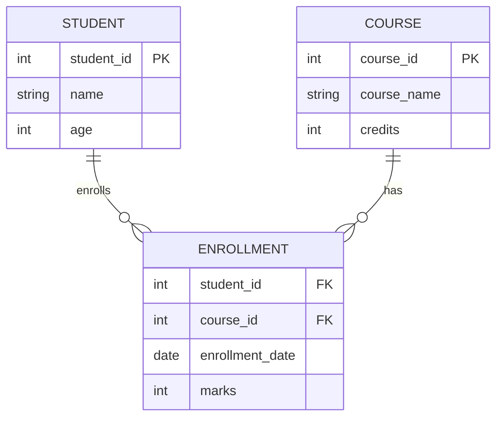

# 🗄️ DBMS — Complete Beginner to Intermediate Notes

> [!tip] 📖 How to Read This Note
> 
> - **First time?** Read from top to bottom. Each section builds on the one before it.
> - **Revising?** Use the Table of Contents to jump to any section.
> - **Confused?** Every concept has a real-life analogy. Find the analogy and the technical part becomes easy.
> - **Rule:** Never skip the "Simple Meaning" boxes. They are the heart of each concept.

---

## 📌 Table of Contents

### 🟦 Part 1 — Foundations

- [[#What is Data, Information and Knowledge]]
- [[#What is a Database]]
- [[#What is a DBMS]]
- [[#File System vs DBMS]]
- [[#Components of a DBMS]]
- [[#Types of DBMS Users]]
- [[#DBMS Architecture]]
- [[#Physical vs Logical Data Independence]]

### 🟩 Part 2 — Database Design

- [[#Database Design Process]]
- [[#Types of Database Models]]
- [[#ER Model]]
- [[#ER Diagram Symbols]]
- [[#Enhanced ER Model]]
- [[#ER Model to Relational Model]]

### 🟨 Part 3 — Relational Model

- [[#Basic Relational DBMS Concepts]]
- [[#Database Keys]]
- [[#Codd's 12 Rules]]
- [[#Functional Dependency]]
- [[#Normalization]]
- [[#Normal Forms]]

### 🟧 Part 4 — SQL

- [[#What is SQL]]
- [[#SQL Data Types]]
- [[#DDL — Data Definition Language]]
- [[#DML — Data Manipulation Language]]
- [[#DQL — SELECT Queries]]
- [[#SQL Clauses]]
- [[#SQL Joins]]
- [[#SQL Aggregate Functions]]
- [[#SQL Subqueries]]
- [[#SQL Views]]
- [[#SQL Indexes]]
- [[#SQL Stored Procedures and Functions]]
- [[#SQL Triggers]]
- [[#DCL — Data Control Language]]
- [[#TCL — Transaction Control Language]]

### 🟥 Part 5 — Advanced Concepts

- [[#Transactions in DBMS]]
- [[#ACID Properties]]
- [[#Concurrency Control]]
- [[#Deadlock in DBMS]]
- [[#Database Recovery]]
- [[#Indexing Deep Dive]]
- [[#Hashing in DBMS]]
- [[#Query Processing and Optimization]]
- [[#Relational Algebra]]
- [[#Relational Calculus]]

### 🟪 Part 6 — Special Topics

- [[#NoSQL vs SQL]]
- [[#Database Security]]
- [[#Backup and Recovery]]
- [[#Data Warehouse vs Database]]
- [[#Big Data Basics]]

### 📋 Quick Reference

- [[#Quick Reference Cheat Sheet]]
- [[#Common Mistakes Beginners Make]]
- [[#How Everything Connects]]

---

# 🟦 PART 1 — FOUNDATIONS

---

## 🔷 What is Data, Information and Knowledge

These three words sound similar but mean very different things.

### The Pyramid of Understanding

```
        WISDOM
       (knowing WHEN to use knowledge)
      ━━━━━━━━━━━━━━━━━━━━━━━━━━━━━━━━
     KNOWLEDGE
    (patterns + experience)
   ━━━━━━━━━━━━━━━━━━━━━━━━━━━━━━━━━━━━
  INFORMATION
 (processed, meaningful data)
━━━━━━━━━━━━━━━━━━━━━━━━━━━━━━━━━━━━━━━━
DATA
(raw facts, meaningless alone)
```

### Real-Life Example

|Level|Example|
|---|---|
|**Data**|`38.5`, `Rahim`, `12-05-2002`|
|**Information**|"Rahim's temperature is 38.5 degrees C on 12-May-2002"|
|**Knowledge**|"38.5 degrees C is a fever — Rahim needs medical attention"|
|**Wisdom**|"Given Rahim's age and history, he needs a doctor, not self-medication"|

### Types of Data

|Type|Example|Where Used|
|---|---|---|
|**Structured**|Excel tables, database rows|Banks, ERP systems|
|**Unstructured**|Photos, videos, emails|Social media|
|**Semi-structured**|JSON files, XML|APIs, web data|
|**Metadata**|"Created 1 Jan 2024, file size 5MB"|File systems, databases|

> [!note] Metadata = "Data about data" When you take a photo, the photo is data. The camera also records the date, time, and location — that is metadata.

---

## 🔷 What is a Database

> [!quote] Simple Definition A **Database** is an organized, electronic collection of related data that can be easily accessed, updated, and managed.

### Real-Life Analogies

|Database Concept|Real-Life Equivalent|
|---|---|
|Database|School filing cabinet with labeled folders|
|Table|One folder (e.g., "Student Records")|
|Row|One student's file inside that folder|
|Column|A specific field on the file (Name, Roll No, Grade)|

### Why "Organized" Matters

```
Without organization:             With a database:
Files scattered everywhere        Files sorted by patient ID
Finding one file = 30 minutes     Finding one file = 2 seconds
Updating = changing every copy    Updating = change once, everywhere
```

### Properties of a Good Database

- **Accurate** — Data is correct and up-to-date
- **Consistent** — Same data looks the same everywhere
- **Complete** — No missing critical information
- **Non-redundant** — Same info not stored twice
- **Secure** — Only authorized people can access it

---

## 🔷 What is a DBMS

> [!quote] Simple Definition A **DBMS (Database Management System)** is software that creates, manages, and controls access to a database.

### The Librarian Analogy

```
Database = A huge library with thousands of books
DBMS     = The librarian + all the library systems

The librarian:
  Organizes books on shelves (stores data in tables)
  Helps you find the right book (queries)
  Decides who can borrow what (access control)
  Keeps track of all borrows/returns (transactions)
  Protects books from damage (backup and recovery)
  Serves multiple people at once (multi-user support)
```

### Popular DBMS Software

|DBMS|Type|Cost|Common Use|
|---|---|---|---|
|**MySQL**|Relational|Free|Websites, WordPress|
|**PostgreSQL**|Relational|Free|Advanced apps|
|**Oracle**|Relational|Paid|Large corporations|
|**SQL Server**|Relational|Paid|Microsoft ecosystem|
|**SQLite**|Relational|Free|Mobile apps|
|**MongoDB**|NoSQL|Free/Paid|Flexible data|
|**Redis**|NoSQL|Free|Caching, speed|

### Core Functions of DBMS

```
1. Data Storage       — Stores data efficiently on disk
2. Data Retrieval     — Answers queries quickly
3. Access Control     — Only authorized users can read/write
4. Concurrency        — Handles many users at same time
5. Backup & Recovery  — Recovers data after crashes
6. Data Integrity     — Ensures rules are followed
7. Data Dictionary    — Stores info about the database structure
```

---

## 🔷 File System vs DBMS

Before DBMS, data was stored in simple files (text files or Excel). Understanding why DBMS replaced file systems helps you understand what DBMS solves.

### Head-to-Head Comparison

|Problem|File System|DBMS|
|---|---|---|
|**Data Redundancy**|Same data in multiple files|Stored once, used everywhere|
|**Data Inconsistency**|Files get out of sync|Always consistent|
|**Concurrent Access**|Two users writing = corruption|Managed safely|
|**Security**|File-level only|Row-level, role-based|
|**Data Integrity**|No rules enforced|Rules built in|
|**Crash Recovery**|Manual, often impossible|Automatic|
|**Query**|Must write custom code|SQL (standard)|

### Real Example

```
University with 3 departments each keeping student data in Excel:

Student "Rahim" changes address:
File System: Must update 3 separate Excel files.
             Miss one = wrong data forever.

DBMS: Update in one place.
      All departments see correct address instantly.
```

---

## 🔷 Components of a DBMS

A DBMS has 5 major components. Think of running a restaurant:

```
Hardware    = Kitchen equipment (physical machines)
Software    = Restaurant management app (programs)
Data        = Food ingredients (what you store)
Procedures  = Recipes and rules (how to operate)
Language    = Order tickets (how you communicate with DB)
```

### Detailed Breakdown

|Component|Real-Life Example|What It Does|
|---|---|---|
|**Hardware**|Computer, hard drive, server|Physically stores the data|
|**Software**|MySQL, Oracle app|The program that runs everything|
|**Data**|Student records, product info|The actual information stored|
|**Procedures**|Backup rules, user manual|Instructions for using the system|
|**Database Language**|SQL|How you talk to the database|

### Types of Data in DBMS

|Type|Description|
|---|---|
|**Operational Data**|The actual data users store (student records)|
|**Metadata**|Data about the data (table names, column types)|
|**System Data**|Data the DBMS uses internally (user accounts, permissions)|

---

## 🔷 Types of DBMS Users

```
                    ┌─────────────────────────┐
                    │         DBMS            │
                    └─────────────────────────┘
                           ▲    ▲    ▲
              ┌────────────┘    │    └────────────┐
              ▼                 ▼                 ▼
      [Database Admin]    [Developer]        [End User]
```

|User Type|What They Do|Real Example|
|---|---|---|
|**DBA**|Manages security, backups, performance|IT admin|
|**Database Designer**|Designs table structures|Database architect|
|**Application Programmer**|Writes code that talks to the DB|App developer|
|**Sophisticated User**|Writes complex SQL queries directly|Data analyst|
|**End User**|Uses apps that use the DB (never sees SQL)|You using a banking app|

---

## 🔷 DBMS Architecture

### 3 Schema Architecture (ANSI-SPARC)

> [!quote] Simple Definition Separates how data is physically stored, how it is logically organized, and how users see it.

```
┌──────────────────────────────────────────┐
│       EXTERNAL LEVEL (View Level)        │
│  What different users SEE                │
│  User A sees: Student name, grade        │
│  User B sees: Student name, fees         │
├──────────────────────────────────────────┤
│     CONCEPTUAL LEVEL (Logical Level)     │
│  The complete logical structure          │
│  All tables, columns, relationships      │
├──────────────────────────────────────────┤
│     INTERNAL LEVEL (Physical Level)      │
│  How data is ACTUALLY stored on disk     │
│  File locations, indexes, formats        │
└──────────────────────────────────────────┘
```

### Real-Life Analogy — A Hospital

```
Internal Level: Data on 50 hard drives, compressed, encrypted
Conceptual:     Patient(id, name, age, doctor_id, diagnosis)
External:       Doctor sees: name, diagnosis, appointment
                Admin sees: name, billing, insurance
                Patient sees: own records only
```

### 1-Tier Architecture

```
[Developer] ──── directly accesses ──── [Database]
```

Used only in development. No security layer.

### 2-Tier Architecture

```
[User] ──── [Application Layer] ──── [Database]
```

App sits between user and database. More secure. Example: Desktop banking app.

### 3-Tier Architecture

```
[User] ──── [GUI/Website] ──── [App Logic] ──── [Database]
```

Three clear layers. Most modern web apps use this. Example: When you use Shohoz or Pathao.

---

## 🔷 Physical vs Logical Data Independence

### Physical Data Independence

Changing how data is physically stored does NOT affect the logical structure.

```
Before: Data on slow HDD
After:  Data moved to fast SSD

Result: Apps still work the same. Users notice only speed improvement.
```

### Logical Data Independence

Changing the logical structure (tables) does NOT affect user views.

```
Before: One big "Person" table
After:  Split into "Student" and "Teacher" tables

Result: Apps still work because the VIEW stays the same.
```

---

# 🟩 PART 2 — DATABASE DESIGN

---

## 🔷 Database Design Process

```
Step 1: Requirements Analysis
   Talk to users. What data is needed? What problems to solve?

Step 2: Conceptual Design
   Build an ER Diagram — visual map of entities and relationships.

Step 3: Logical Design
   Convert ER Diagram to tables (Relational Model).

Step 4: Normalization
   Clean up tables — remove redundancy and anomalies.

Step 5: Physical Design
   Decide storage, indexes, file formats.

Step 6: Implementation
   Write SQL to create the database.

Step 7: Testing and Tuning
   Test with real data, optimize slow queries.
```

### Analogy — Building a House

|DB Design Step|House Building Equivalent|
|---|---|
|Requirements Analysis|Talk to client about needs|
|Conceptual Design|Architect draws floor plan|
|Logical Design|Engineer creates blueprints|
|Normalization|Check for structural problems|
|Physical Design|Choose materials and foundation|
|Implementation|Construction begins|
|Testing|Final inspection|

---

## 🔷 Types of Database Models

A database model is the blueprint — how data is stored and connected.

|Model|Structure|Best For|Example Tool|
|---|---|---|---|
|**Hierarchical**|Tree|One-to-many|Old IBM systems|
|**Network**|Web|Many-to-many|Old telecom DBs|
|**ER Model**|Visual diagram|Planning/design|Design phase only|
|**Relational**|Tables|Most business data|MySQL, PostgreSQL|
|**Object-Oriented**|Objects|Complex software|ObjectDB|
|**NoSQL Document**|JSON docs|Big data, real-time|MongoDB|
|**NoSQL Key-Value**|Key→Value|Caching, sessions|Redis|
|**Graph**|Nodes and edges|Social networks|Neo4j|

### Hierarchical Model

```
Company
  ├── HR Department
  │     ├── Recruiter
  │     └── Payroll
  └── IT Department
        ├── Developer
        └── SysAdmin
```

One parent, many children. Child can only have ONE parent. Good for top-down queries. Bad for "many parents" situations.

### Network Model

```
Student A ──── Course: DBMS ──── Teacher X
    └──────── Course: Java ──── Teacher Y
```

One child can have MULTIPLE parents. More flexible, very hard to maintain.

### Relational Model (Most Important)

```
Students:               Courses:
| s_id | name | c_id |  | c_id | course_name |
|  1   | Rahim|  C1  |  |  C1  | DBMS        |
|  2   | Karim|  C2  |  |  C2  | Java        |
         Foreign Key → links to → Primary Key
```

Simple, powerful, flexible. Uses SQL. Used everywhere today.

### NoSQL Document Model

```json
{
  "student_id": 1,
  "name": "Rahim",
  "courses": ["DBMS", "Java", "Python"],
  "address": { "city": "Dhaka", "area": "Mirpur" }
}
```

Flexible — no fixed structure. Scales to millions of records easily.

### Graph Model

```
(Rahim) ──FRIEND──► (Karim)
   └──LIKES──► (Cricket) ◄──LIKES──(Karim)
```

Best for relationship-heavy data like social networks.

---

## 🔷 ER Model

> [!quote] Simple Definition The **ER Model (Entity-Relationship Model)** is a visual way to plan a database before building it.

### 3 Core Building Blocks

```
ENTITY      — The "things" (nouns): Student, Teacher, Course
ATTRIBUTE   — The "details" (adjectives): name, age, roll number
RELATIONSHIP— The "connections" (verbs): Student STUDIES Course
```

### Entity Types

|Type|Description|Example|
|---|---|---|
|**Strong Entity**|Exists independently|Student (exists without a course)|
|**Weak Entity**|Depends on another entity|"Order Item" depends on "Order"|

### Attribute Types

|Type|Meaning|Example|
|---|---|---|
|**Simple**|Cannot be divided|Age, Gender|
|**Composite**|Can be divided into parts|Address → House, Street, City|
|**Derived**|Calculated from another|Age calculated from Date of Birth|
|**Single-valued**|One value per entity|Roll Number|
|**Multi-valued**|Can have many values|Phone Numbers|
|**Key**|Uniquely identifies entity|Student ID|

### Relationship Types

#### One-to-One (1:1)

```
[Person] ──────── [Passport]
One person has one passport.
One passport belongs to one person.
```

#### One-to-Many (1:N)

```
[Teacher] ────── [Student1]
              ├── [Student2]
              └── [Student3]
One teacher teaches MANY students.
```

#### Many-to-Many (M:N)

```
[Student1] ─── [Course: DBMS]
[Student1] ─── [Course: Java]
[Student2] ─── [Course: DBMS]
One student takes MANY courses. One course has MANY students.
```

> [!important] Many-to-Many needs a Junction Table In actual databases, M:N becomes a third bridge table. Student Table + Course Table + Enrollment Table (bridge)

#### Recursive Relationship

```
[Employee] ──manages──► [Employee]
Manager is also an Employee.
```

### Degree of Relationship

|Degree|Name|Entities|Example|
|---|---|---|---|
|1|Unary|1|Employee manages Employee|
|2|Binary|2|Student enrolls in Course|
|3|Ternary|3|Teacher teaches Subject in Class|

---

## 🔷 ER Diagram Symbols

|Symbol|Drawn As|Represents|
|---|---|---|
|Entity|Rectangle `[Student]`|Main object|
|Weak Entity|Double Rectangle|Dependent object|
|Attribute|Ellipse `(name)`|Property of entity|
|Key Attribute|Underlined Ellipse|Unique identifier|
|Derived Attribute|Dashed Ellipse|Calculated value|
|Multi-valued|Double Ellipse|Multiple values|
|Relationship|Diamond `<studies>`|Connection|

### Full School ER Diagram

```mermaid
erDiagram
    STUDENT {
        int roll_no PK
        string name
        int age
        string gender
    }
    CLASS {
        int class_id PK
        string class_name
    }
    TEACHER {
        int teacher_id PK
        string name
        string specialization
    }
    SUBJECT {
        int subject_id PK
        string subject_name
        int credits
    }
    ENROLLMENT {
        int roll_no FK
        int subject_id FK
        int marks
        string grade
    }

    STUDENT }o--|| CLASS : "studies in"
    TEACHER ||--o{ SUBJECT : "teaches"
    STUDENT ||--o{ ENROLLMENT : "enrolled in"
    SUBJECT ||--o{ ENROLLMENT : "has"
```

---

## 🔷 Enhanced ER Model

When databases get complex, the basic ER Model needs these three additions:

### 1. Generalization (Bottom-Up)

Combine similar entities into one general parent entity.

```
BEFORE:
[Savings_Account]    [Current_Account]    [Fixed_Deposit]

AFTER:
           [Account]  (General Parent)
          /     |     \
  [Savings] [Current] [Fixed]
```

Direction: Specific → General. Like classifying Mango and Banana into "Fruit."

### 2. Specialization (Top-Down)

Divide one general entity into specific child entities.

```
BEFORE:
[Person]

AFTER:
      [Person]  (General Parent)
      /       \
[Student]  [Employee]  (Specific Children)

Student inherits: name, age from Person + adds roll_no, course
Employee inherits: name, age from Person + adds salary, department
```

Direction: General → Specific. Like dividing "Vehicles" into Car, Bike, Truck.

### 3. Aggregation

Treat a relationship as an entity when a relationship itself must connect to something else.

```
[Employee] ──works_on──► [Project]
          This "works_on" relationship
          becomes an entity itself
                │
                ▼
[Manager] ──supervises──► [works_on entity]
```

### Comparison Table

|Feature|Generalization|Specialization|
|---|---|---|
|Direction|Bottom-Up|Top-Down|
|Process|Combine many into one|Divide one into many|
|Example|Savings + Current → Account|Person → Student, Employee|

---

## 🔷 ER Model to Relational Model

### Conversion Rules

|ER Element|Becomes|
|---|---|
|Strong Entity|Table with its own primary key|
|Weak Entity|Table + foreign key of parent|
|Simple Attribute|Column in the table|
|Composite Attribute|Each sub-attribute becomes a column|
|Derived Attribute|Usually NOT stored (calculated when needed)|
|Multi-valued Attribute|Separate table + foreign key|
|1:1 Relationship|Foreign key in either table|
|1:N Relationship|Foreign key on the "many" side|
|M:N Relationship|New junction/bridge table|
|Relationship Attribute|Column in the junction table|

### Step-by-Step Example

```
ER Design:
[Student] ──(enrolls in)── [Course]
           relationship has: enrollment_date, marks

Step 1: Student Table
Student(student_id PK, name, age, address)

Step 2: Course Table
Course(course_id PK, course_name, credits)

Step 3: M:N → Junction Table
Enrollment(student_id FK, course_id FK, enrollment_date, marks)
Primary Key = (student_id + course_id)
```



---

# 🟨 PART 3 — RELATIONAL MODEL DEEP DIVE

---

## 🔷 Basic Relational DBMS Concepts

### Key Terminology

|Term|Simple Meaning|Formal Name|
|---|---|---|
|Table|Grid of rows and columns|Relation|
|Row|One complete record|Tuple|
|Column|One type of data|Attribute|
|Cell|One value in a row+column|Domain value|
|Table design|Structure of a table|Relation Schema|
|All table data|All rows in a table|Relation Instance|

### Full Example

```
Relation Schema: Employee(emp_id, name, age, department, salary)

Relation Instance:
| emp_id | name   | age | department | salary |
|   1    | Adam   |  34 | HR         | 50000  |  <- Tuple 1
|   2    | Alex   |  28 | IT         | 75000  |  <- Tuple 2
|   3    | Stuart |  20 | Marketing  | 45000  |  <- Tuple 3
    ^        ^       ^       ^           ^
 Attribute  ...    ...     ...        Attribute
```

### Integrity Constraints

These are the "laws" of a database. Breaking them = the database rejects the data.

#### 1. Domain Constraint

```
Age column: ONLY accepts positive numbers
  OK:    Age = 25
  WRONG: Age = "twenty"
  WRONG: Age = -5
```

#### 2. Key Constraint (Entity Integrity)

```
student_id is primary key:
  OK:    student_id = 101 (unique, not empty)
  WRONG: student_id = NULL (empty — not allowed)
  WRONG: Two rows with same student_id (duplicate — not allowed)
```

#### 3. Referential Integrity Constraint

```
Order Table:
| order_id | customer_id |
|    1     |    C01      |

customer_id C01 MUST exist in Customer table.
If you add order with customer_id = C99 and C99 does not exist → REJECTED.
```

---

## 🔷 Database Keys

> [!tip] Why Keys Exist Without keys, there is no reliable way to find, connect, or update specific records.

### The Key Family Tree

```
All possible unique identifiers
         │
    SUPER KEYS
    (any combo that is unique)
         │
    CANDIDATE KEYS
    (minimal — no extras)
         │
    ┌────┴────┐
    │         │
 PRIMARY   ALTERNATIVE
   KEY       KEYS
 (chosen)  (not chosen)
```

### 1. Super Key

Any column or combination that can uniquely identify a row.

```
Student(student_id, name, phone, email)

Super Keys:
  student_id
  phone
  email
  student_id + name       (extra but still unique)
  student_id + phone      (extra but still unique)
  NOT: name alone         (two students can share a name)
```

### 2. Candidate Key

The minimal super key — uniquely identifies a row with the fewest columns.

```
Candidate Keys: student_id, phone, email
NOT candidate: student_id + name  (student_id alone is enough)

Rules:
  Must be unique
  Cannot be NULL
  No unnecessary extra columns
  A table can have multiple candidate keys
```

### 3. Primary Key

The one candidate key chosen as the main identifier.

```
Candidate Keys: student_id, phone, email
Primary Key chosen: student_id

Why student_id and not phone?
  Phone numbers can change
  People can share family phones
  student_id is controlled by the system and never changes
```

### 4. Composite Key

A primary key made from two or more columns.

```
Enrollment(student_id, course_id, marks, grade)

student_id alone = NOT unique (student can take many courses)
course_id alone  = NOT unique (course has many students)
student_id + course_id = UNIQUE → Composite Key
```

### 5. Foreign Key

A column in one table that refers to the primary key of another table.

```
Order Table:
| order_id | customer_id | amount |
|    1     |    C001     |  5000  |

Customer Table:
| customer_id | name  |
|    C001     | Rahim |

customer_id in Order Table is a FOREIGN KEY.
It points to customer_id in Customer Table.

Rules:
  The FK value must exist in the referenced table
  FK can be NULL (means "no reference")
  FK creates a parent-child relationship between tables
```

### 6. Alternative Key

A candidate key that was NOT chosen as the primary key.

```
Candidate Keys: student_id, phone, email
Primary Key: student_id
Alternative Keys: phone, email (still unique, just not primary)
```

### 7. Natural Key vs Surrogate Key

|Type|Meaning|Example|
|---|---|---|
|**Natural Key**|Real-world identifier|NID number, ISBN, Email|
|**Surrogate Key**|Artificial ID created for the database|Auto-increment ID: 1, 2, 3|

> [!tip] Most modern databases use surrogate keys (auto-increment IDs) as primary keys for reliability.

### 8. Prime vs Non-Prime Attribute

|Type|Meaning|Example|
|---|---|---|
|**Prime Attribute**|Part of any candidate key|student_id, phone|
|**Non-Prime Attribute**|Not part of any candidate key|name, age|

---

## 🔷 Codd's 12 Rules

E.F. Codd invented the relational database model. His 13 rules (Rule 0 to Rule 12) are a checklist for a true RDBMS.

|Rule|Name|Simple Meaning|
|---|---|---|
|**0**|Foundation|Must fully work as a relational DBMS|
|**1**|Information|All data must be stored in tables|
|**2**|Guaranteed Access|Every value reachable via Table + Primary Key + Column|
|**3**|NULL Handling|NULL values handled consistently (missing/unknown)|
|**4**|Active Catalog|DB stores its own structure info (data dictionary)|
|**5**|Query Language|Must support a comprehensive language like SQL|
|**6**|View Updating|Updatable views must support updates|
|**7**|High-Level Operations|Insert/Update/Delete on groups of data|
|**8**|Physical Independence|Storage changes do not affect users|
|**9**|Logical Independence|Table structure changes do not break user views|
|**10**|Integrity|Rules enforced by DB itself, not outside apps|
|**11**|Distribution|Data location does not matter to users|
|**12**|Non-Subversion|No backdoor to bypass database rules|

---

## 🔷 Functional Dependency

> [!quote] Simple Definition If you know the value of column A, you can determine the value of column B. Written as: A → B ("A determines B")

This is the foundation of normalization.

### Simple Example

```
Student(student_id, name, age, city)

student_id → name   (knowing 101 tells you "Rahim")     OK
student_id → age    (knowing 101 tells you "20")         OK
name → city         WRONG (two Rahims can be from different cities)
```

### Types of Functional Dependency

#### 1. Trivial FD

B is a subset of A. Always true.

```
(student_id, name) → student_id    (student_id is part of the left side)
```

#### 2. Non-Trivial FD

B is NOT part of A. This is the useful type.

```
student_id → name    (name is not part of student_id)
```

#### 3. Partial Dependency

A non-key attribute depends on PART of a composite primary key.

```
Primary Key = (student_id + course_id)

student_id + course_id → marks     (full key — OK)
course_id → teacher_name           (PARTIAL DEPENDENCY — only part of key)
```

#### 4. Transitive Dependency

A non-key attribute depends on another non-key attribute.

```
student_id → zip_code    (PK determines zip — OK)
zip_code → city          (TRANSITIVE — city depends on zip, not the PK)
```

#### 5. Multivalued Dependency

One attribute determines multiple independent values.

```
student →→ course    (student has many courses)
student →→ hobby     (student has many hobbies)
courses and hobbies are INDEPENDENT of each other
```

---

## 🔷 Normalization

> [!quote] Simple Definition Normalization is a step-by-step process to organize tables to reduce data repetition and prevent errors.

### The Messy Room Analogy

```
BEFORE: Clothes in wardrobe + under bed + on chair + in bathroom
        Finding a shirt = search everywhere
        Something missing = check 4 places

AFTER:  Shirts in wardrobe section 1
        Pants in wardrobe section 2
        Finding a shirt = check one place only
```

### The Three Anomalies (Problems Without Normalization)

#### Insertion Anomaly

```
Table: | rollno | name | branch | hod   | phone |
       |  401   | Akon |  CSE   | Mr. X | 53337 |

You want to add new branch "EEE" with HOD Mr. Y,
but no students have joined EEE yet.
You CANNOT add branch info without a student. → Insertion Anomaly
```

#### Update Anomaly

```
Mr. X is replaced by Mr. Z as CSE HOD.
You must update EVERY row that mentions CSE.
Miss one row → two different HODs for same branch = WRONG DATA → Update Anomaly
```

#### Deletion Anomaly

```
Only one student in EEE (rollno 405) leaves.
You delete rollno 405.
EEE branch information is also gone! → Deletion Anomaly
```

### Solution: Separate the Tables

```
Student Table:               Branch Table:
| rollno | name | branch |   | branch | hod   | phone |
|  401   | Akon |  CSE   |   |  CSE   | Mr. X | 53337 |
|  402   | Bkon |  CSE   |   |  EEE   | Mr. Y | 67890 |

Now:
  Add new branch without students (no insertion anomaly)
  Change HOD in one place only (no update anomaly)
  Delete student without losing branch info (no deletion anomaly)
```

---

## 🔷 Normal Forms

```
Unnormalized Table
       ↓
     1NF  — Fix: multiple values in one cell
       ↓
     2NF  — Fix: partial dependency
       ↓
     3NF  — Fix: transitive dependency
       ↓
    BCNF  — Fix: non-super-key determinants
       ↓
     4NF  — Fix: multi-valued dependency
       ↓
     5NF  — Fix: join dependency
```

### 1NF — First Normal Form

**Rule: Every cell must contain ONE value only.**

```
WRONG (Not in 1NF):
| emp_id | name  | skills             |
|   1    | John  | Python, JavaScript |
|   2    | Darth | HTML, CSS, Java    |

CORRECT (In 1NF):
| emp_id | name  | skill      |
|   1    | John  | Python     |
|   1    | John  | JavaScript |
|   2    | Darth | HTML       |
|   2    | Darth | CSS        |
|   2    | Darth | Java       |
```

4 Rules of 1NF:

|Rule|Meaning|
|---|---|
|Atomic values|One value per cell|
|Same type|Column stores same data type|
|Unique column names|No two columns with same name|
|Order does not matter|Swapping rows = same data|

### 2NF — Second Normal Form

**Rule: No partial dependency. Every non-key column must depend on the FULL primary key.**

> [!warning] Only matters when primary key is composite (2+ columns)

```
Score Table:
Primary Key = (student_id + subject_id)

| student_id | subject_id | marks | teacher_name  |
|     1      |     1      |  70   | Java Teacher  |
|     1      |     2      |  75   | C++ Teacher   |

FULL DEPENDENCY (OK):
  student_id + subject_id → marks

PARTIAL DEPENDENCY (BAD):
  subject_id → teacher_name  (only PART of key determines teacher)

Fix: Move teacher_name to Subject table.

Subject Table:
| subject_id | subject_name | teacher_name  |
|     1      | Java         | Java Teacher  |
|     2      | C++          | C++ Teacher   |

Score Table (fixed):
| student_id | subject_id | marks |
|     1      |     1      |  70   |
```

### 3NF — Third Normal Form

**Rule: No transitive dependency. Non-key columns must depend directly on the primary key.**

```
Pattern that VIOLATES 3NF:
Primary Key → Non-key A → Non-key B  (chain is wrong)

Should be:
Primary Key → Non-key A  (direct)
Primary Key → Non-key B  (direct)

Example:
Student(student_id, name, zip_code, city)

student_id → zip_code  (OK — PK directly determines zip)
zip_code → city        (TRANSITIVE — city depends on zip, not student_id)

Fix:
Student(student_id, name, zip_code)
ZipCodes(zip_code, city, state)
```

### BCNF — Boyce-Codd Normal Form

**Rule: For every A → B, A must be a super key.**

BCNF is stricter than 3NF and catches hidden problems 3NF misses.

```
Enrollment Table:
| student | subject  | professor  |
|  101    | Math     | Prof. Ali  |
|  102    | Math     | Prof. Khan |

Rules: professor → subject (one professor teaches one subject)
       student + subject → professor

professor → subject exists, but professor is NOT a super key.
(Many students can have the same professor.)
→ BCNF VIOLATION

Fix:
ProfessorSubject(professor, subject)   professor is PK here
StudentProfessor(student, professor)   junction table
```

### 4NF — Fourth Normal Form

**Rule: No multi-valued dependency. A table should not store two independent multi-valued facts.**

```
WRONG:
| student | course  | hobby    |
|  Rahim  | DBMS    | Cricket  |
|  Rahim  | DBMS    | Football |  DBMS repeated for each hobby
|  Rahim  | Java    | Cricket  |  Cricket repeated for each course
|  Rahim  | Java    | Football |

For 2 courses + 2 hobbies = 4 rows (2x2 explosion of repetition)

CORRECT (4NF):
StudentCourses(student, course)
StudentHobbies(student, hobby)
```

### 5NF — Fifth Normal Form

**Rule: No join dependency.**

If a table can be split into smaller tables and joined back without losing any data, it should be decomposed.

> [!info] Most databases stop at BCNF or 4NF. 5NF is theoretically important but rarely applied daily.

### Normal Forms Summary

|Form|Problem Solved|Test Question|Fix|
|---|---|---|---|
|**1NF**|Multiple values per cell|Does any cell have a list?|Separate rows or table|
|**2NF**|Partial dependency|Does non-key depend on PART of composite key?|Move column to right table|
|**3NF**|Transitive dependency|Does a non-key depend on another non-key?|Create new table|
|**BCNF**|Non-superkey determinant|Does any non-super-key determine another column?|Split the table|
|**4NF**|Multi-valued dependency|Are two independent multi-valued facts together?|Separate into tables|
|**5NF**|Join dependency|Can this be split and perfectly rejoined?|Decompose|

---

# 🟧 PART 4 — SQL (STRUCTURED QUERY LANGUAGE)

---

## 🔷 What is SQL

> [!quote] Simple Definition SQL is the standard language used to communicate with a relational database.

```
You want to:                     SQL:
See all students            →    SELECT * FROM students;
Add a new student           →    INSERT INTO students VALUES (...);
Update a student's grade    →    UPDATE students SET grade='A' WHERE id=1;
Delete a student record     →    DELETE FROM students WHERE id=1;
Create a new table          →    CREATE TABLE teachers (...);
```

### SQL is Divided into 5 Categories

```
SQL
 ├── DDL (Data Definition Language)      CREATE, ALTER, DROP, TRUNCATE
 ├── DML (Data Manipulation Language)    INSERT, UPDATE, DELETE
 ├── DQL (Data Query Language)           SELECT
 ├── DCL (Data Control Language)         GRANT, REVOKE
 └── TCL (Transaction Control Language)  COMMIT, ROLLBACK, SAVEPOINT
```

---

## 🔷 SQL Data Types

### Numeric Types

|Type|What It Stores|Example|
|---|---|---|
|`INT`|Whole numbers|Age: 25, Quantity: 100|
|`BIGINT`|Very large whole numbers|Population: 1700000000|
|`DECIMAL(p,s)`|Exact decimal numbers|Price: 1999.99|
|`FLOAT`|Approximate decimal|Scientific measurements|

### Text Types

|Type|What It Stores|Example|
|---|---|---|
|`CHAR(n)`|Fixed-length text|Country code: 'BD'|
|`VARCHAR(n)`|Variable-length text|Name: 'Rahim'|
|`TEXT`|Very long text|Product description|

### Date and Time Types

|Type|Stores|Example|
|---|---|---|
|`DATE`|Date only|'2024-01-15'|
|`TIME`|Time only|'14:30:00'|
|`DATETIME`|Date + Time|'2024-01-15 14:30:00'|
|`TIMESTAMP`|Date + Time + auto-record|When row was last changed|

### Other Types

|Type|Stores|Example|
|---|---|---|
|`BOOLEAN`|True or False|is_active: TRUE|
|`BLOB`|Files (binary)|Profile photo, PDF|
|`ENUM`|One value from fixed list|status: 'active', 'inactive'|

---

## 🔷 DDL — Data Definition Language

DDL commands define the STRUCTURE of your database.

### CREATE TABLE

```sql
CREATE TABLE students (
    student_id   INT          PRIMARY KEY AUTO_INCREMENT,
    name         VARCHAR(100) NOT NULL,
    age          INT          CHECK (age > 0 AND age < 120),
    email        VARCHAR(200) UNIQUE,
    branch       VARCHAR(50),
    enrolled_on  DATE         DEFAULT CURRENT_DATE
);
```

Breaking it down:

```
student_id INT PRIMARY KEY AUTO_INCREMENT
             auto-numbers each new row as 1, 2, 3...

name VARCHAR(100) NOT NULL
     cannot be empty

email VARCHAR(200) UNIQUE
     no two rows can have same email

age INT CHECK (age > 0 AND age < 120)
    must pass this condition to be accepted
```

### ALTER TABLE

```sql
-- Add a new column
ALTER TABLE students ADD COLUMN phone VARCHAR(15);

-- Change a column data type
ALTER TABLE students MODIFY COLUMN age SMALLINT;

-- Drop a column
ALTER TABLE students DROP COLUMN phone;
```

### DROP vs TRUNCATE

```sql
-- Permanently delete a table and ALL its data
DROP TABLE students;

-- Delete ALL rows but keep the table structure
TRUNCATE TABLE students;
```

|Command|Deletes Structure?|Deletes Data?|Can Rollback?|
|---|---|---|---|
|`DROP`|Yes|Yes|No|
|`TRUNCATE`|No|Yes|No|
|`DELETE` (DML)|No|Yes (selected rows)|Yes|

> [!warning] DROP and TRUNCATE are permanent. Always backup first.

### Constraints in DDL

|Constraint|Purpose|
|---|---|
|`PRIMARY KEY`|Unique + Not Null identifier|
|`FOREIGN KEY`|Links to another table's primary key|
|`UNIQUE`|No duplicate values allowed|
|`NOT NULL`|Column cannot be empty|
|`DEFAULT`|Auto-fills value if none provided|
|`CHECK`|Column must pass a condition|

---

## 🔷 DML — Data Manipulation Language

DML commands manipulate the DATA inside tables.

### INSERT

```sql
-- Insert one row
INSERT INTO students (student_id, name, age, email, branch)
VALUES (1, 'Rahim', 20, 'rahim@email.com', 'CSE');

-- Insert multiple rows at once
INSERT INTO students (name, age, branch) VALUES
    ('Ayesha', 19, 'CSE'),
    ('Samin', 21, 'EEE'),
    ('Rima', 20, 'BBA');
```

### UPDATE

```sql
-- Update one field for one student
UPDATE students SET age = 21 WHERE student_id = 1;

-- Update multiple fields
UPDATE students SET age = 23, branch = 'IT' WHERE student_id = 2;
```

> [!warning] Always use WHERE with UPDATE `UPDATE students SET age = 0;` sets EVERY student's age to 0!

### DELETE

```sql
-- Delete one row
DELETE FROM students WHERE student_id = 5;

-- Delete rows matching a condition
DELETE FROM students WHERE branch = 'EEE';
```

> [!warning] Always use WHERE with DELETE `DELETE FROM students;` empties the entire table!

---

## 🔷 DQL — SELECT Queries

SELECT is the most used command in SQL. It retrieves data.

### Basic SELECT

```sql
-- All columns, all rows
SELECT * FROM students;

-- Specific columns
SELECT name, age FROM students;

-- Column alias (rename for display)
SELECT name AS student_name, age AS student_age FROM students;
```

### SELECT with WHERE (Filtering)

```sql
-- Students older than 18
SELECT * FROM students WHERE age > 18;

-- Students in CSE AND older than 20
SELECT * FROM students WHERE branch = 'CSE' AND age > 20;

-- Students in CSE OR IT
SELECT * FROM students WHERE branch = 'CSE' OR branch = 'IT';

-- Students whose name starts with 'R'
SELECT * FROM students WHERE name LIKE 'R%';

-- Students aged between 18 and 22
SELECT * FROM students WHERE age BETWEEN 18 AND 22;

-- Students in specific branches
SELECT * FROM students WHERE branch IN ('CSE', 'IT', 'EEE');

-- Students with no email
SELECT * FROM students WHERE email IS NULL;

-- Students with an email
SELECT * FROM students WHERE email IS NOT NULL;
```

### LIKE Pattern Guide

|Pattern|Meaning|Example Match|
|---|---|---|
|`'R%'`|Starts with R|Rahim, Rima, Roy|
|`'%im'`|Ends with "im"|Rahim, Karim|
|`'%ah%'`|Contains "ah"|Rahim, Fahad|
|`'_a%'`|Second letter is 'a'|Karim, Rahim|
|`'___'`|Exactly 3 characters|CSE, BBA, EEE|

---

## 🔷 SQL Clauses

### ORDER BY

```sql
-- Sort youngest first
SELECT * FROM students ORDER BY age ASC;

-- Sort oldest first
SELECT * FROM students ORDER BY age DESC;

-- Sort by branch, then by age
SELECT * FROM students ORDER BY branch ASC, age DESC;
```

### LIMIT

```sql
-- Get only first 5 results
SELECT * FROM students LIMIT 5;

-- Skip first 10, then get next 5 (pagination)
SELECT * FROM students LIMIT 5 OFFSET 10;
```

### DISTINCT

```sql
-- Show each branch name only once
SELECT DISTINCT branch FROM students;
```

### GROUP BY

```sql
-- Count students per branch
SELECT branch, COUNT(*) AS total_students
FROM students
GROUP BY branch;

-- Average age per branch
SELECT branch, AVG(age) AS avg_age
FROM students
GROUP BY branch;
```

### HAVING

```sql
-- Show only branches with more than 10 students
SELECT branch, COUNT(*) AS total
FROM students
GROUP BY branch
HAVING COUNT(*) > 10;
```

> [!note] WHERE vs HAVING WHERE filters individual ROWS before grouping. HAVING filters GROUPS after grouping.

```sql
-- Combining WHERE and HAVING:
SELECT branch, AVG(age) as avg_age
FROM students
WHERE age > 17              -- filter rows first
GROUP BY branch
HAVING AVG(age) > 19;      -- then filter groups
```

---

## 🔷 SQL Aggregate Functions

|Function|What It Does|Example|
|---|---|---|
|`COUNT(*)`|Count rows|How many students?|
|`SUM(col)`|Add up values|Total salary|
|`AVG(col)`|Calculate average|Average age|
|`MAX(col)`|Find maximum|Highest mark|
|`MIN(col)`|Find minimum|Lowest salary|

```sql
-- All together with GROUP BY
SELECT
    department,
    COUNT(*) AS headcount,
    AVG(salary) AS avg_salary,
    MAX(salary) AS top_salary,
    MIN(salary) AS min_salary
FROM employees
GROUP BY department
ORDER BY avg_salary DESC;
```

---

## 🔷 SQL Joins

Joins combine rows from two or more tables based on a related column.

> [!tip] Think of Joins Like Merging Two Lists You have a list of students and a list of courses. JOIN = combine them based on a shared column.

### Sample Tables

```
Student:                       Enrollment:
| s_id | name   | branch |     | s_id | course | marks |
|  1   | Rahim  |  CSE   |     |  1   | DBMS   |  85   |
|  2   | Karim  |  IT    |     |  1   | Java   |  72   |
|  3   | Ayesha |  EEE   |     |  2   | DBMS   |  90   |
|  4   | Samin  |  CSE   |     (Samin has NO enrollment)
```

### INNER JOIN

Returns only rows that have matches in BOTH tables.

```sql
SELECT s.name, s.branch, e.course, e.marks
FROM students s
INNER JOIN enrollment e ON s.s_id = e.s_id;
```

```
Result:
| name  | branch | course | marks |
| Rahim |  CSE   | DBMS   |  85   |
| Rahim |  CSE   | Java   |  72   |
| Karim |  IT    | DBMS   |  90   |

Ayesha and Samin NOT included — no enrollment match.
```

### LEFT JOIN

Returns ALL rows from left table, matched rows from right. Unmatched = NULL.

```sql
SELECT s.name, s.branch, e.course, e.marks
FROM students s
LEFT JOIN enrollment e ON s.s_id = e.s_id;
```

```
Result:
| name   | branch | course | marks |
| Rahim  | CSE    | DBMS   |  85   |
| Rahim  | CSE    | Java   |  72   |
| Karim  | IT     | DBMS   |  90   |
| Ayesha | EEE    | NULL   | NULL  |  included even without enrollment
| Samin  | CSE    | NULL   | NULL  |  included even without enrollment
```

Use case: "Show ALL students, and their courses if they have any."

### RIGHT JOIN

Returns ALL rows from right table, matched from left. Unmatched = NULL. Use case: "Show ALL enrollments, and student info if available."

### FULL OUTER JOIN

Returns ALL rows from BOTH tables. Unmatched sides = NULL. Use case: "Show everything from both tables."

### CROSS JOIN

Every row of first table combined with every row of second.

```sql
SELECT s.name, c.course_name FROM students s CROSS JOIN courses c;
```

4 students × 3 courses = 12 rows. Use case: Generating all possible combinations.

### SELF JOIN

A table joined with itself. Used for recursive relationships.

```sql
-- Find employees and their managers
SELECT e1.name AS employee, e2.name AS manager
FROM employees e1
INNER JOIN employees e2 ON e1.manager_id = e2.emp_id;
```

### Join Visual Summary

```
LEFT JOIN:     RIGHT JOIN:    INNER JOIN:    FULL OUTER JOIN:
[ L ██ ]       [ ██ R ]       [   ██  ]      [ L ██ R ]
All of L        All of R       Only overlap   Everything
+ overlap       + overlap
```

---

## 🔷 SQL Subqueries

A subquery is a query inside another query. Inner query runs first.

```sql
-- Find students older than the average age
SELECT name, age FROM students
WHERE age > (SELECT AVG(age) FROM students);

-- Find students enrolled in DBMS course
SELECT name FROM students
WHERE student_id IN (
    SELECT student_id FROM enrollment WHERE course = 'DBMS'
);

-- Find the student with highest marks
SELECT name FROM students
WHERE student_id = (
    SELECT student_id FROM enrollment ORDER BY marks DESC LIMIT 1
);
```

### Types of Subqueries

|Type|Returns|Used In|
|---|---|---|
|**Scalar**|One value|WHERE, SELECT|
|**Row**|One row|WHERE with comparison|
|**Column (IN)**|One column of values|WHERE column IN (...)|
|**Table**|Multiple rows and columns|FROM clause|

---

## 🔷 SQL Views

> [!quote] Simple Definition A View is a saved SQL query that acts like a virtual table.

```sql
-- Create a view showing only CSE students
CREATE VIEW cse_students AS
SELECT student_id, name, age, email
FROM students
WHERE branch = 'CSE';

-- Use the view like a table
SELECT * FROM cse_students;

-- Delete the view
DROP VIEW cse_students;
```

### Why Use Views?

|Reason|Explanation|
|---|---|
|**Security**|Hide sensitive columns from certain users|
|**Simplicity**|Hide complex joins behind a simple name|
|**Consistency**|Reuse the same query everywhere|
|**Abstraction**|Table structure can change; view stays the same|

---

## 🔷 SQL Indexes

> [!quote] Simple Definition An Index is a data structure that makes searching faster — like the index at the back of a textbook.

```
Without index:
Find "Rahim" in 1,000,000 rows → check all 1,000,000 rows (SLOW)

With index on name:
Find "Rahim" → check index → jump directly to row 452,891 (FAST)
```

```sql
-- Create a simple index
CREATE INDEX idx_student_name ON students(name);

-- Create a unique index
CREATE UNIQUE INDEX idx_student_email ON students(email);

-- Composite index
CREATE INDEX idx_branch_age ON students(branch, age);

-- Drop an index
DROP INDEX idx_student_name ON students;
```

### Index Trade-offs

||With Index|Without Index|
|---|---|---|
|SELECT speed|Fast|Slow|
|INSERT speed|Slower|Faster|
|UPDATE speed|Slower|Faster|
|Storage|More|Less|

### When to Use Indexes

Use on: columns frequently in WHERE, JOIN, ORDER BY, high uniqueness columns. Avoid on: rarely queried columns, tiny tables, frequently updated columns.

---

## 🔷 SQL Stored Procedures and Functions

### Stored Procedure

A saved block of SQL code you can call by name.

```sql
-- Create a stored procedure
DELIMITER //
CREATE PROCEDURE GetStudentsByBranch(IN branch_name VARCHAR(50))
BEGIN
    SELECT student_id, name, age
    FROM students
    WHERE branch = branch_name;
END //
DELIMITER ;

-- Call the stored procedure
CALL GetStudentsByBranch('CSE');
CALL GetStudentsByBranch('IT');
```

### Function

```sql
DELIMITER //
CREATE FUNCTION GetFullName(first_name VARCHAR(50), last_name VARCHAR(50))
RETURNS VARCHAR(100)
BEGIN
    RETURN CONCAT(first_name, ' ', last_name);
END //
DELIMITER ;

-- Use the function
SELECT GetFullName('Nurul', 'Amin') AS full_name;
-- Returns: "Nurul Amin"
```

### Procedure vs Function

|Feature|Stored Procedure|Function|
|---|---|---|
|Returns|Nothing (or output params)|Always returns a value|
|Called with|CALL procedure_name()|Used in SELECT/WHERE|
|Use case|Complex operations|Reusable calculations|

---

## 🔷 SQL Triggers

> [!quote] Simple Definition A Trigger is code that runs automatically when something happens in the database.

Think of it as an alarm — automatically fires on a specific event.

```sql
-- Trigger: log when a student is deleted
CREATE TABLE deletion_log (
    student_id INT,
    name VARCHAR(100),
    deleted_at DATETIME
);

DELIMITER //
CREATE TRIGGER after_student_delete
AFTER DELETE ON students
FOR EACH ROW
BEGIN
    INSERT INTO deletion_log (student_id, name, deleted_at)
    VALUES (OLD.student_id, OLD.name, NOW());
END //
DELIMITER ;
```

### Trigger Timing

|Timing|Event|Use Case|
|---|---|---|
|`BEFORE INSERT`|Before new row added|Validate data|
|`AFTER INSERT`|After new row added|Log the addition|
|`BEFORE UPDATE`|Before row changed|Validate changes|
|`AFTER UPDATE`|After row changed|Log what changed|
|`BEFORE DELETE`|Before row removed|Check if safe|
|`AFTER DELETE`|After row removed|Archive deleted data|

### OLD and NEW in Triggers

```sql
-- OLD = row values BEFORE the change
-- NEW = row values AFTER the change

CREATE TRIGGER before_salary_update
BEFORE UPDATE ON employees
FOR EACH ROW
BEGIN
    IF NEW.salary < OLD.salary THEN
        SIGNAL SQLSTATE '45000'
        SET MESSAGE_TEXT = 'Salary cannot be reduced!';
    END IF;
END;
```

---

## 🔷 DCL — Data Control Language

Controls who can do what in the database.

```sql
-- Give user permission to SELECT
GRANT SELECT ON students TO 'nurul'@'localhost';

-- Give all permissions
GRANT ALL PRIVILEGES ON my_database.* TO 'admin'@'localhost';

-- Remove a permission
REVOKE SELECT ON students FROM 'nurul'@'localhost';
```

### Permission Types

|Permission|What It Allows|
|---|---|
|`SELECT`|Read data|
|`INSERT`|Add new data|
|`UPDATE`|Modify data|
|`DELETE`|Remove data|
|`CREATE`|Create tables/databases|
|`DROP`|Delete tables/databases|
|`ALL PRIVILEGES`|Everything|

---

## 🔷 TCL — Transaction Control Language

Controls how changes are saved or cancelled.

```sql
START TRANSACTION;
    UPDATE accounts SET balance = balance - 5000 WHERE id = 1;
    UPDATE accounts SET balance = balance + 5000 WHERE id = 2;
COMMIT;        -- Save both changes permanently

-- OR if something goes wrong:
ROLLBACK;      -- Cancel ALL changes since START TRANSACTION

-- Save a checkpoint
SAVEPOINT before_transfer;
-- Do some work...
ROLLBACK TO before_transfer;  -- Undo only to this checkpoint
```

---

# 🟥 PART 5 — ADVANCED CONCEPTS

---

## 🔷 Transactions in DBMS

> [!quote] Simple Definition A Transaction is a group of database operations that must ALL succeed together, or ALL fail together. No partial results allowed.

### The Bank Transfer Example

```
Transfer 5000 BDT from Rahim to Karim:

Step 1: Deduct 5000 from Rahim: 50000 → 45000
Step 2: Add 5000 to Karim:      30000 → 35000

What if system crashes BETWEEN Step 1 and Step 2?
  Rahim lost 5000
  Karim never received it
  5000 BDT vanished from the system

TRANSACTION PREVENTS THIS:
  Either BOTH steps succeed → COMMIT (saved)
  Or NEITHER step is applied → ROLLBACK (reverted)
```

### Transaction States

```
START
  │
  ▼
ACTIVE  (executing SQL statements)
  │
  ├──────────────────────┐
  ▼                      ▼
PARTIALLY COMMITTED    FAILED
  │                      │
  ▼                      ▼
COMMITTED            ABORTED
(saved permanently)  (rollback done, nothing changed)
```

---

## 🔷 ACID Properties

ACID is the set of 4 properties that guarantee transactions are reliable.

> [!quote] ACID = Atomicity + Consistency + Isolation + Durability

### A — Atomicity ("All or Nothing")

```
A transaction either:
  Fully succeeds (all steps completed)    → COMMITTED
  Fully fails and reverts (nothing saved) → ROLLED BACK

Bank transfer:
  Both deduct + add happen = COMMITTED
  System crashes = both ROLLED BACK (nothing changed)
  Only deduct happens, add does not = NOT ALLOWED
```

### C — Consistency

```
A transaction must take the database from one VALID state
to another VALID state. Rules are never broken.

Bank rule: Total money must always be the same.
Before: Rahim=50000, Karim=30000, Total=80000
After:  Rahim=45000, Karim=35000, Total=80000  (consistent)

If total becomes 79000 after transaction → consistency violated
```

### I — Isolation

```
Transactions must not interfere with each other.

While Transaction A is transferring money:
Transaction B checking Rahim's balance at the same time
should see either the OLD balance or the NEW balance,
NOT the in-between state (money deducted but not added yet).
```

### D — Durability

```
Once a transaction is COMMITTED, it is permanent.

Even if:
  Power goes out
  Server crashes
  Natural disaster occurs

The committed data must survive because it was written to disk.
```

### ACID Summary

|Property|Simple Word|Means|
|---|---|---|
|**Atomicity**|All-or-Nothing|Full success or full failure|
|**Consistency**|Valid to Valid|Rules are never broken|
|**Isolation**|Independent|No interference between transactions|
|**Durability**|Permanent|Committed data survives crashes|

---

## 🔷 Concurrency Control

> [!quote] Simple Definition Concurrency Control manages multiple transactions running at the same time to prevent data corruption.

### Why Concurrency is Tricky

```
1000 users trying to book the LAST train seat simultaneously:
Without control: ALL 1000 see "1 seat available" and book it
Result: 1000 bookings for 1 seat

With concurrency control:
One user gets it. The other 999 see "Sold out."
```

### Problems Without Concurrency Control

#### 1. Lost Update Problem

```
Time   Transaction A              Transaction B
 1     Read balance = 1000
 2                                Read balance = 1000
 3     Add 500 → write 1500
 4                                Subtract 200 → write 800

Final balance: 800   WRONG
Should be: 1000 + 500 - 200 = 1300
A's update was lost because B overwrote it.
```

#### 2. Dirty Read

```
Transaction A writes value 500 (not yet committed)
Transaction B reads 500
Transaction A ROLLS BACK → 500 was never real

Transaction B used a value that should not have existed.
```

#### 3. Unrepeatable Read

```
Transaction A reads age = 20
Transaction B updates age to 21 and commits
Transaction A reads age again → gets 21

Same transaction, same query, different results.
```

#### 4. Phantom Read

```
Transaction A: SELECT COUNT(*) WHERE age > 18 → gets 100
Transaction B: INSERT 5 new students with age > 18
Transaction A: SELECT COUNT(*) WHERE age > 18 → gets 105

New "phantom" rows appeared between two reads of the same transaction.
```

### Solutions: Locking

```
Shared Lock (Read Lock):
  Many transactions can read at the same time.
  Nobody can write while others are reading.

Exclusive Lock (Write Lock):
  Only ONE transaction can write at a time.
  Nobody can read or write while this lock is held.
```

### Isolation Levels

|Level|Prevents|Still Allows|
|---|---|---|
|**Read Uncommitted**|Nothing|Dirty Read, Unrepeatable, Phantom|
|**Read Committed**|Dirty Read|Unrepeatable, Phantom|
|**Repeatable Read**|Dirty + Unrepeatable|Phantom|
|**Serializable**|Everything|Nothing (safest but slowest)|

---

## 🔷 Deadlock in DBMS

> [!quote] Simple Definition A Deadlock occurs when two transactions are each waiting for the other to release a lock — forever. Neither can proceed.

### Classic Example

```
Transaction A holds Lock on Table 1
Transaction B holds Lock on Table 2

Transaction A wants Lock on Table 2 → WAITING for B
Transaction B wants Lock on Table 1 → WAITING for A

Both are waiting. Neither will ever finish. DEADLOCK!

A ──waits for──► B
▲                │
└────waits for───┘
(circle of death)
```

### How to Detect Deadlock

The DBMS builds a "Wait-For Graph":

- Nodes = transactions
- Edges = "waiting for" relationships
- If there is a CYCLE → deadlock

### How to Resolve Deadlock

```
1. Deadlock Prevention
   Design transactions to always lock resources in the same order.
   If everyone locks Table1 before Table2, no deadlock occurs.

2. Deadlock Detection + Recovery
   DBMS checks for cycles periodically.
   When found: KILL one transaction (the "victim").
   Victim is rolled back, other transaction proceeds.

3. Timeout
   If a transaction waits too long, automatically roll it back.
```

---

## 🔷 Database Recovery

> [!quote] Simple Definition Database Recovery is restoring the database to a correct state after a failure.

### Types of Failures

|Failure Type|Cause|Example|
|---|---|---|
|**Transaction Failure**|Logic error, deadlock|Division by zero in a query|
|**System Failure**|OS crash, power failure|Server unexpectedly restarts|
|**Media Failure**|Hard drive crash|Physical disk destroyed|
|**Network Failure**|Connection lost|Internet cut during transfer|

### The Log File (Transaction Journal)

The database keeps a log of every single operation.

```
Log entries written BEFORE actual changes:
[T1 START]
[T1, Account_A, OLD=50000, NEW=45000]
[T1, Account_B, OLD=30000, NEW=35000]
[T1 COMMIT]
[T2 START]
[T2, Product_Stock, OLD=100, NEW=99]
[T2 COMMIT]
```

### Recovery Using the Log

```
After a crash, the database checks the log:

COMMITTED transaction → REDO (re-apply the changes)
UNCOMMITTED transaction → UNDO (reverse any partial changes)

This brings the database back to a consistent state.
```

### Recovery Techniques

|Technique|How It Works|
|---|---|
|**Log-Based Recovery**|Use transaction log to redo/undo operations|
|**Checkpoint Recovery**|Periodically save DB state — recover only from last checkpoint|
|**Shadow Paging**|Keep old copy, swap only when committed|

---

## 🔷 Indexing Deep Dive

### The Book Index Analogy

```
Without index:
  Want to find "normalization" in a 500-page textbook
  → Read every page (slow)

With index:
  Check back of book → "Normalization: pages 234, 267, 312"
  → Go directly to those pages (fast)
```

### Types of Indexes

#### 1. Primary Index

Created automatically on the primary key.

#### 2. Secondary Index

On a non-key column you search frequently.

```sql
-- You often query: WHERE branch = 'CSE'
CREATE INDEX idx_branch ON students(branch);
```

#### 3. Composite Index

Index on multiple columns.

```sql
-- Best for: WHERE branch = 'CSE' AND age > 18
CREATE INDEX idx_branch_age ON students(branch, age);
```

#### 4. Clustered vs Non-Clustered Index

```
CLUSTERED INDEX:
  The actual table rows are physically sorted by this index.
  Like a physical library where books are arranged by Dewey Decimal.
  Each table can only have ONE clustered index (usually primary key).

NON-CLUSTERED INDEX:
  A separate structure that points to the actual rows.
  Like library catalog cards that point to book shelf locations.
  A table can have MANY non-clustered indexes.
```

### How B-Tree Index Works

Most databases use B-Tree (Balanced Tree) for indexes:

```
              [Root: 50]
             /          \
        [25]             [75]
       /    \           /    \
    [10]   [40]      [60]   [90]

Searching for 65:
  Root: 65 > 50 → go right
  Node 75: 65 < 75 → go left
  Node 60: 65 > 60 → go right
  Found: 65

Only 4 steps instead of checking all values.
```

---

## 🔷 Hashing in DBMS

> [!quote] Simple Definition Hashing converts a key value into a storage location using a formula (hash function). Used for very fast exact lookups.

```
Key: student_id = 104
Hash function: 104 % 10 = 4
→ Store in bucket 4

To find student 104 later:
→ Apply same formula: 104 % 10 = 4
→ Go to bucket 4 directly
→ Found instantly
```

### Hashing vs Indexing

|Feature|Indexing (B-Tree)|Hashing|
|---|---|---|
|Equality search (id = 5)|Fast|Very Fast|
|Range search (id > 5)|Fast|Not possible|
|Ordering|Supports|Does not support|
|Best for|General queries|Exact-match lookups|

---

## 🔷 Query Processing and Optimization

### What Happens When You Run a Query

```
You type: SELECT name FROM students WHERE age > 18;

Step 1 — PARSING
  Check SQL syntax (is it valid?)
  Build a parse tree

Step 2 — SEMANTIC ANALYSIS
  Does 'students' table exist?
  Does 'name' column exist?

Step 3 — QUERY OPTIMIZATION
  What is the fastest way to get this result?
  Should we use an index on age?
  Generate multiple execution plans, pick the best one.

Step 4 — EXECUTION
  Run the chosen plan and return results.
```

### Optimization Strategies

|Strategy|Meaning|
|---|---|
|Use indexes|Check if column has an index before scanning|
|Push WHERE early|Filter rows as early as possible|
|Join order|Join smaller tables first|
|Avoid SELECT *|Only request columns you need|
|Use EXPLAIN|Ask the DB to show its execution plan|

```sql
-- See how MySQL executes a query
EXPLAIN SELECT * FROM students WHERE age > 18;
-- Shows: which index was used, how many rows were checked
```

---

## 🔷 Relational Algebra

> [!quote] Simple Definition Relational Algebra is a set of mathematical operations to query data from tables. It is the theoretical foundation of SQL. It is PROCEDURAL — tells HOW to get data.

### Working Table

```
Student:
| Roll | Name   | Age | Gender |
|  1   | Rahim  |  18 | Male   |
|  2   | Karim  |  16 | Male   |
|  3   | Ayesha |  19 | Female |
|  4   | Samin  |  17 | Male   |
```

### All Operations

#### Select σ — Filter Rows

```
σ Age > 17 (Student)

Result:
| 1 | Rahim  | 18 | Male   |
| 3 | Ayesha | 19 | Female |

SQL equivalent: SELECT * FROM student WHERE age > 17;
```

#### Project π — Choose Columns

```
π Name, Age (Student)

Result:
| Name   | Age |
| Rahim  |  18 |
| Karim  |  16 |

SQL equivalent: SELECT name, age FROM student;
```

#### Combined

```
π Name (σ Age > 17 AND Gender = 'Male' (Student))

Step 1 — Filter: Age > 17 AND Male → Rahim
Step 2 — Keep only Name → Rahim

SQL: SELECT name FROM student WHERE age > 17 AND gender = 'Male';
```

#### Union ∪ — Combine, Remove Duplicates

```
Class_A ∪ Class_B
If Rahim is in both → appears ONCE in result
SQL: SELECT * FROM class_a UNION SELECT * FROM class_b;
```

#### Set Difference − — Items in A not in B

```
Class_A − Class_B
Students in A but NOT in B
SQL: SELECT * FROM class_a EXCEPT SELECT * FROM class_b;
```

#### Cartesian Product × — All Combinations

```
A × B
A has 3 rows, B has 4 rows → result has 12 rows
SQL: SELECT * FROM A CROSS JOIN B;
```

#### Rename ρ — Rename

```
ρ NewName (OldTable)
SQL: SELECT * FROM OldTable AS NewName;
```

#### Natural Join ⋈

```
Student ⋈ Enrollment
Automatically matches on common column names
Only keeps rows with matches in both tables
SQL: INNER JOIN using common column names
```

### Operation Summary

|Symbol|Name|SQL Equivalent|Does|
|---|---|---|---|
|σ|Select|WHERE|Filter rows|
|π|Project|SELECT columns|Choose columns|
|∪|Union|UNION|Combine + deduplicate|
|−|Difference|EXCEPT|Items in A not in B|
|×|Cartesian Product|CROSS JOIN|All combinations|
|ρ|Rename|AS|Rename table|
|⋈|Natural Join|INNER JOIN|Match on common columns|

---

## 🔷 Relational Calculus

> [!quote] Simple Definition Relational Calculus also queries data but is NON-PROCEDURAL — it says WHAT data you want, not HOW to get it.

### Algebra vs Calculus

```
ALGEBRA (procedural — tells steps):
"Go to Student table. Filter age > 17. Take only Name column."

CALCULUS (non-procedural — tells condition):
"I want student names where the student's age is greater than 17."

Both give the same result — different way of expressing.
```

### TRC — Tuple Relational Calculus

Works with entire rows (tuples).

```
Notation: { T.column | Condition }

Example: Find names of students older than 17
{ T.name | Student(T) AND T.age > 17 }

Reading:
  For every row T in Student table
  If T.age > 17
  Return T.name

T = one full row
T.name = the name column of that row
T.age = the age column of that row
```

### DRC — Domain Relational Calculus

Works with individual column values.

```
Notation: { <c1, c2, ...> | Condition }

Example: Find names and ages where age > 17
{ <name, age> | <name, age> ∈ Student AND age > 17 }
```

### TRC vs DRC

|Feature|TRC|DRC|
|---|---|---|
|Works with|Whole rows|Individual values|
|Variable =|A full row (T)|Specific attributes (name, age)|

### Algebra vs Calculus Summary

||Relational Algebra|Relational Calculus|
|---|---|---|
|Type|Procedural (how)|Non-procedural (what)|
|Focus|Steps to get data|Condition for data|
|Like|Recipe instructions|Food order|

---

# 🟪 PART 6 — SPECIAL TOPICS

---

## 🔷 NoSQL vs SQL

> [!quote] Simple Definition SQL databases store data in tables with fixed structure. NoSQL databases store data in flexible formats — documents, key-value, graphs, etc.

### When to Use Which

|Situation|Use SQL|Use NoSQL|
|---|---|---|
|Structured, predictable data|Yes||
|Complex relationships between tables|Yes||
|Financial/transactional data|Yes||
|Strong data integrity needed|Yes||
|Flexible, changing data structure||Yes|
|Massive scale (millions of writes/sec)||Yes|
|Unstructured data (social posts, logs)||Yes|
|Real-time apps (chat, gaming)||Yes|

### NoSQL Types

|Type|Structure|Example|Best For|
|---|---|---|---|
|**Document**|JSON documents|MongoDB|User profiles, catalogs|
|**Key-Value**|Key → Value pairs|Redis|Sessions, caching|
|**Column-Family**|Wide columns|Cassandra|Time-series, analytics|
|**Graph**|Nodes and Edges|Neo4j|Social networks|

### SQL vs NoSQL Comparison

|Feature|SQL|NoSQL|
|---|---|---|
|**Structure**|Fixed schema (table)|Flexible|
|**Scaling**|Vertical (bigger server)|Horizontal (more servers)|
|**ACID**|Full ACID|Partial (depends on DB)|
|**Query language**|SQL (standard)|Varies by DB|
|**Joins**|Easy with SQL|Hard or impossible|
|**Examples**|MySQL, PostgreSQL|MongoDB, Redis|

---

## 🔷 Database Security

> [!quote] Simple Definition Database Security protects the database from unauthorized access, misuse, and data breaches.

### Threats to a Database

|Threat|Description|Example|
|---|---|---|
|**SQL Injection**|Attacker inserts SQL code through input fields|Login form hack|
|**Privilege Misuse**|Users accessing data beyond authorization|Employee reading CEO salary|
|**Data Breach**|Unauthorized copying of sensitive data|Customer data stolen|
|**Denial of Service**|Overwhelming DB with requests|App becomes unavailable|
|**Insider Threat**|Trusted employee stealing data|Disgruntled staff|

### SQL Injection Example

```
Login form: username = admin'--    password = anything

SQL becomes:
SELECT * FROM users WHERE username='admin'--' AND password='anything';

Everything after -- is a comment. Password check is ignored.
Hacker logs in as admin without knowing the password.

FIX: Use parameterized queries (prepared statements):
SELECT * FROM users WHERE username=? AND password=?
The ? values are treated as pure data, never as SQL commands.
```

### Security Measures

```
1. Authentication
   Require username + password (or multi-factor authentication)

2. Authorization (Access Control)
   GRANT only needed permissions
   Principle of least privilege: give only what is needed

3. Encryption
   Encrypt sensitive data at rest (stored on disk)
   Encrypt data in transit (SSL/TLS for connections)

4. Auditing
   Log all database access and changes
   Track who accessed what, when

5. Input Validation
   Never trust user input
   Use parameterized queries to prevent injection

6. Backup
   Regular backups
   Test recovery procedures
```

---

## 🔷 Backup and Recovery

> [!quote] Simple Definition Backup = copying your database to a safe location. Recovery = restoring the database from that copy after failure.

### Types of Backup

|Type|What It Backs Up|Speed|Storage|
|---|---|---|---|
|**Full Backup**|Everything|Slow|Large|
|**Incremental**|Only changes since LAST backup|Fast|Small|
|**Differential**|Only changes since last FULL backup|Medium|Medium|
|**Transaction Log**|Log of all transactions|Fast|Small|

### Backup Strategy Example

```
Sunday:     FULL BACKUP (baseline)
Monday:     Incremental (only Monday changes)
Tuesday:    Incremental (only Tuesday changes)
Wednesday:  Incremental (only Wednesday changes)
Next Sunday: FULL BACKUP (new baseline)

Recovery: Restore Sunday full backup, then apply each incremental in order.
```

### RPO and RTO

```
RPO = Recovery Point Objective
  "How much data loss is acceptable?"
  "We backup every hour, so we can lose up to 1 hour of data."

RTO = Recovery Time Objective
  "How long can the system be down during recovery?"
  "We must be back online within 4 hours."
```

---

## 🔷 Data Warehouse vs Database

|Feature|Database (OLTP)|Data Warehouse (OLAP)|
|---|---|---|
|Full name|Online Transaction Processing|Online Analytical Processing|
|Purpose|Day-to-day operations|Analysis and reporting|
|Data|Current data|Historical data (months/years)|
|Queries|Simple, fast, frequent|Complex, slow, occasional|
|Users|Many (thousands)|Few (analysts, managers)|
|Updates|Constant inserts/updates|Batch loads (daily/weekly)|
|Example|Hospital patient records|5-year patient trend analysis|
|Tools|MySQL, PostgreSQL|Snowflake, Redshift, BigQuery|

### ETL Process (Extract, Transform, Load)

Data goes from databases to a warehouse through ETL:

```
Source Databases (MySQL, Oracle, etc.)
        │
        ▼  EXTRACT: Pull raw data
   Staging Area
        │
        ▼  TRANSFORM: Clean, reshape, standardize
   Cleaned Data
        │
        ▼  LOAD: Push into warehouse
   Data Warehouse
        │
        ▼
   Analytics Tools (Power BI, Tableau)
        │
        ▼
   Reports + Dashboards
```

---

## 🔷 Big Data Basics

> [!quote] Simple Definition Big Data refers to datasets so large and complex that traditional databases cannot handle them efficiently.

### The 5 Vs of Big Data

|V|Meaning|Example|
|---|---|---|
|**Volume**|Massive size|Facebook generates 4 petabytes/day|
|**Velocity**|High speed|Twitter: 6,000 tweets/second|
|**Variety**|Different formats|Text, video, sensor data, GPS|
|**Veracity**|Data quality|Is this data trustworthy?|
|**Value**|Business value|Does this data help us decide?|

### Big Data vs Traditional Database

```
Traditional Database:
  Handles: Gigabytes to Terabytes
  Scale: One server (or few)
  Data type: Structured only

Big Data:
  Handles: Terabytes to Petabytes
  Scale: Thousands of servers
  Data type: Structured + Unstructured + Semi-structured
```

### Tools for Big Data

|Tool|What It Does|
|---|---|
|**Hadoop**|Distributed storage and processing|
|**Spark**|Fast in-memory big data processing|
|**Kafka**|Real-time data streaming|
|**Hive**|SQL-like queries on Hadoop data|
|**MongoDB**|Flexible NoSQL for large datasets|

---

# 📋 QUICK REFERENCE

---

## 🗂️ Quick Reference Cheat Sheet

### Core Definitions

| Term             | One-Line Definition                              |
| ---------------- | ------------------------------------------------ |
| Data             | Raw, unprocessed facts                           |
| Information      | Processed data with meaning                      |
| Database         | Organized electronic collection of data          |
| DBMS             | Software that manages databases                  |
| Table            | Data in rows and columns                         |
| Row/Tuple        | One record in a table                            |
| Column/Attribute | One type of data in a table                      |
| Primary Key      | Unique identifier for each row                   |
| Foreign Key      | Column linking two tables                        |
| SQL              | Standard language to query databases             |
| Index            | Data structure for faster lookups                |
| View             | Saved query that acts as virtual table           |
| Transaction      | Group of operations that all succeed or all fail |
| ACID             | Properties ensuring reliable transactions        |
| Normalization    | Process to reduce data redundancy                |
| ER Model         | Visual diagram for database planning             |

### SQL Commands Quick Reference

```sql
-- DDL
CREATE TABLE name (columns);
ALTER TABLE name ADD COLUMN col type;
DROP TABLE name;
TRUNCATE TABLE name;

-- DML
INSERT INTO table VALUES (...);
UPDATE table SET col=val WHERE condition;
DELETE FROM table WHERE condition;

-- DQL
SELECT col1, col2 FROM table
WHERE condition
ORDER BY col DESC
LIMIT 10;

-- Aggregates
SELECT COUNT(*), SUM(col), AVG(col), MAX(col), MIN(col) FROM table;

-- GROUP BY
SELECT col, COUNT(*) FROM table GROUP BY col HAVING COUNT(*) > 5;

-- Joins
FROM t1 INNER JOIN t2 ON t1.id = t2.id
FROM t1 LEFT JOIN t2 ON t1.id = t2.id
FROM t1 RIGHT JOIN t2 ON t1.id = t2.id

-- DCL
GRANT SELECT ON table TO 'user';
REVOKE SELECT ON table FROM 'user';

-- TCL
START TRANSACTION;
COMMIT;
ROLLBACK;
SAVEPOINT name;
```

### Keys Summary

|Key|Definition|Unique?|NULL?|
|---|---|---|---|
|Super Key|Any unique identifier|Yes|Allowed (except PK)|
|Candidate Key|Minimal super key|Yes|Not allowed|
|Primary Key|Chosen candidate key|Yes|Never|
|Foreign Key|Reference to another PK|Not required|Allowed|
|Composite Key|2+ columns together as PK|Together unique|Usually not|
|Alternative Key|Candidate key not chosen|Yes|Not allowed|

### Normal Forms Quick Test

|Form|Ask This|If YES → Problem|
|---|---|---|
|**1NF**|Does any cell have multiple values?|Multiple values in one cell|
|**2NF**|Does non-key depend on PART of composite key?|Partial dependency|
|**3NF**|Does non-key depend on another non-key?|Transitive dependency|
|**BCNF**|Does non-super-key determine another column?|Non-super-key determinant|
|**4NF**|Are two independent multi-valued facts in one table?|Multi-valued dependency|

### Relational Algebra Quick Reference

|Operation|Symbol|SQL Equivalent|
|---|---|---|
|Select (rows)|σ condition (R)|WHERE|
|Project (cols)|π col1,col2 (R)|SELECT col1, col2|
|Union|R ∪ S|UNION|
|Difference|R − S|EXCEPT|
|Cartesian Product|R × S|CROSS JOIN|
|Rename|ρ NewName (R)|AS|
|Natural Join|R ⋈ S|INNER JOIN|

### ACID Properties

|Letter|Property|One Word|Means|
|---|---|---|---|
|A|Atomicity|All-or-Nothing|Complete or revert|
|C|Consistency|Valid to Valid|Rules never broken|
|I|Isolation|Independent|No interference|
|D|Durability|Permanent|Survives crashes|

### Architecture Summary

|Architecture|Layers|Used In|
|---|---|---|
|1-Tier|Direct access to DB|Developer testing|
|2-Tier|Client + DB|Desktop applications|
|3-Tier|Client + App Server + DB|Web applications|

---

## ⚠️ Common Mistakes Beginners Make

| Mistake                        | Wrong                                         | Correct                                          |
| ------------------------------ | --------------------------------------------- | ------------------------------------------------ |
| UPDATE without WHERE           | `UPDATE students SET age=0;` updates ALL rows | Always add `WHERE student_id=1`                  |
| DELETE without WHERE           | `DELETE FROM students;` empties the table     | Always specify which rows                        |
| Forgetting to normalize        | Storing city in every student row             | Separate City/Zip table                          |
| Using SELECT * always          | Loads unnecessary data                        | SELECT only needed columns                       |
| Ignoring NULL                  | Treating NULL as 0 or empty string            | NULL means unknown — use `IS NULL`               |
| Skipping indexes               | Large table, no index = slow                  | Add index on frequently searched columns         |
| No transaction for related ops | Two related updates done separately           | Wrap in START TRANSACTION...COMMIT               |
| Poor naming                    | Column `d`, table `t1`                        | Descriptive names: `enrollment_date`, `students` |
| No foreign key constraint      | Tables not linked properly                    | Define FK relationships explicitly               |
| Skipping backups               | No backup before major changes                | Always backup before DROP or large updates       |

---

## 🗺️ How Everything Connects

```
REAL WORLD NEED:
"I need to store and manage my school's data"
                    │
                    ▼
        STEP 1: REQUIREMENTS ANALYSIS
        What data do I need? Who uses it?
                    │
                    ▼
        STEP 2: ER DIAGRAM
        Draw entities, attributes, relationships
        [Student]──[Enrollment]──[Course]
                    │
                    ▼
        STEP 3: RELATIONAL MODEL
        Convert ER to tables with keys
        Student(id, name, age)
        Course(id, name)
        Enrollment(student_id FK, course_id FK, marks)
                    │
                    ▼
        STEP 4: NORMALIZATION
        1NF → 2NF → 3NF → BCNF
        Remove redundancy and anomalies
                    │
                    ▼
        STEP 5: CREATE IN DBMS USING SQL
        CREATE TABLE, INSERT, CREATE INDEX
                    │
                    ▼
        STEP 6: QUERY THE DATA
        SELECT, JOIN, GROUP BY, aggregate functions
                    │
                    ▼
        STEP 7: PROTECT AND MAINTAIN
        Transactions, ACID, Backup, Security, Indexes
                    │
                    ▼
        STEP 8: ADVANCED NEEDS (if needed)
        Data Warehouse, Big Data, NoSQL
```

---

## 🧭 Learning Roadmap

```
BEGINNER (Start here):
  What is data, database, DBMS
  Types of database models
  Basic SQL (SELECT, INSERT, UPDATE, DELETE)
  Primary key, foreign key
  Basic ER Model concepts

INTERMEDIATE (Next):
  ER Diagrams (draw and read them)
  Normalization (1NF, 2NF, 3NF, BCNF)
  SQL Joins (INNER, LEFT, RIGHT)
  SQL aggregate functions
  Indexes and Views
  Transactions and ACID

ADVANCED (When ready):
  4NF, 5NF normalization
  Stored Procedures, Triggers
  Query processing and optimization
  Concurrency control and deadlocks
  NoSQL databases
  Data Warehousing and ETL
  Big Data tools
```

---

## 🏷️ Tags

`#database` `#dbms` `#sql` `#normalization` `#er-model` `#relational-algebra` `#keys` `#transactions` `#acid` `#indexing` `#joins` `#study-notes` `#computer-science` `#beginner-friendly` `#intermediate`

---

_Complete DBMS notes — Foundations to Advanced. Written for beginners with real-life analogies, visual diagrams, and step-by-step explanations._