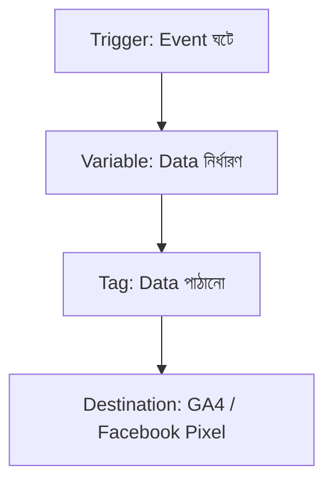
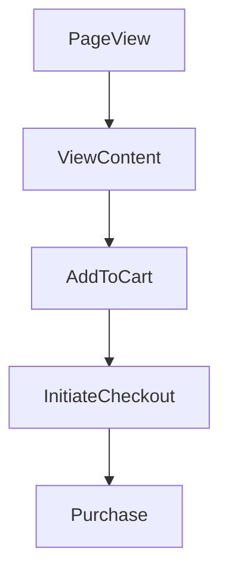

## title: Google Tag Manager & DataLayer Concept 
tags: [gtm, datalayer, conversion-tracking, facebook-pixel, web-analytics] 
created: 2026-07-02 
source: class notes

# Google Tag Manager & DataLayer Concept

> [!summary] Google Tag Manager (GTM) একটা tag management tool যা দিয়ে developer ছাড়াই সব tracking code manage করা যায়। DataLayer সেই ডেটার সোর্স যা GTM কে বলে দেয় ঠিক কী ঘটেছে এবং তার details কী। এই নোটে GTM এর core concept, DataLayer scraping, এবং Facebook Pixel conversion tracking সেটআপ কভার করা হয়েছে।

## What is Google Tag Manager (GTM)

Google Tag Manager হলো একটা Tag Management Tool যেটির মাধ্যমে ওয়েবসাইটে দরকারি সব tracking code যেমন pixel, analytics ইত্যাদি এক জায়গা থেকে সহজে manage করা যায়। একবার GTM code বসিয়ে দিলে ওয়েবসাইটের কোডে বারবার হাত দেওয়ার প্রয়োজন পড়ে না, এবং একজন developer ছাড়াই marketer নিজে tracking সেটআপ ও আপডেট করতে পারে।

- ওয়েবসাইটে একবার container code বসালেই কাজ শেষ
- Developer এর dependency অনেকটা কমে যায়
- সব tracking tag একটা central জায়গা থেকে manage হয়
- Tag পরিবর্তন করলে ওয়েবসাইট কোড টাচ করা লাগে না
- Trigger, Variable এবং Tag এই তিনটা core building block নিয়ে কাজ করে

> [!definition] **GTM**: এমন একটা tool যা tracking code গুলোকে ওয়েবসাইট কোড থেকে আলাদা করে একটা central container এ ম্যানেজ করার সুযোগ দেয়।

---

## GTM Core Building Blocks

GTM মূলত তিনটা component নিয়ে কাজ করে, যেগুলো একসাথে মিলে ঠিক করে কখন, কী ডেটা, কোথায় পাঠানো হবে। এই তিনটার মধ্যে সম্পর্কটা বোঝা GTM শেখার সবচেয়ে গুরুত্বপূর্ণ ধাপ।

|Component|Purpose|
|---|---|
|Trigger|কখন কোনো event ঘটবে সেটা নির্ধারণ করে|
|Variable|এক্সট্রা কী কী data পাঠাতে হবে সেটা ঠিক করে|
|Tag|সেই data কোথায় পাঠানো হবে সেটা নির্ধারণ করে|

Variable এর মধ্যে আবার দুই ধরনের ভাগ আছে, যেগুলো আলাদাভাবে বোঝা দরকার।

- Built-in Variable: GTM এর নিজস্ব predefined variable
- User Defined Variable: নিজের প্রয়োজন অনুযায়ী তৈরি করা custom variable



---

## Basic Website Code Structure

GTM ও DataLayer বোঝার আগে ওয়েবসাইটের basic HTML structure বোঝা দরকার, কারণ DataLayer এই structure এর মধ্যেই বসে কাজ করে। একটা সাধারণ HTML পেজে মূলত দুইটা অংশ থাকে, head এবং body।

- `<head>` অংশে website title এবং metadata থাকে
- `<body>` অংশে সব visible content থাকে
- Paragraph, picture, video সব body এর ভিতরে থাকে
- E-commerce product information ও body তে render হয়
- DataLayer সাধারণত head বা body এর শুরুতে বসানো হয়

> [!example]
> 
> ```html
> <html>
>      <head>
> This is my Website Title
>      </head>
>      <body>
> Paragraph
> Picture
> Videos
> e-commerce Products
> Every Contents
>      </body>
> </html>
> ```

---

## What is DataLayer

DataLayer হলো একটা JavaScript object যেটা ওয়েবসাইট থেকে তথ্য store করে এবং GTM এর মতো অন্য application এ পাঠায়। এটাকে সহজভাবে বলা যায়, DataLayer GTM কে জানায় যে ঠিক কী ঘটেছে এবং তার সাথে exact details কী কী। এর বিপরীতে Presentation Layer হলো ওয়েবসাইটের visible UI বা frontend অংশ, যা user সরাসরি দেখতে পায়।

- Website এবং GTM এর মধ্যে একটা bridge হিসেবে কাজ করে
- JavaScript object আকারে ডেটা store করে
- Purchase, add to cart এর মতো event এর detail carry করে
- Developer এবং marketer দুইজনেরই বোঝা প্রয়োজন
- Presentation Layer থেকে সম্পূর্ণ আলাদা একটা layer

> [!definition] **DataLayer**: একটা JavaScript object যা website থেকে information store করে GTM এর মতো tool এ পাঠায়, যেন GTM জানতে পারে কী event ঘটেছে এবং তার details কী।


---

## Scraping Data from DataLayer

DataLayer থেকে data scrape করার নিয়মটা মূলত দুইটা structure এর উপর নির্ভর করে, Object এবং Array। এই দুইটার পার্থক্য বুঝলে যেকোনো DataLayer থেকে সহজেই দরকারি value বের করা যায়।

|Structure|Symbol|Access Method|Example|
|---|---|---|---|
|Object|`{ }` (second bracket)|Object এর পর dot (.) ব্যবহার করে|`ecommerce.value`, `ecommerce.currency`|
|Array|`[ ]` (third bracket)|Array এর পর index number ব্যবহার করে|`ecommerce.items.0.item_name`, `ecommerce.items.0.item_id`|

> [!tip] Object এর পর সবসময় dot (.) বসে, কিন্তু Array এর পর সরাসরি index number বসাতে হয়, যেমন `items.0` বা `items.1`, dot না দিয়ে।

---

## Facebook Pixel Web Conversion Tracking

Facebook Pixel দিয়ে conversion tracking সেটআপ করার সময় একটা নির্দিষ্ট sequence অনুসরণ করতে হয়, যেখানে প্রতিটা ধাপ user journey এর একটা নির্দিষ্ট স্টেজ track করে।

- PageView Event Setup
- ViewContent Event Setup with Dynamic Value Tracking
- AddToCart Event Setup with Dynamic Value Tracking
- InitiateCheckout Event Setup with Dynamic Value Tracking
- Purchase Event Setup with Dynamic Value Tracking



> [!note] প্রতিটা event এ Dynamic Value Tracking মানে হলো static value না বসিয়ে, actual product/price/currency এর real data DataLayer থেকে টেনে পাঠানো।

---

## Required Chrome Extensions & Resources

Tracking সেটআপ verify এবং debug করার জন্য কিছু নির্দিষ্ট Chrome extension দরকার হয়, যেগুলো দিয়ে GTM tag, Facebook Pixel এবং DataLayer রিয়েল টাইমে চেক করা যায়।

- Google Tag Assistant (Legacy)
- Facebook Pixel Helper
- DataLayer Checker
- Simple DataLayer Viewer
- Wappalyzer

|Resource|Purpose|
|---|---|
|Important note doc|Facebook Pixel conversion tracking guideline|
|GA4 DataLayer developer guide|GA4 ecommerce DataLayer structure|
|Facebook Business Help|Facebook Pixel সংক্রান্ত অফিসিয়াল guide|

---

## Homework: Next Class Preparation

পরের ক্লাসের আগে হাতে-কলমে practice করে event setup এ দক্ষ হওয়াটাই মূল লক্ষ্য। কোনো shortcut বা কপি-পেস্ট ছাড়াই কমপক্ষে ২০ বার পুরো event set আপ করতে হবে।

- [ ] কমপক্ষে ২০ বার সব event নিজে হাতে সেটআপ করা (কোনো tag copy বা JSON copy না করে)
- [ ] Pixel/Dataset তৈরি করা
- [ ] PageView Event Setup করা
- [ ] ViewContent Event Setup (Dynamic Value সহ) করা
- [ ] AddToCart Event Setup (Dynamic Value সহ) করা
- [ ] InitiateCheckout Event Setup (Dynamic Value সহ) করা
- [ ] AddPaymentInfo Event Setup (Dynamic Value সহ) করা
- [ ] Purchase Event Setup (Dynamic Value সহ) করা
- [ ] Record video দুইবার repeat করা
- [ ] আগের record video গুলো শেষ করা
- [ ] নিজে থেকে tracking world explore করা

> [!warning] কোনো event setup এ tag copy-paste বা JSON copy করে শর্টকাট নেওয়া যাবে না, কারণ হাতে-কলমে practice না করলে actual client project এ সমস্যা হবে।

---

## Key Takeaways

- GTM এর তিনটা core building block হলো Trigger, Variable এবং Tag
- DataLayer হলো ওয়েবসাইট থেকে GTM এ ডেটা পাঠানোর জন্য ব্যবহৃত JavaScript object
- Object এর পর dot, আর Array এর পর index number দিয়ে value scrape করতে হয়
- Facebook Pixel এ PageView থেকে Purchase পর্যন্ত পাঁচটা core event track করতে হয়
- Extension গুলো (Tag Assistant, Pixel Helper, DataLayer Checker) দিয়ে setup verify করা যায়
- পরের ক্লাসের আগে কমপক্ষে ২০ বার হাতে event setup practice করতে হবে

## Related Notes

- [[Understanding Freelancing & Web Analytics Basics]]
- [[GA4 Ecommerce Event Tracking]]
- [[Facebook Pixel Setup Guide]]
- [[JavaScript Objects and Arrays Basics]]

## References

- Class notes on GTM & DataLayer
- [Important note (Google Doc)](https://docs.google.com/document/d/105XcS9dzs6mfBS0UPQriUWiWA5ztoNQNLQ0DNm2joNI/edit?usp=sharing)
- [GA4 DataLayer Developer Guide](https://developers.google.com/analytics/devguides/collection/ga4/ecommerce?client_type=gtm)
- [Facebook Business Help](https://www.facebook.com/business/help/402791146561655?id=1205376682832142)