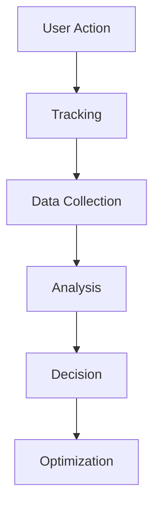

 tags: [freelancing, web-analytics, conversion-tracking, career, digital-marketing] 
 created: 2026-07-02
source: class notes

# Understanding Freelancing & Web Analytics Basics

> [!summary] Freelancing হলো নিজের skill কে service বানিয়ে ইন্টারনেটের মাধ্যমে আয় করা, আর Web Analytics হলো user behaviour ডেটা দিয়ে বুঝে business decision নেওয়ার স্কিল। এই নোটে দুটোর বেসিক concept, তুলনা, এবং একজন Web Analyst এর কাজ কী তা কভার করা হয়েছে।

## What is Freelancing

নিজের জানা কোনো skill যেমন design, video editing বা web analytics কে service বানিয়ে, কোনো নির্দিষ্ট অফিসে না গিয়ে দেশ-বিদেশের ক্লায়েন্টদের প্রজেক্ট বা কাজভিত্তিক ভাবে টাকা আয় করাই freelancing। এখানে কাজের জায়গা, সময় এবং দায়িত্ব সবকিছুই মূলত নিজের নিয়ন্ত্রণে থাকে। Traditional job এর তুলনায় এটা অনেক বেশি flexible একটা career path।

- ইন্টারনেট connection থাকলেই যেকোনো জায়গা থেকে কাজ করা যায়
- কোনো fixed office হাজিরার প্রয়োজন নেই
- কাজের সময় নিজেই ঠিক করা যায়
- একাধিক ক্লায়েন্টের সাথে একসাথে কাজ করার সুযোগ থাকে
- Skill এবং experience এর উপর ভিত্তি করে rate বাড়ানো যায়

> [!definition] **Freelancing**: নির্দিষ্ট office বা employer ছাড়া, নিজের skill কে service হিসেবে বিক্রি করে project-basis এ আয় করার পদ্ধতি।

---

## Freelance Job vs Traditional Job

Freelance এবং traditional job এর মধ্যে পার্থক্য মূলত freedom, responsibility, এবং risk এর জায়গায়। Freelance job এ flexibility বেশি কিন্তু job security কম, আর traditional job এ এর উল্টোটা।

|Comparison|Freelance Job|Traditional Job|
|---|---|---|
|Job Place|যেকোনো জায়গা যেখানে internet আছে|নির্দিষ্ট একটা জায়গা|
|Job Hour|নিজে সেট করা|কর্তৃপক্ষ নির্ধারিত|
|Job Responsibility|Experience অনুযায়ী নিজে সেট করা|কর্তৃপক্ষ নির্ধারিত|
|Job Promotion|Level 1 → Level 2 → Top Rated (experience ও earning ভিত্তিক)|একাধিক metric এর উপর নির্ভরশীল|
|Vacation|নিজের সিদ্ধান্তে|বসের অনুমতি লাগে|
|Job Security|নিজের skill ও intellect এর উপর নির্ভরশীল|Public sector এ বেশি, private এ কম|
|Salary|Skill অনুযায়ী unlimited সম্ভাবনা|সাধারণত fixed structure|

> [!tip] Freelancing এ salary এর কোনো ceiling নেই, কিন্তু সেটা পুরোপুরি নির্ভর করে skill, consistency এবং client handling এর উপর।

---

## Core Freelancing Skills

Freelance market এ demand থাকা কিছু নির্দিষ্ট skill আছে যেগুলো দিয়ে শুরু করা যায়। এর মধ্যে Web Analytics তুলনামূলক কম competitive এবং high-value একটা skill।

- Web Design
- Web Development
- Graphics Design
- Digital Advertising
- Video Editing
- Web Analytics

> [!note] এই ছয়টা skill এর মধ্যে যেকোনো একটাতে গভীরভাবে দক্ষ হওয়া, সবগুলোতে অল্প অল্প জানার চেয়ে বেশি কার্যকর।

---

## What is Web Analytics

Web Analytics মানে হলো data ব্যবহার করে website এর ভিজিটরদের behaviour বোঝা এবং সেই বোঝাপড়া দিয়ে smart business decision নেওয়া। এর core অংশটা হলো Conversion Tracking, অর্থাৎ যেসব action business এর জন্য valuable সেগুলোকে track করা।

- Form submit ট্র্যাক করা
- Lead generation মনিটর করা
- Phone number এবং WhatsApp click ট্র্যাক করা
- Product view এবং add to cart event ট্র্যাক করা
- Purchase বা booking সম্পূর্ণ হওয়া পর্যন্ত ট্র্যাক করা

> [!definition] **Conversion Tracking**: যে action, behaviour বা event গুলো business এর জন্য মূল্যবান, সেগুলোকে measure ও record করার প্রক্রিয়া।

---

## Why Web Analytics & Conversion Tracking Matter

একটা business এ Web Analytics এত গুরুত্বপূর্ণ কারণ এটা user behaviour এর একটা full picture দেয়, যা ছাড়া advertising অনেকটা অন্ধভাবে গাড়ি চালানোর মতো। পুরো প্রক্রিয়াটা একটা নির্দিষ্ট ধাপে ধাপে কাজ করে, user action থেকে শুরু করে optimization পর্যন্ত।

> [!example] "Ads without Web Analytics & Conversion Tracking is like driving a car with blindfold on" — এই উপমাটাই বোঝায় কেন tracking ছাড়া ad campaign চালানো ঝুঁকিপূর্ণ।

---

## Role of a Web Analyst & Market Landscape

একজন Web Analyst এর মূল কাজ হলো website ও ads এর জন্য measurement এবং tracking system তৈরি করা, এবং সেই tracked data analyze করে ক্লায়েন্টকে business decision নিতে সাহায্য করা। মূলত এই role টা Ad Expert দের সাপোর্ট করার জন্যই কাজ করে।

- Measurement system ডিজাইন করা
- Tracking implementation করা (events, conversions)
- Collected data analyze করা
- Insight থেকে actionable recommendation তৈরি করা
- Ad Expert দের decision-making এ সহায়তা করা

|Platform|Type|
|---|---|
|Fiverr|Marketplace|
|Upwork|Marketplace|
|Out of Marketplace|Direct client sourcing|

---

## Homework: Next Class Preparation

পরের ক্লাসে অংশ নেওয়ার আগে কিছু প্রস্তুতিমূলক কাজ সম্পন্ন করতে হবে, যার মধ্যে account setup এবং practice video অন্তর্ভুক্ত।

- [ ] Facebook Business Manager account খোলা
- [ ] Record video ২ বার repeat করে practice করা
- [ ] Pantheon দিয়ে একটা free WordPress website তৈরি করা: https://pantheon.io/
- [ ] Business Manager তৈরির আগে Facebook account verify করা: https://www.facebook.com/id/hub/
- [ ] প্রয়োজনে profile name পরিবর্তন করা: https://accountscenter.facebook.com/profiles/

> [!warning] Facebook account verify না করে Business Manager খুললে পরে account restriction এর সমস্যা হতে পারে, তাই verification ধাপটা স্কিপ করা যাবে না।

---

## Key Takeaways

- Freelancing এ freedom বেশি কিন্তু job security পুরোপুরি নিজের skill এর উপর নির্ভরশীল
- Web Analytics এর core হলো Conversion Tracking, যা valuable user action গুলো measure করে
- Web analytics এর process: User action → Tracking → Data collection → Analysis → Decision → Optimization
- একজন Web Analyst মূলত Ad Expert দের decision-making এ সহায়তা করে
- Fiverr, Upwork এবং marketplace এর বাইরেও client পাওয়ার সুযোগ আছে
- পরের ক্লাসের আগে Business Manager account ও practice website তৈরি করতে হবে

## Related Notes

- [[Facebook Business Manager Setup]]
- [[Conversion Tracking Fundamentals]]
- [[Digital Advertising Basics]]
- [[Google Tag Manager Notes]]

## References

- Class notes on Freelancing & Web Analytics
- https://www.simoahava.com/
- Analytics Mania
- Measurement School