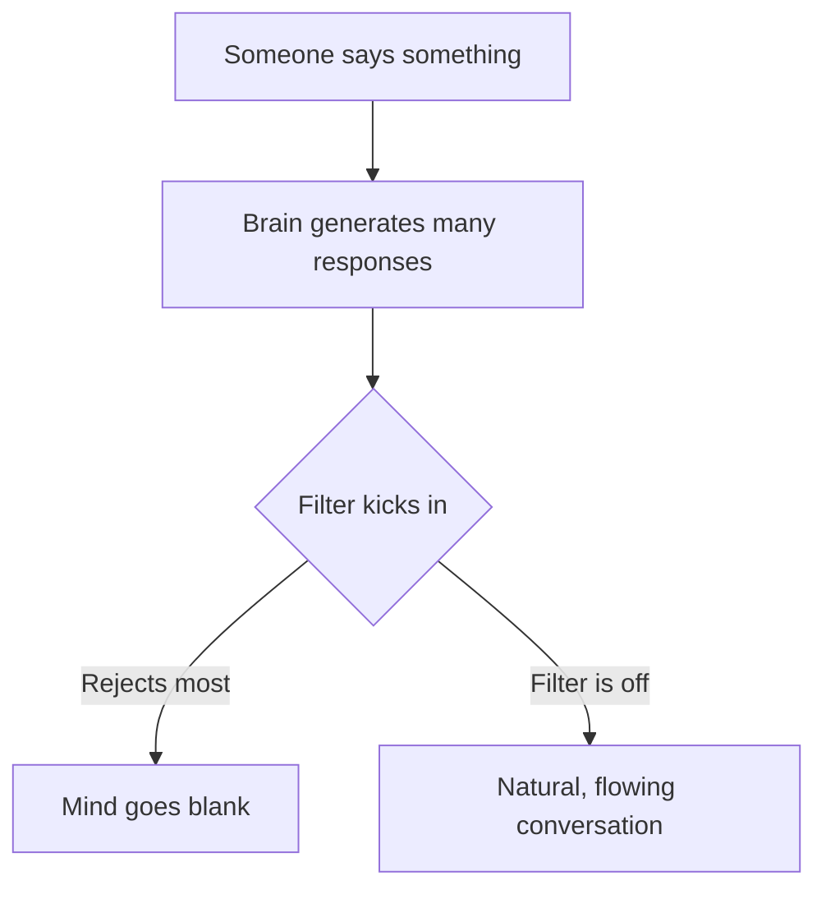
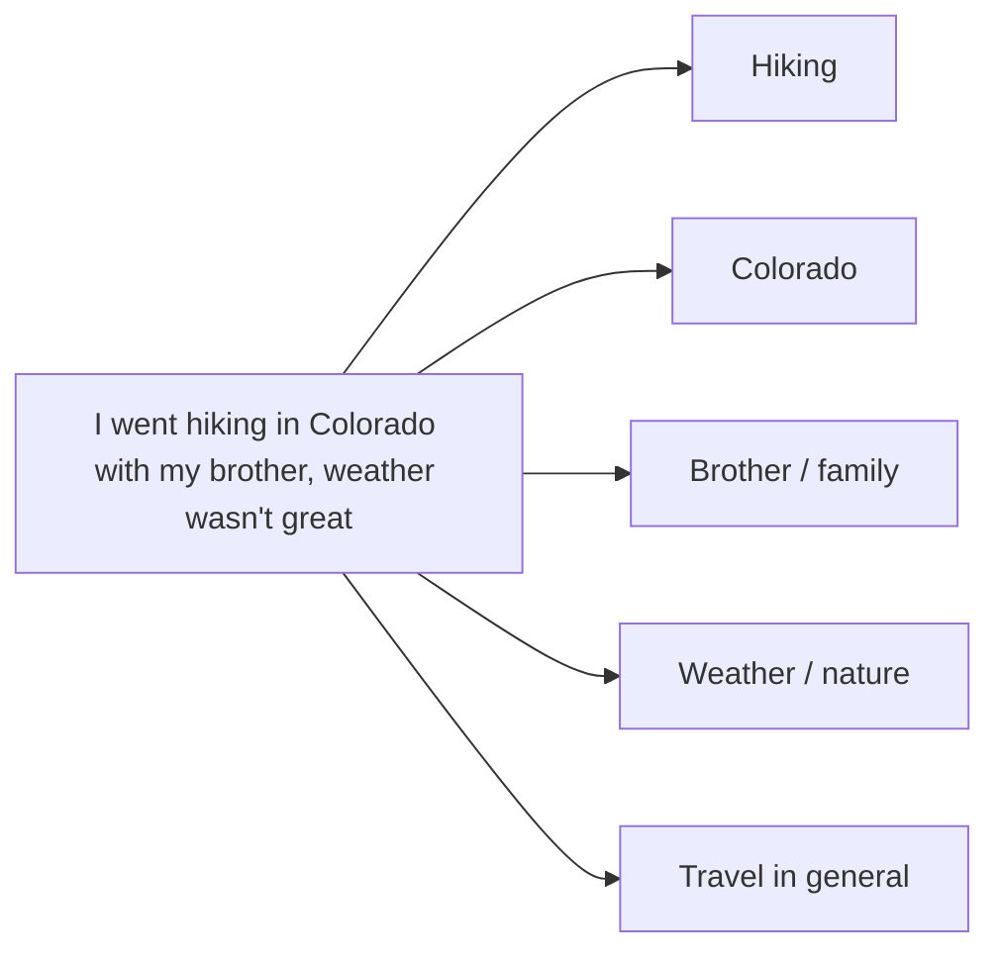
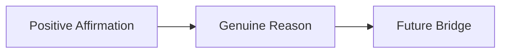

tags: [communication, social-skills, conversation, self-improvement, psychology] 
created: 2026-06-10 
source: https://youtu.be/La1ZffENdt8?si=MV4W2AnxAYbexzgM

# Never Run Out of Things to Say

> [!summary] Running out of things to say isn't a sign of being boring — it's the result of an overactive mental filter that blocks perfectly good conversation material. This note covers nine practical techniques to stay fluent, curious, and confident in any conversation.

---

## The Conversation Paradox

Most people assume they go blank because they have nothing interesting to say. The truth is the opposite: the brain generates dozens of potential responses in any moment, but an overactive filter rejects them before they reach your lips. Every time you think "that's too random" or "they won't care," you shrink your own available options. The moment you understand the problem is the filter, not the content, the solution becomes much clearer.

- Blank mind moments are caused by excessive filtering, not lack of ideas
- Worry about saying the "right" thing reduces conscious options
- Authentic, unfiltered responses often lead to the most engaging conversations
- Casual conversations are not job interviews — relax the standard
- [[Mental Filtering]] is a cognitive habit that can be trained and reduced
- The goal is to approximate the ease you already have with close friends

---

## The 3-Second Rule

The Stop Overthinking Principle is simple: say what comes to mind within 3 seconds. After that window closes, the second-guessing system takes over and starts eliminating perfectly usable responses. This isn't about saying whatever pops into your head with no social awareness — basic context still applies. It's about skipping the over-analysis loop.

- Respond within 3 seconds to bypass the inner critic
- "Boring" responses often spark the best follow-up threads
- Authentic reactions are more memorable than polished ones
- [[Overthinking]] in conversation is a performance anxiety loop, not genuine caution
- Practice with low-stakes interactions first (cashiers, colleagues, acquaintances)

> [!tip] The next time you feel the urge to evaluate your response before saying it, just say it. The 3-second window is the rule. If it passes, pick something else and say that within 3 seconds.

|Situation|Filtered Response|3-Second Response|Likely Outcome|
|---|---|---|---|
|Friend mentions they love dogs|"Oh cool, what kind?"|"My neighbor's dog barks all night"|Opens a thread on neighbors, noise, city life|
|Colleague just got back from Italy|"How was it?"|"Did you actually eat real carbonara?"|Sparks food, culture, travel stories|
|Someone mentions a bad week|Silence (too sensitive?)|"What happened?"|Shows genuine care, deepens trust|

---

## Curiosity as a Superpower

The best conversationalists are not the most interesting people in the room — they are the most interested ones. Genuine curiosity naturally generates questions, and people feel good when someone finds them fascinating. The key distinction is real curiosity, not performed interest as a technique. When you are authentically curious, conversation anxiety fades because the focus shifts from your performance to their experience.

- Shift focus from "how am I coming across?" to "what's interesting about this person?"
- Ask about the aspect of their topic that genuinely intrigues you
- People remember how you made them feel, not the exact words you used
- [[Active Listening]] and curiosity are deeply linked skills
- Follow threads that surprise or confuse you — those are the richest veins

> [!note] "What's the most challenging part of your job?" and "What would surprise people about your industry?" are curiosity-driven questions that open far richer conversations than "What do you do?"

---

## Follow-Up Questions and Conversation Threading

Two techniques that work together: follow-up questions go one level deeper on the current topic, while conversation threading maps all the available directions inside a single statement. Together, they eliminate the "now what?" moment entirely. Most people switch topics too quickly out of anxiety — the real skill is staying with a subject long enough to reach something meaningful.

- Follow the formula: listen, identify details, dig deeper
- Avoid jumping to your own related story too fast
- Every statement contains multiple embedded threads to pull on
- Track unused threads as backup when one direction runs dry
- [[Conversation Threading]] turns any sentence into a map of five new topics

> [!example] Someone says: "I've been working on a website that's taking forever because the client keeps changing things." Available threads: the website itself, the timeline, the client relationship, scope creep, freelance work culture, or how they handle stress.

---

## Balancing Depth and Lightness

The most engaging conversations move like a good film — light moments for enjoyment, deeper moments for connection. Going too deep too fast creates discomfort; staying too surface-level prevents real rapport. The rhythm between the two is what makes a conversation feel both meaningful and enjoyable. Most people default too hard to one end.

- Start light to establish comfort, introduce depth once rapport exists
- Pivot to lightness when a topic gets too heavy
- [[Conversational Rhythm]] is a learnable skill, not a personality trait
- Depth creates connection; lightness creates enjoyment — both are necessary
- After sharing something heavy, a humor pivot releases tension naturally

|Mode|Example|Purpose|
|---|---|---|
|Depth|"Do you think what we watch actually shapes how we see the world?"|Creates meaningful connection|
|Lightness|"Have you seen that viral video of the guy meditating while his office falls apart?"|Releases tension, creates enjoyment|
|Transition|"Speaking of work stress..."|Bridges between modes smoothly|

---

## Recovery Strategies and the Emergency Kit

Even with strong technique, the mind will occasionally go blank. Recovery strategies work by giving the brain a pre-loaded direction instead of requiring creative thinking under pressure. They sound natural, work in almost any context, and remove the panic from the moment. Alongside recovery moves, a mental emergency kit of versatile questions provides a safety net for any situation.

**Recovery moves:**

- Environment scan: comment on something immediately around you ("This place has a great playlist")
- Curious reversion: return to something mentioned earlier ("You said you grew up in Seattle — what was that like?")
- Honest admission: "I completely lost my train of thought — what were we talking about?" (often gets a laugh)

**Emergency kit questions:**

- "What's been keeping you busy lately?" (replaces "What do you do?")
- "What are you watching right now that you'd actually recommend?"
- "If you could teleport anywhere for just 24 hours, where would you go?"
- "What's something you've changed your mind about recently?"
- "What's the best thing that happened to you this week?"

> [!tip] Keep 5 to 7 emergency questions refreshed periodically. Questions get stale the more you use them — swap them out every few months.

---

## Self-Disclosure and Graceful Exits

[[Self-Disclosure]] is the fastest way to move from small talk to real connection. It works through reciprocity: when you share something slightly personal, it creates safety for the other person to match your level. The key is gradual escalation — facts first, then opinions, then feelings. Ending conversations well is equally important; a graceful exit leaves a positive final impression and sets up future interaction.

**Self-disclosure ladder:**

- Fact: "I'm from Dhaka."
- Opinion: "I love it but I'd find it hard to leave permanently."
- Feeling: "Moving away for a period was actually really difficult for me."

**The perfect exit formula:**

- Positive affirmation: acknowledge the value of the conversation
- Genuine reason: a non-personal explanation for leaving
- Future bridge: something that keeps the connection alive beyond this moment

> [!example] "It's been really great hearing about your photography work. I need to head out for another meeting, but I'd love to see some of your photos — could you send me a link?"

---

## Key Takeaways

- Conversation blanks are caused by an overactive filter, not a lack of ideas
- The 3-second rule bypasses over-analysis and keeps responses authentic
- Genuine curiosity is more powerful than wit or cleverness
- Follow-up questions and conversation threading eliminate "now what?" moments
- Balance depth and lightness to create conversations that feel both meaningful and enjoyable
- Keep a mental emergency kit of 5 to 7 versatile questions at all times
- Self-disclosure deepens connection through the principle of reciprocity
- A graceful exit (affirmation + reason + future bridge) completes the skill set

---

## Related Notes

- [[Active Listening]]
- [[Social Anxiety and Communication]]
- [[Conversation Threading]]
- [[Mental Filtering]]
- [[Self-Disclosure in Relationships]]
- [[Building Rapport]]

---

## References

- Video transcript: _Never Run Out of Things to Say_ (source video, 2026)