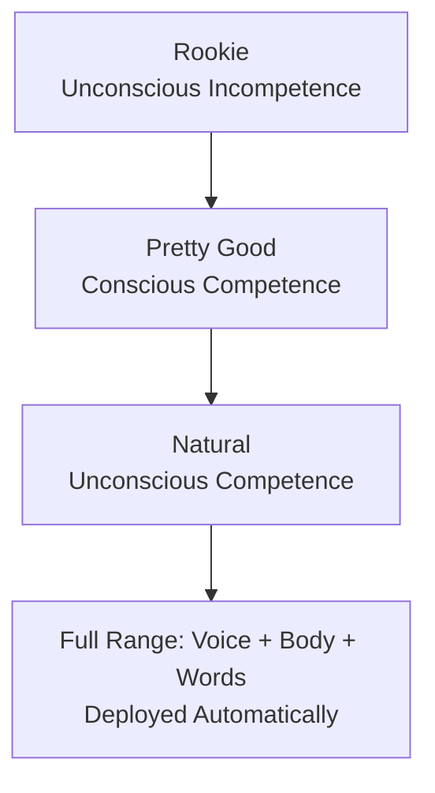
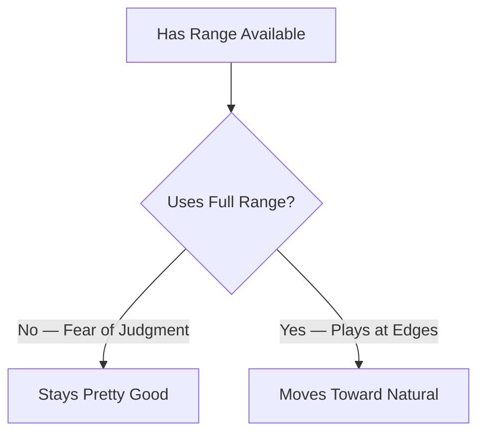
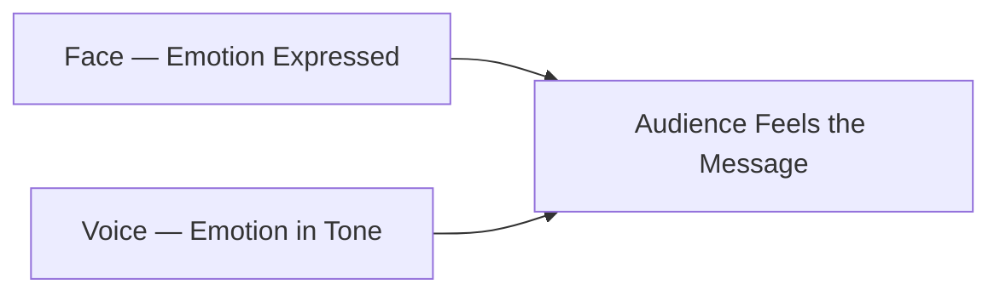

tags: [communication, public-speaking, body-language, voice, self-improvement] 
created: 2026-06-09 
source: https://www.youtube.com/watch?v=FsxorSNJBaA
# The Three Levels of Communication

> [!summary] Every communicator falls into one of three levels — Rookie, Pretty Good, or Natural — based on how they use their voice, body language, and words. Moving up requires deliberate practice, self-awareness, and the willingness to use your full range.

---

## The Three-Level Framework

Communication skill is not fixed at birth. It sits on a spectrum, and most people are stuck at the bottom without knowing it — a state called **unconscious incompetence**. The three levels apply to all contexts: job interviews, presentations, conversations, and content creation. The gap between levels is not talent but habit.

- Rookie: unconscious incompetence, unaware of bad habits
- Pretty Good: conscious competence, knows the basics but plays it safe
- Natural: unconscious competence, full range deployed without thinking
- Every level is defined by voice, body language, and words
- The goal is to reach a state where good communication is automatic

---

## Rookie Communicator — What Goes Wrong

Rookies are not bad people; they simply have bad habits they are not aware of. The core problem is a lack of variation across all three channels. Their voice is flat, their body is frozen, and their words have no structure. The listener ends up doing all the cognitive work to decode what is being said.

- Flat delivery: same pitch, speed, volume, and emotion from start to finish
- Vocal fry: low, creaky voice quality that signals uncertainty
- Filler words: um, uh, like, you know — used so frequently they obscure the message
- Zero body language: no intentional gesture, posture, or eye contact
- No structure in words: speaking in circles, rambling, no clear point

> [!tip] Record yourself on your phone answering this question: "Why do you want to improve your communication skills?" Then transcribe it using an AI tool like Gemini. Check for filler words, circular thinking, and lack of structure. This is the fastest way to build self-awareness.

|Rookie Habit|What It Signals to the Listener|
|---|---|
|Flat delivery|Boredom, disengagement, low energy|
|Vocal fry|Uncertainty, low confidence|
|Filler words every sentence|Unpreparedness, lack of clarity|
|No body language|Disconnection, low presence|
|No structure|Forces listener to decode meaning|

---

## Pretty Good Communicator — Stuck at Safe

Pretty good communicators have done the work. They have read books, taken courses, and broken most rookie habits. The problem is they have learned enough to be decent, but they are afraid to use the full range of their instrument. They play within a narrow, safe zone and never venture toward the edges.

- Voice has more variety: pitch, speed, and volume are no longer flat
- Body language basics are covered: posture, hand placement, eye contact
- Uses frameworks to structure responses, so less rambling
- Fear of judgment keeps them from being playful or expressive
- Gesture vocabulary is limited to a small set of repeated movements

> [!warning] Repetitive, non-functional body movements distract the audience from the message. The rule is simple: only move with purpose. If a movement adds nothing to what you are saying, cut it.

---

## The Five Voice Dials of a Natural Communicator

Natural communicators operate all five vocal dials simultaneously without thinking. Each dial serves a specific emotional function. Using all five together creates the variety that holds attention, builds trust, and drives influence. The key insight is that the variety itself is what engages people, not any single setting on its own.

- **Rate of speech**: fast to show passion, slow to emphasize what matters
- **Volume**: loud to show vitality, soft to create intimacy
- **Pitch**: high for warmth and playfulness, low for authority
- **Tonality**: injecting real emotion so the voice sounds human, not robotic
- **The pause**: deliberate silence to create weight and impact

|Dial|Low Setting|High Setting|Effect|
|---|---|---|---|
|Rate|Slow — emphasis|Fast — energy|Controls attention|
|Volume|Soft — intimate|Loud — vital|Controls emotional intensity|
|Pitch|Low — authority|High — warmth|Controls perceived personality|
|Tonality|Flat — robotic|Emotional — authentic|Controls connection|
|Pause|None — rushed|Timed — impactful|Controls weight of message|

---

## Body Language at the Natural Level

Natural communicators treat the body as a full communication instrument. They have a large gesture vocabulary, make powerful eye contact, move with clear purpose, and keep their facial expressions synced with what they are saying. The face is the most overlooked element — most people hold a neutral or blank expression while talking and then wonder why people do not connect with them.

- Large gesture vocabulary: varied, intentional movements that support the message
- Facial expression: the face must match the emotion in the voice for the listener to feel it
- Eye contact: direct, confident, not darting or avoiding
- Stillness: knows when NOT to move, which creates presence and authority
- Sync between face and voice: if the face says one thing and the voice says another, the audience feels nothing

> [!note] When people see emotion on your face but do not hear it in your voice, they do not feel it. When the face and voice are in sync, the message lands emotionally. This is what separates a natural communicator from a merely competent one.

---

## The Word Toolkit — Beyond Frameworks

Rookies wing it; pretty good communicators use frameworks (PREP, STAR, PARA, PEEL); natural communicators use the entire toolkit. Frameworks structure thinking into clear, concise responses. But naturals add a second layer on top of that: stories, analogies, props, and activities that make the same message land in a completely different way. The content is the same; the delivery multiplies the impact.

- **Frameworks**: filter raw thinking into clear, structured responses
- **Analogies**: transfer a concept into familiar territory ("Reading is to the mind like exercise is to the body")
- **Stories**: personal or third-party narratives that carry emotional weight
- **Props**: physical objects that anchor an abstract idea
- **Activities**: audience participation that creates experiential memory

> [!example] Saying "you should read more books" is weak. Saying "every book you read is a soldier in your army — and right now you only have four soldiers" is unforgettable. Same message. Completely different impact. That is the word toolkit at work.

|Communication Tool|Best Used For|Impact Level|
|---|---|---|
|Plain statement|Quick facts|Low|
|Framework (PREP, STAR)|Structured answers, presentations|Medium|
|Analogy|Making abstract ideas concrete|Medium-High|
|Story|Emotional connection, memorability|High|
|Prop / Activity|Anchoring ideas physically|Very High|

---

## Key Takeaways

- Most people are rookies without knowing it — self-awareness is the first requirement for growth
- Bad communication is a set of habits, not a fixed identity — habits can be changed
- The voice has five dials: rate, volume, pitch, tonality, and pause — use all five
- Pretty good communicators have range but fear using it fully — judgment is a false fear
- Body language includes the face; sync facial expression with vocal emotion for real connection
- Only move with purpose; non-functional movements steal attention from the message
- Natural communicators use frameworks AND stories, analogies, and props
- Record yourself, transcribe it, and audit it — this is the fastest path to self-awareness
- Communication improves every area of life because it is used in every area of life

---

## Related Notes

- [[Active Listening and Presence in Conversation]]
- [[Storytelling Frameworks for Persuasion]]
- [[Body Language and Nonverbal Communication]]
- [[Public Speaking Anxiety and Overcoming the Fear of Judgment]]
- [[Vocal Tonality and Emotional Delivery]]

---

## References
  
 https://event.webinarjam.com/yp188/replay/5w177iyh6i5x4r4bnm577?webinar_id=4